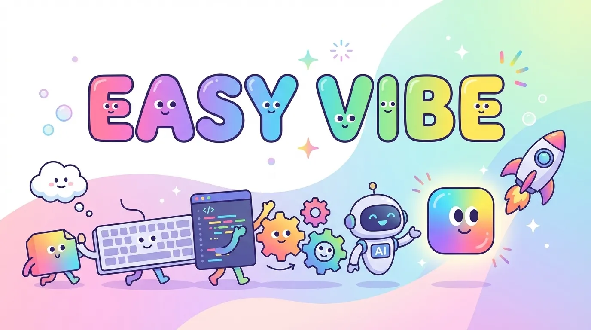

<div align='center'>
  
</div>
<div align="center">
  <h1>Easy-Vibe</h1>
  
  
  
  <a href="https://github.com/datawhalechina/easy-vibe"></a>
</div>

<div align="center">

[中文](https://github.com/datawhalechina/easy-vibe/blob/main/README.md) | [English](https://github.com/THU-SIGS-AIID/ai-vibe-coding-101/blob/main/README.md)

</div>

<div align="center">
  <h3>📚 AI Vibe Coding 101 教程</h3>
  <p>零基础，在项目制学习中掌握 Vibe Coding 与 AI 技能，构建第一个 AI 原生产品</p>
</div>

## 项目介绍

2025 年，被很多人视为 AI 编程的元年。越来越多的人已经开始用 AI 写代码，但如果没有一套清晰的 Vibe Coding 工作方式，做出来的东西往往还停留在玩具层面，一到真正动手做产品就会被各种门槛劝退：

- 不知道如何用 Vibe Coding 的工作方式组织自己的开发流程；
- 不知道该选哪些 AI 编程工具、如何和现有技术栈配合；
- 不清楚从会用 AI 工具到真正用好 AI 能力，再到把应用上线，中间还差哪些关键步骤。

通过这个项目，我们希望你先把 Vibe Coding 的工作方式练熟，再搞清楚常见 AI 能力能做什么、怎么接入到产品里。你会在一个又一个项目制学习挑战中，逐步完成游戏、实用工具、产品原型，最后独立构建一款由 AI 能力驱动的真实应用。

我们相信，只要掌握好 Vibe Coding 的方式，你一个人就可以成为前后端开发、AI 算法开发、产品经理。

### 项目受众

本项目采用项目制教学，对零基础学习者友好；在循序渐进的项目实践中，系统覆盖 AI 的常见能力与典型应用场景，内容由入门扩展到高级应用，主要面向三类学习者：

- 新手（普通人 / 产品与运营侧）：帮助非技术背景角色和入门学习者听懂关键概念，完成第一个 AI 小工具或产品原型。
- 初中级开发者：面向有一定编程基础的学生和开发者，系统掌握 vibe coding 与原生 AI 应用开发。
- 高级开发者（公司与初创、开源与独立开发者）：支持团队和个人快速搭建、验证与迭代原生 AI 应用。

### 你将收获什么？

- **一套全新的工作方式**：理解什么是 vibe coding，学会用它来组织从需求到上线的完整开发流程。
- **扎实的 AI 与工程能力**：不仅搞懂主流大模型和常见 AI 能力怎么用，还能掌握 Git、API、RAG、部署等将 AI 落地到产品所需的关键基础设施。
- **独立完成原生 AI 应用的底气**：通过从小游戏到工具、再到产品原型的实战，真正独立做出一款由 AI 能力驱动的完整应用。
- **真实的产品思维**：学会像产品经理一样思考，围绕真实需求去设计功能、打磨体验，而不仅仅是写代码。

## 📖 内容导航

本教程整体分为三个循序渐进的学习阶段：从第零阶段的入门小游戏，到第一阶段的产品策划与原型设计，再到第二、第三阶段的全栈开发与多平台高级应用，配合前言与附录，帮助你系统掌握以 vibe coding 为核心的开发方式，把想法落地为真正可用的应用与产品。

### 第零阶段：幼儿园

#### 第零阶段主线任务

| 章节 | 关键内容 | 状态 |
| :--- | :--- | :--- |
| 前言：学习地图 | 整体学习路径与三大阶段的鸟瞰式导览 | ✅ |
| 模块一：先看看 AI 能做什么 | 通过贪吃蛇等案例体验 AI 编程能力与边界 | ✅ |

### 第一阶段：AI 产品经理

#### 第一阶段主线任务

| 章节 | 关键内容 | 状态 |
| :--- | :--- | :--- |
| 模块二：认识 AI IDE 这个工具 | 认识 AI IDE，掌握界面结构和高效提示方式 | ✅ |
| 模块三：动手做出原型 | 从需求拆解到多页面原型与数据存储的完整闭环 | ✅ |
| 模块四：给原型加上 AI 能力 | 理解并完成常见 AI 能力的 API 接入与控制成本 | ✅ |
| 模块五：完整项目实战 | 用模拟数据和用户反馈迭代并完成项目展示 | ✅ |
| 大作业：做一个完整的 Web 应用原型并展示 | 独立用 AI IDE 落地并演示一个可用 Web 应用 | ✅ |

#### 第一阶段 附录

| 章节 | 关键内容 | 状态 |
| :--- | :--- | :--- |
| 附录A：产品思维补充 | 从想法评估到需求拆解与 MVP 的产品思维框架 | ✅ |
| 附录B：常见报错及解决方案 | 汇总前端页面、数据、交互与 API 常见错误及排查方法 | ✅ |

### 第二阶段：初中级开发工程师

#### 第二阶段主线任务

##### 前端部分

| 章节 | 关键内容 | 状态 |
| :--- | :--- | :--- |
| 前端部分：Figma 与 MasterGo 入门 | 用设计工具梳理信息架构和页面结构，为前端实现打基础 | 🚧 |
| Project 7: 构建第一个现代应用程序-UI 设计 | 基于设计稿完成组件化界面，实现从设计到代码的第一条链路 | 🚧 |
| 参考 UI 设计规范与多产品 UI 设计 | 围绕统一主视觉扩展多产品界面，练习系统化设计能力 | 🚧 |
| [Project 4: 一起做霍格沃茨画像](https://github.com/datawhalechina/easy-vibe/blob/main/docs/project/chapter4/chapter4-lets-build-hogwarts-portraits.md) | 从 0 到 1 做出接入 AI 能力的前端应用，串联设计与开发 | 🚧 |

##### 后端与全栈部分

| 章节 | 关键内容 | 状态 |
| :--- | :--- | :--- |
| 后端部分：什么是 API | 理解 HTTP 接口与请求响应模型，为后端集成与联调做准备 | 🚧 |
| [Project 5: 从数据库到 Supabase](https://github.com/datawhalechina/easy-vibe/blob/main/docs/project/chapter5/chapter5-from-database-to-supabase.md) | 在 Supabase 上落地数据库和 API，打通数据模型与前端页面 | 🚧 |
| 大模型辅助编写接口代码与接口文档 | 用大模型协助生成接口与数据库文档及代码，实现可读可测的后端 | 🚧 |
| Git 工作流与 Zeabur 部署 | 在 Git 工作流中管理代码，并将应用部署到 Zeabur 上线 | 🚧 |
| 现代 CLI 开发工具 | 使用 CLI 类 AI 编程工具加速开发与调试，形成个人工程化工作流 | 🚧 |
| 如何集成 stripe 等收费系统 | 接入支付系统，完成收费链路与基础结算流程 | 🚧 |
| Project 9: 构建第一个现代应用程序-全栈应用 | 综合前端、后端与支付模块，完成可上线的全栈 Web 应用 | 🚧 |
| 大作业 2：现代前端组件库 + Trae 实战 | 使用现代前端组件库与 Trae，独立完成可登录注册并支持收费的产品 | 🚧 |

#### 第二阶段 AI 能力补充

| 章节 | 关键内容 | 状态 |
| :--- | :--- | :--- |
| [Project 3: Dify 入门与知识库集成](https://github.com/datawhalechina/easy-vibe/blob/main/docs/project/chapter3/chapter3-getting-started-with-dify-and-its-knowledge-base-integration.md) | 用 Dify Workflow 与基础 RAG 搭建工具类产品，为后续应用升级打样 | 🚧 |
| 学会查询 AI 词典与集成多模态 API | 学会查找合适的模型与 API，并把文本、图像等多模态能力接入产品 | 🚧 |

### 第三阶段：高级开发工程师

#### 第三阶段主线任务

| 章节 | 关键内容 | 状态 |
| :--- | :--- | :--- |
| 扩展知识 8: MCP 与 ClaudeCode Skills | 通过 MCP 与 Skills 扩展 IDE 能力，把外部服务接成工具 | 🚧 |
| 扩展知识 9: 如何让 Coding Tools 长时间工作 | 设计和配置长时间运行的任务，让 Coding Tools 更稳定可靠 | 🚧 |
| 多平台应用 vibe coding 开发实例 | 以多平台场景为例，练习 vibe coding 的跨平台复用思路 | 🚧 |
| Example 1: 如何构建微信小程序 | 了解微信小程序生态，从官方模板到上线完成一个前端小程序 | 🚧 |
| Example 2: 如何构建微信小程序-包含后端 | 在小程序中接入数据库与后端逻辑，打通完整业务闭环 | 🚧 |
| Example 3: 如何构建安卓程序 | 使用 Expo 等工具，完成 Web/原生一体化的安卓应用开发 | 🚧 |
| 大作业：多平台复杂应用实践 | 综合 RAG、多平台与工程化能力，独立完成一个复杂应用 | 🚧 |

#### 第三阶段 AI 能力补充

| 章节 | 关键内容 | 状态 |
| :--- | :--- | :--- |
| 扩展知识 5: 什么是 RAG 以及它如何工作 | 系统理解 RAG 原理与常见架构，为复杂应用提供知识检索基础 | 🚧 |
| 中高级 RAG 与工作流编排：以 LangGraph 为例 | 使用 LangGraph 等工具设计多步工作流与中高级 RAG 系统 | 🚧 |

### 附录：AI 能力与工具索引

- AI 能力词典：常见 AI 核心概念与名词、场景解释


## 如何学习

- 建议具备基本编程经验（任意一门语言均可），并对 AI 与产品开发有兴趣
- 按照 Project 模块从 0 到 6 依次实践，完成从小游戏到完整应用原型的进阶
- 在 Extra 模块中补充 Git、API、RAG、部署等通识知识，完善你的 AI 开发知识图谱
- 遇到问题时优先尝试自己排查与检索，再对照教程与源码进行比对和反思

你可以根据个人时间与需求，选择性地阅读和实践相关章节，但推荐至少完成全部 Project，以形成一套完整的实践闭环。

## 本地启动本课件

### 现代方案

在 AI IDE 对话框（vscode、cursor、trae 等）中，输入下列提示词启动本课件：

```
请你帮我运行这个项目的本地服务
```

### 旧方案

1. npm install
2. npm run dev
3. 打开浏览器访问 `http://localhost:3000` 即可查看。

## 参与贡献

- 如果你发现了一些问题，或者觉得任何可以改进本项目的地方，可以提 Issue 进行反馈。如果提完没有人回复你可以联系[保姆团队](https://github.com/datawhalechina/DOPMC/blob/main/OP.md)的同学进行反馈跟进~
- 如果你想参与贡献本项目，可以提 Pull Request，如果提完没有人回复你可以联系[保姆团队](https://github.com/datawhalechina/DOPMC/blob/main/OP.md)的同学进行反馈跟进~
- 如果你对 Datawhale 很感兴趣并想要发起一个新的项目，请按照[Datawhale 开源项目指南](https://github.com/datawhalechina/DOPMC/blob/main/GUIDE.md)进行操作即可~

## 🙏 感谢每位贡献者

- [散步-项目负责人](https://github.com/sanbuphy) (Datawhale成员)
- 方可-指导老师（Datawhale成员, 清华大学）
- [Yerim Kang](https://github.com/yerim25)（实践项目部分-清华大学）
- 赵芷霖（实践项目部分-清华大学）
- [李亦萱](https://yixuan20.github.io/)（页面美术设计-清华大学）
- AI Vibe Coding 101 内测群完整给建议体验的小伙伴们

### 特别感谢

- 感谢 [@Sm1les](https://github.com/Sm1les) 对本项目的帮助与支持
- 感谢所有为本项目做出贡献的开发者们 ❤️

<div align=center style="margin-top: 30px;">
  <a href="https://github.com/datawhalechina/easy-vibe/graphs/contributors">
    
  </a>
</div>

## 联系我们

<div align=center>
<p>如果有问题提建议吐槽，或者想要一起交流，请扫描下方二维码</p>


<p>扫描下方二维码关注公众号：Datawhale</p>

</div>

## LICENSE

<a rel="license" href="http://creativecommons.org/licenses/by-nc-sa/4.0/">
  
</a>
<br />
本作品采用
<a rel="license" href="http://creativecommons.org/licenses/by-nc-sa/4.0/">
  知识共享署名-非商业性使用-相同方式共享 4.0 国际许可协议
</a>
进行许可。

## Star History

[](https://www.star-history.com/#datawhalechina/easy-vibe&type=date&legend=top-left)
