<script setup>
import { relatedArticlesMap } from '@theme/data/relatedArticles'

const relatedArticles = relatedArticlesMap['ko-kr/stage-2/frontend/lovart-assets'] ?? []
</script>

# Nano Banana에서 출발해 나만의 소재 생성 에이전트 만들기

## 제1장: 1분 만에 첫 번째 이미지 소재 생성하기

디자인, 스타일, 프롬프트를 논의하기 전에, 최소한의 단계로 첫 번째 이미지를 생성해 보겠습니다.

### 1.1 Nano Banana 알아보기

디자인 스타일과 프롬프트 엔지니어링을 논의하기 전에, 더 중요한 한 가지를 먼저 확인합니다. **당신이 정말로 이미지를 생성할 수 있는지 확인하는 것입니다.**

현재 주류 대형 모델은 이미 이미지 생성과 편집 능력을 갖추고 있으며, 이러한 유형의 모델은 보통 **생성형 모델**이라고 불립니다.

이 튜토리얼에서는 흐름을 최대한 단순화하기 위해, 안정적인 이미지 생성 및 편집 능력을 갖춘 모델 하나를 예시로 선택했습니다. 바로 Nano Banana(Google의 AI 이미지 생성 모델)입니다. 공식 명칭은 **Gemini 3.1 Flash Image Preview**로, 자연어를 통해 직접 이미지를 생성할 수 있으며, 기존 이미지를 기반으로 수정하는 것도 지원합니다.

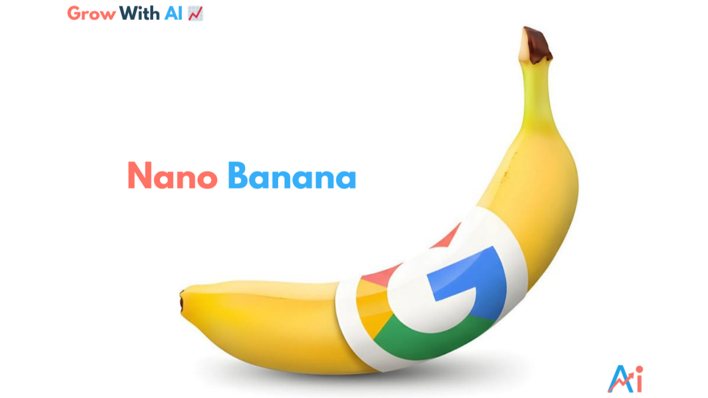

기능 면에서 보면, 이 모델은 여러분이 들어 봤을 다른 모델들(GPT-4o, Claude, Qwen, Midjourney 등)과 본질적인 차이가 없습니다. **설명을 입력하면 모델이 결과를 생성합니다.**

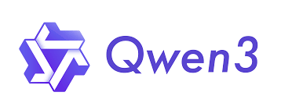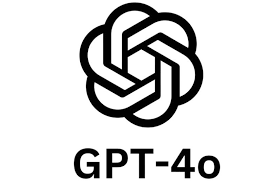

이 모델을 하나의 "붓"이라고 생각해도 좋습니다. 이 장에서 우리는 딱 한 가지에만 집중합니다.
 👉 **이 붓이 당신의 손에서 첫 번째 획을 그을 수 있는지.**

실제 사용 시 Nano Banana는 **Google AI Studio** 등 공식 플랫폼을 통해 직접 사용할 수도 있고, **API** 방식으로 개발 흐름에 통합할 수도 있습니다. 이 튜토리얼은 API 호출 방식을 채택합니다. 현재 Nano Banana 2 모델도 출시되었으니, 최신 대형 모델로 시도해 볼 수 있습니다.

### 1.2 "Hello World" 수준의 생성

시작하기 전에 아래 세 단계만 완료하면 됩니다.

1. Trae(中 ByteDance의 AI 코딩 IDE)에서 새 폴더를 만듭니다


2. Python 파일을 새로 만듭니다

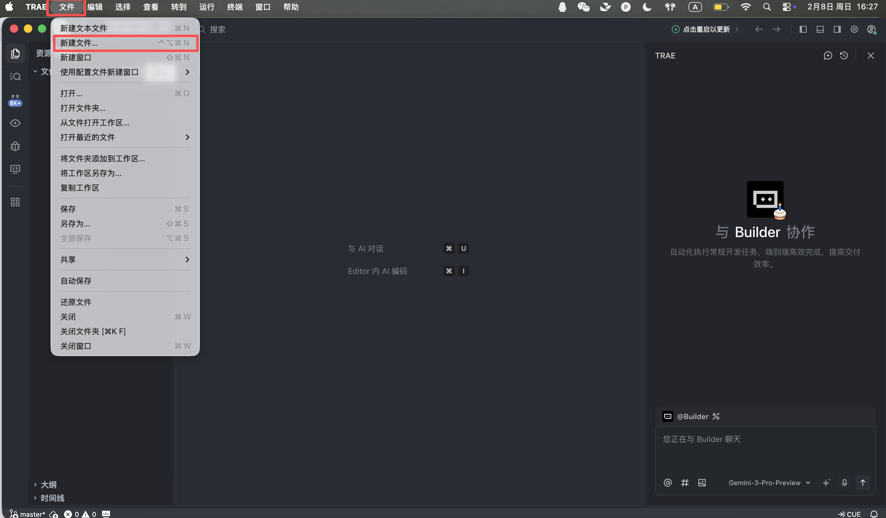


3. 아래 코드 전체를 붙여넣습니다

Trae는 필요한 환경 배포와 의존성 설치를 자동으로 완료하므로, 별도 설정이 필요하지 않습니다.

코드에는 Nano Banana의 API Key가 필요합니다. 신청 절차는 여기서 다루지 않으므로, 해당 파라미터를 직접 획득해 입력하면 됩니다. **이 단계에서는 코드의 모든 줄을 이해하려 하지 않아도 됩니다. 성공적으로 실행되면 됩니다.**

```Python
# /// script
# dependencies = [
#  "gradio>=4.0.0",
#  "pillow>=10.0.0",
#  "requests>=2.31.0",
# ]
# ///

import gradio as gr
import requests
import base64
from PIL import Image
import io
import os
import time
import re
from typing import Optional, Dict, Any, List

# 配置 API 信息
NANOBANANA_API_URL: str = "YOUR API URL"
NANOBANANA_API_KEY: str = "YOUR API KEY"
OUTPUT_DIR: str = "outputs"

# 确保输出目录存在
os.makedirs(OUTPUT_DIR, exist_ok=True)

def image_to_base64_data_uri(image: Image.Image) -> str:
    """
    将 PIL 图像转换为 OpenAI API 兼容的 data URI 格式。
    """
    buffer = io.BytesIO()
    # 统一转为 PNG 以保证兼容性
    image.save(buffer, format="PNG")
    encoded = base64.b64encode(buffer.getvalue()).decode('utf-8')
    return f"data:image/png;base64,{encoded}"

def base64_to_image(base64_str: str) -> Optional[Image.Image]:
    """
    将纯 base64 字符串转换为 PIL Image。
    """
    try:
        image_bytes = base64.b64decode(base64_str)
        return Image.open(io.BytesIO(image_bytes))
    except Exception as e:
        print(f"Base64 解码失败: {e}")
        return None

def extract_base64_from_response(content: Any) -> Optional[str]:
    """
    核心解析逻辑：从 API 返回的 content 中提取图片 Base64 数据。
    兼容 Markdown 格式和结构化列表格式。
    """
    if not content:
        return None

    base64_data = None

    # 1. 尝试结构化提取 (List)
    # 对应返回格式: [{"type": "image_url", "image_url": {"url": "data:..."}}]
    if isinstance(content, list):
        for part in reversed(content):  # 倒序查找，通常最新的图片在最后
            if isinstance(part, dict):
                # 检查 image_url 或 output_image 字段
                img_field = part.get("image_url") or part.get("image") or part.get("output_image")
                if isinstance(img_field, dict):
                    url = img_field.get("url", "")
                    if url.startswith("data:image/") and "," in url:
                        return url.split(",", 1)[1].strip()

        # 如果列表中没有结构化图片，尝试把列表里的文本拼起来找 Markdown
        text_parts = [
            str(p.get("text", ""))
            for p in content
            if isinstance(p, dict) and p.get("type") in ["text", "input_text"]
        ]
        content_str = "".join(text_parts)
    else:
        content_str = str(content)

    # 2. 尝试 Markdown 正则提取 (String)
    # 对应返回格式: "Here is your image: "
    pattern = re.compile(r"!\[.*?\]\((data:image/[^;]+;base64,[^)]+)\)", re.IGNORECASE)
    match = pattern.search(content_str)

    if match:
        data_url = match.group(1)
        if "," in data_url:
            return data_url.split(",", 1)[1].strip()

    return None

def synthesize(prompt: str, input_image: Optional[Image.Image]) -> Optional[Image.Image]:
    """
    调用 Nanobanana API 进行生成。
    """
    if not prompt or not prompt.strip():
        gr.Warning("请输入提示词")
        return None

    print(f">>> 开始任务: {prompt[:50]}...")

    headers = {
        "Content-Type": "application/json",
        "Authorization": f"Bearer {NANOBANANA_API_KEY}"
    }

    # 构造符合 OpenAI Vision / Chat 标准的 payload
    messages = []

    if input_image is not None:
        # 图生图/多模态输入模式
        print(">>> 检测到输入图片，使用多模态模式")
        img_base64 = image_to_base64_data_uri(input_image)
        messages.append({
            "role": "user",
            "content": [
                {"type": "text", "text": prompt},
                {"type": "image_url", "image_url": {"url": img_base64}}
            ]
        })
    else:
        # 纯文生图模式
        messages.append({
            "role": "user",
            "content": prompt
        })

    payload = {
        "messages": messages,
        # 使用第一段代码中验证可用的模型
        "model": "gemini-2.5-flash-image",
        # 可选参数，视 API 支持情况而定
        "stream": False
    }

    try:
        # 增加超时时间，图片生成通常较慢
        response = requests.post(NANOBANANA_API_URL, headers=headers, json=payload, timeout=120)

        # 检查 HTTP 状态
        if response.status_code != 200:
            error_msg = f"API 请求失败: {response.status_code} - {response.text}"
            print(error_msg)
            gr.Error(error_msg)
            return None

        result = response.json()
        # Debug: 打印返回结果的前一部分，方便调试
        print(f"API 原始响应 (截取): {str(result)[:200]}...")

        # 提取 Content
        content = None
        if "choices" in result and len(result["choices"]) > 0:
            content = result["choices"][0].get("message", {}).get("content")

        if not content:
            gr.Warning("API 返回结果中没有 content 字段")
            return None

        # 使用之前验证过的逻辑提取 Base64
        base64_str = extract_base64_from_response(content)

        if base64_str:
            output_image = base64_to_image(base64_str)
            if output_image:
                return output_image

        # 如果没提取到图片，可能是模型拒绝了或只返回了文本
        text_content = str(content) if not isinstance(content, list) else " ".join([str(x) for x in content])
        gr.Info(f"未生成图片，模型返回文本: {text_content[:100]}...")
        return None

    except requests.exceptions.Timeout:
        gr.Error("请求超时，请稍后重试")
        return None
    except Exception as e:
        import traceback
        traceback.print_exc()
        gr.Error(f"发生未知错误: {str(e)}")
        return None

# Gradio 界面配置
with gr.Blocks(title="Nanobanana Image Generator") as app:
    gr.Markdown("# 🍌 Nanobanana Text/Image to Image")
    gr.Markdown("基于 Gemini-2.5-Flash-Image 模型，支持文生图与图生图。")

    with gr.Row():
        with gr.Column():
            prompt_input = gr.Textbox(
                label="提示词 (Prompt)",
                placeholder="例如: A cyberpunk cat holding a neon sign...",
                lines=3
            )
            image_input = gr.Image(
                label="参考图 (可选，用于图生图)",
                type="pil",
                height=300
            )
            submit_btn = gr.Button("开始生成", variant="primary")

        with gr.Column():
            image_output = gr.Image(label="生成结果", format="png")

    submit_btn.click(
        fn=synthesize,
        inputs=[prompt_input, image_input],
        outputs=image_output
    )

if __name__ == "__main__":
    app.launch(share=True)
```

Trae가 실행 성공을 알리면, 제공된 로컬 링크(보통 http://127.0.0.1:7860)를 클릭합니다.


모든 것이 정상이라면, 이미 작동하는 AI 그림 그리기 인터페이스를 볼 수 있습니다.

이 인터페이스는 단순해 보이지만, 이미 상용 수준의 드로잉 도구의 핵심 기능 두 가지, 즉 텍스트-이미지(이미지 생성)와 이미지-이미지를 갖추고 있습니다.

* **왼쪽:** **지시 영역 (Input Zone)** — 여기서 명령을 내립니다.
* **Prompt (프롬프트 입력란):** 창의적인 설명을 입력합니다(영문 사용 권장).
* **Input Image (참고 이미지란):**
  * **텍스트-이미지 모드:** 이 란을 **비워** 둡니다.
  * **이미지-이미지 모드:** 로컬 이미지를 이 란에 드래그하면 AI가 이를 기반으로 창작합니다.
* **Submit 버튼:** 클릭하면 명령을 전송하고 생성을 시작합니다.
* **오른쪽: 표시 영역 (Output Zone)** — 기적이 일어나는 곳으로, 생성 결과가 여기에 표시됩니다.


이제 첫 번째 이미지를 생성해 볼 수 있습니다!

이 예시에서 사용하는 프롬프트는 다음과 같습니다.

> **A red apple**

이것은 의도적으로 단순화한 예시로, 스타일이나 파라미터 설명을 전혀 포함하지 않습니다.

#### 실제 흐름

코드를 실행한 후 흐름은 세 단계로 요약할 수 있습니다.

1. 텍스트 설명을 모델에 전송
2. 모델이 해당하는 이미지를 생성
3. 이미지가 로컬 파일로 저장

몇 초 후, 로컬에서 생성 결과를 볼 수 있습니다. 모델 생성에는 무작위성이 있으므로 동일한 프롬프트로도 매번 다른 결과가 나올 수 있습니다. 여러 번 생성해서 마음에 드는 이미지를 선택하면 됩니다.

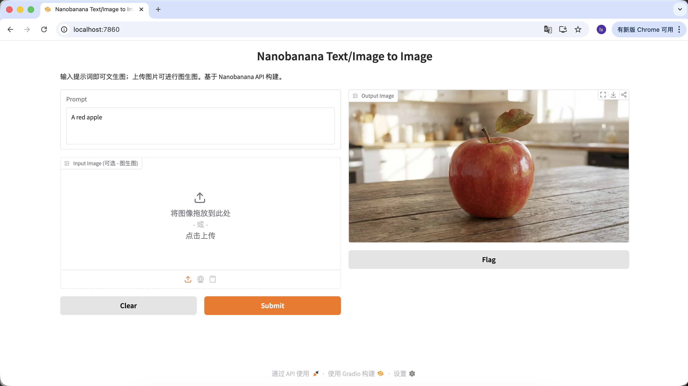

프롬프트를 더 풍부하게 만들어 설명과 제약을 추가할 수도 있습니다. 예를 들어 아래 프롬프트를 사용하면 훨씬 특별한 이미지를 얻을 수 있습니다.

```Plain
"A hyper-realistic close-up of a fresh red apple with water droplets on its skin, sitting on a dark rustic wooden table. Cinematic dramatic lighting, rim light, shallow depth of field, bokeh background, 8k resolution, macro photography."
(초사실적인 물방울 맺힌 신선한 빨간 사과 클로즈업, 어두운 거친 나무 테이블 위. 영화적 드라마 조명, 테두리 광, 얕은 피사계 심도, 배경 흐림, 8k 해상도, 접사 촬영.)
```

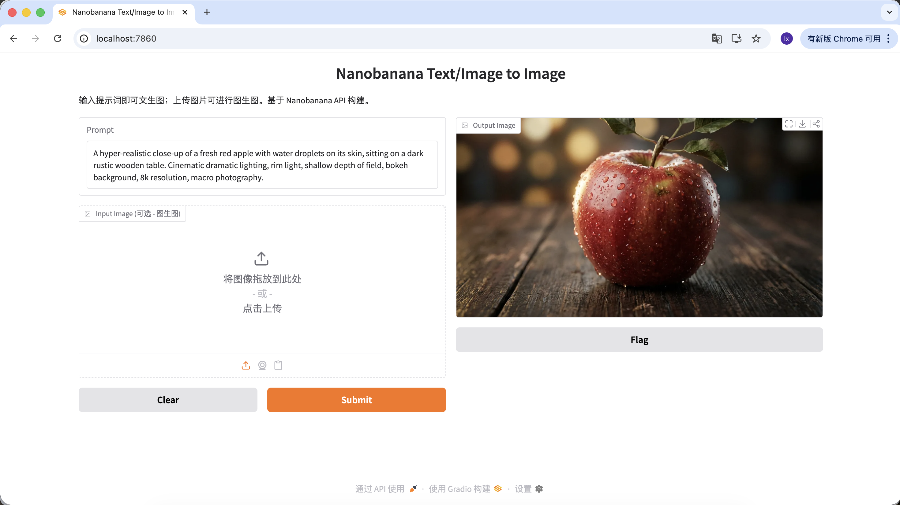

Output Image 영역에서 이미지를 클릭해 다운로드하면 로컬에 저장됩니다.


### 1.3 이미지 생성 모델의 일반적인 소재 생성 시나리오

실제 업무에서 대형 모델의 이미지 생성은 단일 예술 작품 창작보다는 **디자인 소재를 효율적으로 산출**하는 데 더 많이 활용됩니다.

디자인 분야 마케팅 계정의 고조회수 사례를 살펴보면, 대부분의 산출물이 두 가지 시나리오에 집중되어 있음을 알 수 있습니다.

* **텍스트-이미지 (0에서 1로)**
* **참고 이미지 기반 생성 (1에서 N으로)**

#### 첫 번째: 텍스트-이미지 — 디자인 소재 빠르게 확보하기

이 시나리오는 효율에 초점을 맞춥니다. 디자인의 빈 공간(빈 상태, 아바타, 삽화 등)을 채워야 할 때 AI는 본질적으로 **즉시 생성되는 이미지 라이브러리** 역할을 합니다.

1. ##### UI 디자인 소재 생성

* 트렌드: Dribbble에서 흔히 볼 수 있는 유리모피즘, 클레이 스타일 3D 아이콘
* 일반적인 표현: 투명한 소재, 발광 테두리, 사탕색 기능 또는 날씨 아이콘

**예시 Prompt:**

> A set of 3D weather icons (sun, cloud, rain), glassmorphism style, frosted glass texture, soft pastel gradient colors, soft studio lighting, isometric view, transparent background, 4k.

（3D 날씨 아이콘 세트, 유리모피즘 스타일, 젖빛 유리 질감, 부드러운 파스텔 그라데이션, 스튜디오 조명, 등각 뷰）

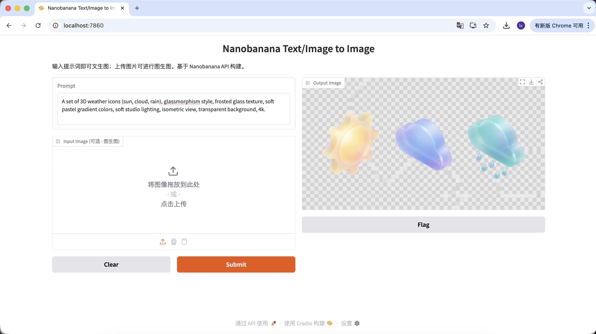

2. ##### 로고 생성

* 트렌드: 미니멀 라인, 기하학적 조합의 테크 감성 로고
* 일반적인 표현: 흑백 배색, 네거티브 스페이스 디자인, 명확한 브랜드 감성

**예시 Prompt:**

> Minimalist vector logo design for a tech brand "Coffee Code", combining a coffee cup with coding brackets < >, flat design, solid black lines, white background, Paul Rand style, svg.

（극도로 미니멀한 벡터 로고, 커피컵과 코드 기호 결합, 플랫 디자인, 순흑 라인）


3. ##### 공식 사이트 사용자 이미지 생성

* 트렌드: SaaS 공식 사이트에서 저작권 침해를 피하기 위한 3D 가상 아바타 활용
* 일반적인 표현: 친근한 표정, 만화적 비율, Pixar 또는 Memoji 스타일

**예시 Prompt:**

> Close-up portrait of a friendly young tech professional, smiling, Memoji 3D style, clay render, bright colors, soft lighting, solid plain background, Pixar character design.

（친근한 젊은 테크 종사자, 3D Memoji 스타일, 클레이 렌더링）


4. ##### 아티클 삽화 생성

* 트렌드: 테크 기업 블로그에서 흔히 볼 수 있는 추상적인 플랫 일러스트레이션
* 일반적인 표현: 보라-파랑 배색, 과장된 인물 비율, 플로팅 UI 요소

**예시 Prompt:**

> Editorial flat illustration representing remote work, a person sitting on a giant globe using a laptop, corporate memphis art style, vibrant colors (purple and teal), vector texture.

（원격 근무 테마 플랫 일러스트레이션, 기업 멤피스 스타일）


#### 두 번째: 참고 이미지 기반 생성 — 시각적 일관성 유지하기

이 시나리오는 **확장성**에 더 집중합니다. 이미 만족스러운 메인 비주얼이 있고, 스타일이 일관된 소재 세트를 생성해야 할 때 사용합니다.

5. ##### 메인 비주얼과 유사한 버튼 또는 인터랙션 소재 이미지 세트

게임 개발에서 UI 일관성은 매우 중요합니다. 이미 메인 화면의 **"PLAY"** 버튼이 있다고 가정할 때, 스타일이 통일된 기능 버튼 세트(예: 일시정지, 설정, 홈)를 확장해야 합니다. 손으로만 그리면 각 버튼의 광택, 원근감, 색상값의 완전한 일관성을 보장하기 어렵습니다.

**기본 작업 흐름:**

1. 기존의 파란색 "PLAY" 버튼 이미지를 저장합니다


2. 인터페이스의 **Input Image** 영역에 드래그해 이후 생성의 참고 원본으로 설정합니다
3. 프롬프트의 스타일 설명은 유지하고, 주체 내용만 수정합니다

이 흐름에서 주체 설명만 교체하면 기능은 다르지만 스타일이 일관된 버튼을 얻을 수 있습니다.

**예시 Prompt:**

**변형 A: 일시정지 버튼 (아이콘 유형)**

> A capsule-shaped game UI button with a white pause icon (two vertical bars) inside. Same glossy blue jelly style, shiny plastic texture, white thick outline, vector illustration, high quality.

（캡슐형 게임 UI 버튼, 흰색 일시정지 아이콘, 파란 젤리 질감）


**변형 B: 설정 버튼 (복잡한 아이콘)**

> A capsule-shaped game UI button with a white gear icon (settings symbol) inside. Same glossy blue jelly style, shiny plastic texture, white thick outline, vector illustration, high quality.

（캡슐형 게임 UI 버튼, 흰색 톱니바퀴 아이콘, 파란 젤리 질감）


**변형 C: 다시 플레이 버튼 (형태 변화)**

버튼 외형을 조정해야 할 경우, 프롬프트에 형태를 직접 설명하면 모델이 소재 특성을 유지하면서 구조를 변경하려 시도합니다.

> A round game UI button with a white circular arrow icon (replay symbol) inside. Same glossy blue jelly style, shiny plastic texture, white thick outline, vector illustration, high quality.

（원형 게임 UI 버튼, 순환 화살표 아이콘, 파란 젤리 질감）

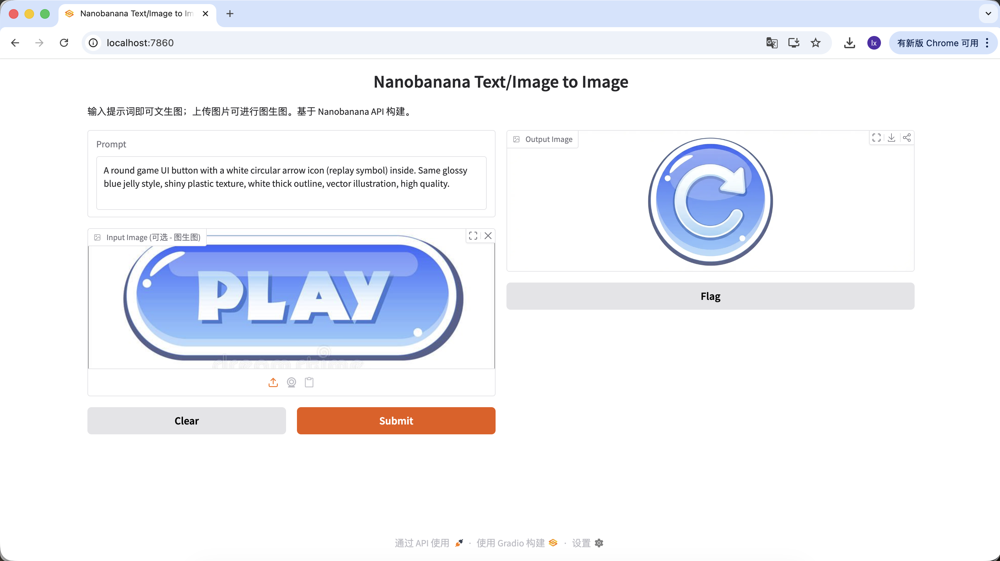

이 일련의 작업을 통해 버튼 기능과 아이콘을 교체할 수 있을 뿐만 아니라 버튼 형태도 변경할 수 있습니다. 그럼에도 모든 생성 결과는 소재, 배색, 광영에서 높은 일관성을 유지합니다. 이것이 바로 디자인 소재 확장 시나리오에서 대형 모델의 핵심 가치입니다.

## 제2장: 더 순종적인 이미지 생성 도우미 — Lovart를 예로

첫 번째 파트에서는 코드로 Nano Banana를 직접 호출하며 "입력하면 생성"되는 기본 흐름을 경험했습니다. 이 방식은 요구사항이 단순할 때는 문제가 없습니다. 하지만 생성 작업에 다음과 같은 제약이 포함되기 시작하면 이야기가 달라집니다.

* 스타일이 일관된 여러 장의 이미지가 필요한 경우
* 기존 결과를 반복적으로 조정해야 하는 경우
* 사용자 입력에 따라 생성 방향을 동적으로 수정해야 하는 경우

단일 호출 방식은 점차 부족해집니다.

이때 **AI 에이전트**를 도입해야 합니다. 이 절에서는 Lovart(美 샌프란시스코의 AI 디자인 에이전트)를 예시로, 이미지 생성 모델에 "사고 계층"이 추가되었을 때 전체 워크플로우가 어떻게 변화하는지 보여 드립니다. 참고로 여기서는 광고가 아니라, 여러분이 AI 에이전트의 편리함을 빠르게 체험할 수 있도록 돕기 위한 것입니다.

### 2.0 Lovart 처음 만나기: AI 디자인 에이전트

Lovart는 에이전트 기반의 디자인 도구 Web입니다. 일반 이미지 생성 도구와 달리, 생성 전에 "사고와 계획" 단계가 하나 더 있습니다.


Lovart에 입장하면 다음 몇 가지 제어 항목을 알아 두어야 합니다.

#### 모델 선택

입력란 하단의 큐브 아이콘을 클릭하면 현재 사용 가능한 생성 모델(GPT Image, Flux 등)을 확인할 수 있습니다.

앞의 예시와 일관성을 유지하기 위해 이 절에서도 Nano Banana를 하위 생성 모델로 계속 사용합니다.

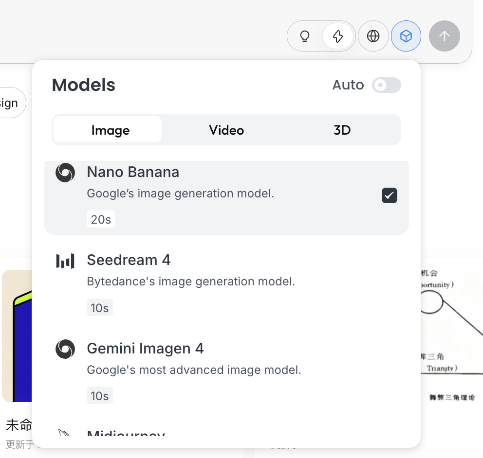

#### 사고 모드

이것이 Lovart의 핵심 스위치입니다.

* **Fast Mode (⚡)**: 원래 API에 가깝고, 응답이 빠르며, 단일 이미지·명확한 지시 생성에 적합합니다
* **Thinking Mode (💡)**: 에이전트 모드로, AI가 먼저 요구사항을 분해하고 프롬프트를 재작성한 후 생성을 실행합니다

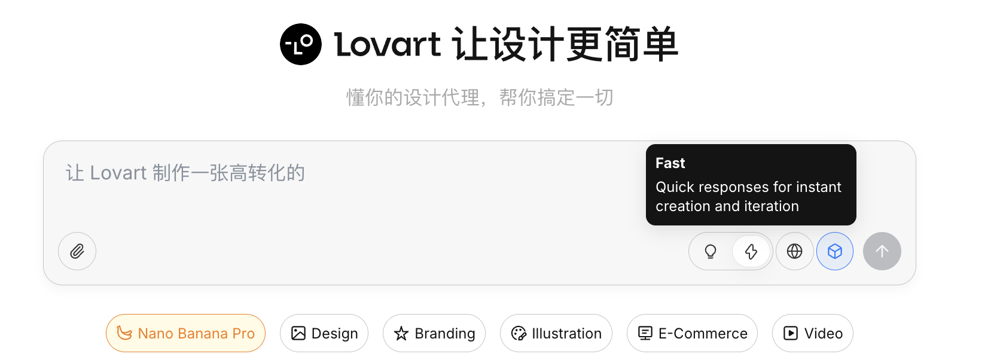

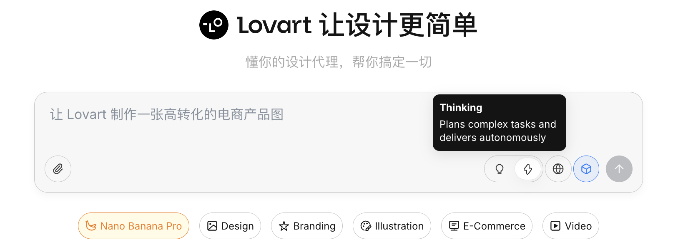

#### 인터넷 연결 기능

지구본 아이콘을 활성화하면 에이전트가 생성 과정에서 인터넷 정보(예: 디자인 트렌드, 배색 스타일)를 검색해 보조 입력으로 활용할 수 있습니다.

### 2.1 왜 원래 API만으로는 부족한가?

Python으로 품질 좋은 이미지를 생성할 수 있게 되었더라도, 원래 API는 복잡한 작업에서 여전히 한계가 있습니다. 핵심 이유는 원래 API가 본질적으로 지시형이기 때문입니다. 구체적인 대상을 생성하도록 요청하면 직접 실행할 수 있지만, 입력이 "완전한 게임 소재 세트를 기획하라"가 되면 목표를 여러 실행 가능한 단계로 능동적으로 분해하지 못합니다.

Lovart의 핵심 차이점은 에이전트 메커니즘에 있습니다. 사용자 입력과 이미지 생성 모델 사이에 이해와 계획을 위한 논리 계층을 추가합니다. 먼저 사용자 의도를 파악하고, 작업을 분해하며, 프롬프트를 재작성한 후 생성을 실행합니다.

### 2.2 실전 데모: 5분 만에 IP 이모티콘 세트 만들기

**"프로그래머 오리 IP 이모티콘 세트 제작"**을 예시로, 에이전트가 전체 흐름에 어떻게 참여하는지 살펴봅니다.

#### 단계 1: 기획 (에이전트의 사고 능력)

**원래 API의 문제점:**
캐릭터 설정과 감정 상태를 직접 생각해야 하고, 각 이미지마다 별도로 프롬프트를 작성해야 합니다.

**Lovart의 방식:**

1. 💡 **Thinking Mode**를 켭니다
2. 한 줄의 지시를 입력합니다.

> 프로그래머 오리 IP 이모티콘 세트를 디자인해 줘. 스타일은 플랫하고 귀엽게

AI는 즉시 그림을 그리지 않고, 먼저 인터넷에서 관련 프로그래머 오리 디자인을 검색합니다. 분해된 방안을 출력하고, Debug, Coffee Break, Panic 등의 장면을 자동으로 생성하며, 여러 시각 설명을 대응해 생성합니다.

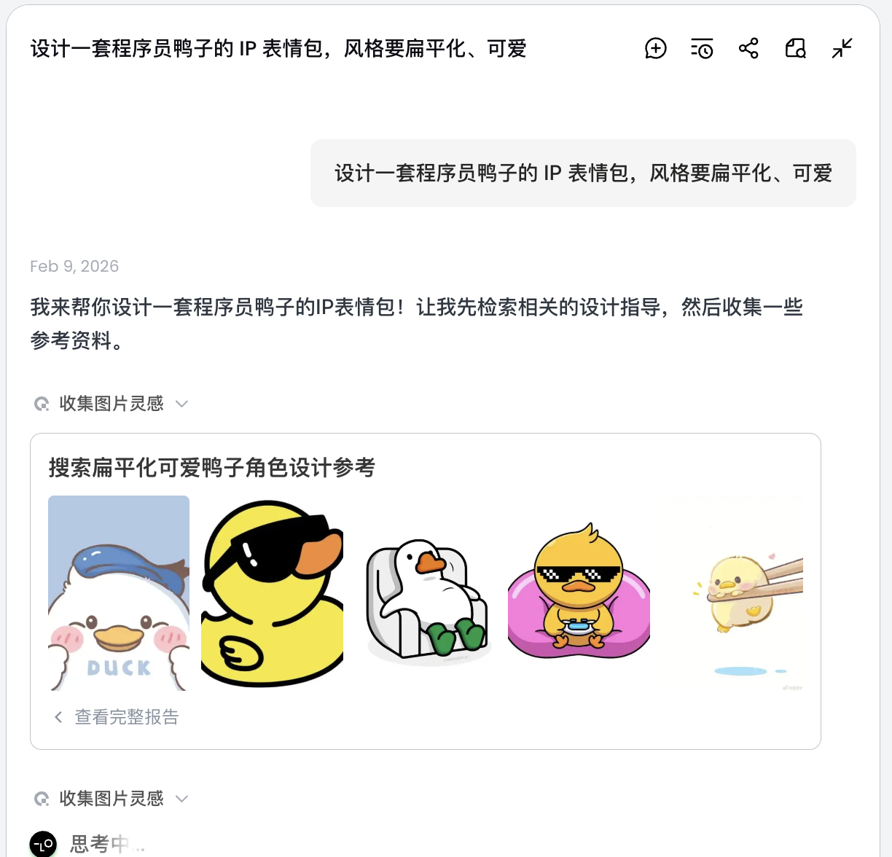

이 단계에서 AI는 "실행자"에서 "기획자"로 변합니다. AI가 요구사항을 분석한 후, Lovart의 캔버스 영역에서 다양한 스타일과 내용의 프로그래머 오리 이미지를 볼 수 있습니다. 마음에 드는 스타일을 선택하면 됩니다.


#### 단계 2: 일관성 (참고 기반 시각적 앵커)

Lovart에서 이미지는 결과물일 뿐만 아니라 이후 생성에도 참여합니다.

##### 완전한 참고 이미지

* 초안에서 가장 만족스러운 "표준 오리"를 하나 선택하고, 캔버스 영역에서 해당 이미지를 클릭합니다
* 해당 이미지가 자동으로 대화 영역에 Reference로 나타납니다


* 새로운 동작(예: 기뻐하는)을 입력하고 생성합니다

생성 결과는 원본의 배색, 비율, 세부 요소를 이어받습니다.


##### 부분 참고 / 다중 이미지 통합

전체 이미지를 참고로 사용하는 것 외에도, Lovart는 다음을 지원합니다.

* **이미지의 부분 영역만 선택** (예: 모자나 표정만 참고)

캔버스 영역 왼쪽 탭바에서 「Mark」키를 선택하고, 대상 이미지의 부분 영역을 표시하면 해당 내용이 자동으로 대화창에 동기화됩니다. 예를 들어 여기서는 배경색을 변경하도록 선택할 수 있습니다.


새로 생성된 이미지는 배경색만 변경된 것을 확인할 수 있으며, 이는 우리가 입력한 요구사항과 일치합니다.

* **여러 이미지에서 각각 하위 요소를 참고**해 새로운 결과물을 조합 생성하는 것도 가능합니다

예를 들어 A 이미지의 캐릭터 주체는 유지하면서 모자만 B 이미지 스타일로 교체할 수 있으며, 에이전트가 백그라운드에서 이러한 시각적 제약을 자동으로 통합합니다.

프로그래머 오리를 예로 들면, 첫 번째 이미지의 오리 이미지를 유지하면서 두 번째 이미지의 주체 요소로 교체할 수 있습니다.


최종 효과도 매우 두드러집니다. 다른 조합도 시도해 보세요!

#### 단계 3: 실용화 (에이전트의 도구 호출)

생성이 완료된 후 다음 작업을 바로 실행할 수 있습니다. 확대, 배경 제거, 지우기 등

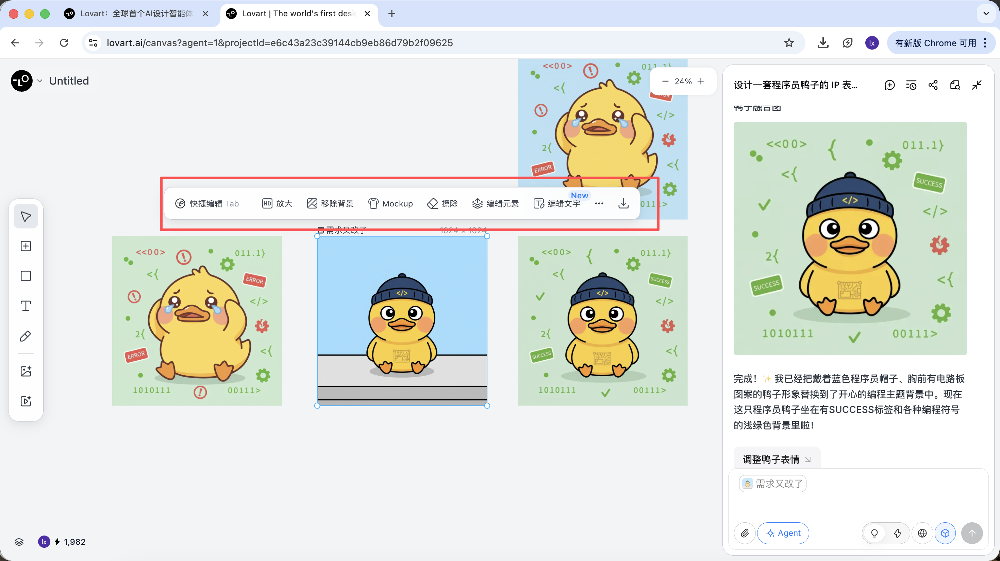

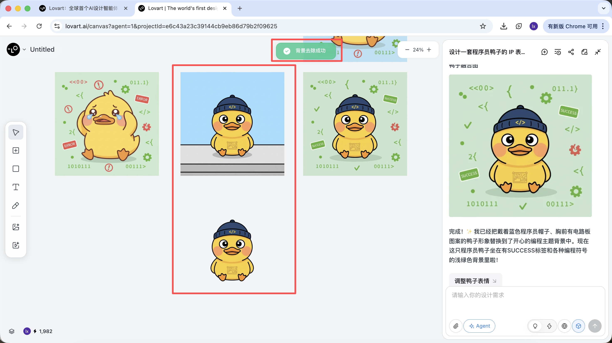

이것은 단순한 필터가 아니라, 에이전트가 다양한 도구를 자동으로 스케줄링해 완성한 결과입니다.

기본 스타일을 결정한 후에는 일련의 이모티콘 이미지를 매우 빠르게 생성할 수 있습니다.

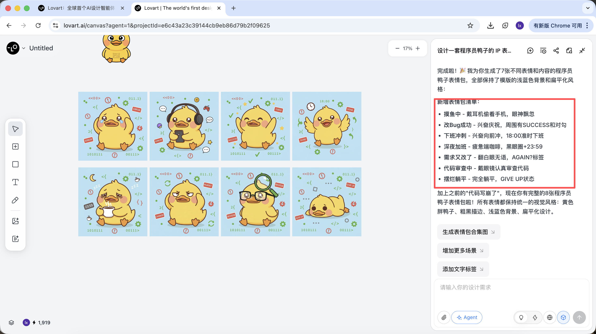

최종적으로 얻는 것은 단순한 전시 이미지가 아닌, 바로 납품 가능한 생산급 소재입니다.

### 2.3 이용 방법 및 요금제 안내

Lovart는 구독형 요금제를 채택하며, 요금제별로 사용 한도와 기능 권한이 다릅니다. 자세한 내용은 공식 사이트에서 확인하시기 바랍니다.

이 튜토리얼은 어떠한 요금제도 추천하거나 비교하지 않습니다. 실제 사용 중 필요하다면 개인 상황에 따라 유료 업그레이드를 선택할 수 있습니다.
현재 **알리페이** 등의 방식으로 결제가 가능합니다.


#### 소결

Lovart는 하위 모델을 대체하는 것이 아니라, 에이전트 메커니즘을 통해 이미지 생성을 "단일 실행"에서 "연속 워크플로우"로 업그레이드합니다.

작업에 기획, 일관성, 납품이 포함되기 시작하면 이러한 도구의 강점이 매우 뚜렷해집니다.

## 제3장: 직접 만들어 보는 스마트 드로잉 도우미

Lovart를 직접 사용하는 것 외에도, 간단한 버전의 드로잉 도우미를 직접 구현할 수 있습니다.

이 장에서는 "아티클 자동 삽화"를 예시로, 실제 문제에서 출발해 사고 능력이 있는 에이전트를 단계적으로 구축합니다.

### 3.1 문제점 도입: 왜 긴 아티클을 이미지 생성 모델에 바로 전달하면 안 되나요?

비교적 긴 아티클을 Nano Banana에 직접 입력하고 삽화를 요청하면 대부분 이상적인 결과를 얻기 어렵습니다. 이유는 모델이 "그림을 잘 못 그리는" 것이 아니라, **긴 텍스트를 잘 이해하지 못하기** 때문입니다.

이미지 생성 모델은 짧고 명확한 시각 설명을 처리하는 데 더 적합합니다. 입력이 구조, 핵심, 컨텍스트 관계를 포함하는 아티클이 되면, 모델은 어떤 내용이 화면에서 정말로 표현해야 할 부분인지 판단하지 못합니다. 이는 생성 결과가 주제에서 벗어나거나, 산발적인 세부 사항만 포착하고 전체적인 개괄 능력이 부족한 결과로 이어집니다.

본질적으로 이미지 모델은 "실행" 능력만 있고, 텍스트를 분석하고 취사선택하는 과정이 없습니다.


### 3.2 해결 방안: 에이전트를 사용해 「이해」와 「실행」을 분리하기

이 문제를 해결하는 핵심은 더 복잡한 프롬프트가 아니라, **그림을 그리기 전에 먼저 생각을 정리하는 것**입니다. 따라서 생성 흐름에 독립적인 「사고 계층」을 도입하고, 이를 기반으로 가장 단순하고 사용 가능한 에이전트를 구축합니다.

이 에이전트의 핵심 목표는 단 하나입니다. **최종 생성된 이미지가 가능한 한 사용자의 실제 표현 의도에 부합하도록 하는 것입니다.**

전체 흐름을 요약하면: **긴 텍스트 입력 → 언어 모델 이해 및 판단 → 적합한 시각 프롬프트 생성 → 이미지 모델 실행 생성 → 이미지 출력**


그렇다면 우리가 구축하는 에이전트는 어떻게 사용자의 의도를 파악할 수 있을까요?

여기서는 간단화된 **"사고 계층"**을 만들기로 하고, 세 가지 다른 의도를 설정합니다. 유효하지 않은 입력, 직접 이미지 생성, 이해가 필요한 긴 텍스트입니다.

이 에이전트에서 각 역할의 분담은 네 가지로 요약할 수 있습니다.

1. **언어 모델이 의사결정 핵심 역할**
   아티클 내용을 이해하고, 사용자 입력의 의도를 판단하며, 작업을 적합한 생성 경로로 배분하고, 다음에 "어떻게 할지"와 이미지 생성 프롬프트를 어떻게 생성할지를 결정합니다.
2. **이미지 모델이 실행자 역할**
   이미지 모델은 이해와 판단에 참여하지 않고, 이미 정리된 시각 지시만 받아 이미지 렌더링에만 집중합니다.
3. **사용자가 개입 가능한 안내자 역할**
   텍스트를 직접 입력하는 것 외에도, 사용자는 과정 중에 생성된 프롬프트를 수동으로 조정하거나 참고 이미지를 추가해 생성을 보조할 수 있으며, 최종 결과에 대한 안내와 미세 조정을 수행합니다.
4. **Gradio와 백엔드 API가 전체 지지 계층 역할**
   인터페이스, 모델 호출, 결과 표시를 하나로 연결해 전체 에이전트가 완전한 Web 애플리케이션 형태로 안정적으로 실행될 수 있도록 보장합니다.


### 3.3 실전 준비: API 획득

흥미롭지 않으신가요! 위의 흐름을 실행하려면 두 가지 유형의 API만 준비하면 됩니다.

#### 손: Nano Banana API (이미지 생성)

제1장에서 이미 설정한 API Key와 API URL을 그대로 사용합니다. 추가 설정이 필요하지 않습니다.

#### 뇌: SiliconFlow API (텍스트 사고)

"사고 계층" 역할을 담당할 대형 언어 모델이 필요합니다. 이 튜토리얼에서는 SiliconFlow(中 AI 모델 추론·호스팅 플랫폼)가 제공하는 모델 서비스를 사용합니다. [https://cloud.siliconflow.cn](https://cloud.siliconflow.cn/)


SiliconFlow는 OpenAI API 규격과 호환되는 인터페이스를 제공하므로, 표준 네트워크 요청으로 프로젝트에서 매우 편리하게 호출할 수 있습니다. 여기서는 무료 Qwen2.5-7B-Instruct 모델을 선택하며, 호출에 필요한 내용은 모두 아래 프롬프트에 작성되어 있습니다. 시작하기 전에 공식 사이트에서 계정을 등록하고 API Key를 생성하기만 하면 됩니다.


해당 Key는 이후 모델 호출에 사용됩니다.

### 3.4 에이전트 구축:

이번 실험은 주로 Trae를 사용해 코드를 작성합니다. 이 튜토리얼에서 선택한 모델은 Gemini-3-Pro-Preview입니다. 전체 접근 방식은, 새 프로젝트 생성 후 아래의 완전한 프롬프트를 대화창에 복사해 입력하고, 순차적으로 API KEY를 교체한 후 코드를 실행해 테스트를 완료하는 것입니다.


#### 단계 1️⃣: Gradio Blocks 기본 프레임워크와 인터페이스 레이아웃

이 단계에서 주요 목표는 전체 에이전트의 "외관"을 먼저 구축하는 것, 즉 프론트엔드 페이지 디자인을 구현하는 것입니다. 아래 프롬프트를 Trae 대화창에 복사해 구현한 후, 로컬 URL(보통 http://127.0.0.1:7860)을 얻어 인터페이스를 확인하고 구현 효과를 검증할 수 있습니다.

```Plain
모듈 1: Gradio Blocks 기본 프레임워크와 인터페이스 레이아웃
1. 작업 목표
· Gradio 4.0.0+ Blocks 레이아웃을 기반으로 「LLM+Nanobanana 텍스트-이미지」 프로젝트의 기본 인터페이스를 구현합니다. 고정 좌우 분할 레이아웃을 엄격히 따르고, 모든 UI 컴포넌트를 초기화하며 올바른 초기 상태를 설정합니다.

2. 기술 스택 요구사항
· 반드시 Gradio 4.0.0+ Blocks 모드로 개발해야 하며, Interface 모드 사용은 금지합니다.
· 의존성: gradio>=4.0.0, pillow>=10.0.0 (임포트만 하고 이미지 처리 로직은 아직 구현하지 않음)
· 코드는 모든 필요한 임포트 문을 포함한 완전히 실행 가능한 Python 파일이어야 합니다.

3. 인터페이스 레이아웃 규칙 (핵심 제약, 실전 세부사항 통합)
· 전체 레이아웃:
  페이지 제목: LLM 기반 텍스트-이미지 전체 흐름 도구
  고정 좌우 분할: 왼쪽 60% 너비, 오른쪽 40% 너비, gr.Row와 gr.Column으로 비율 제어
· 왼쪽 60% (프롬프트 생성 흐름 영역) 컴포넌트 목록:
  input_text: gr.Textbox, 라벨「입력 텍스트(튜토리얼 단락 / 드로잉 지시)」, lines=6, placeholder「삽화가 필요한 튜토리얼 텍스트 또는 직접 드로잉 지시를 입력하세요...」
  identify_intent_btn: gr.Button, value="의도 인식", 초기 상태 정상 클릭 가능
  intent_status: gr.Textbox, 라벨「의도 유형 / 처리 상태」, lines=2, interactive=False, 초기값「의도 미인식」
  system_prompt: gr.Textbox, 라벨「System Prompt (아티클 삽화 의도에서만 편집 가능)」, lines=4, interactive=False, placeholder「LLM 프롬프트 생성 제약 규칙...」
  confirm_prompt_btn: gr.Button, value="이미지 생성 프롬프트 확인 생성", interactive=False (오조작 방지 초기 비활성화)
  generation_prompt: gr.Textbox, 라벨「이미지 생성 프롬프트 (편집 가능)」, lines=3, interactive=True, 초기값 빈 문자열, placeholder「생성된 영문 이미지 생성 프롬프트가 여기에 표시되며 수동 수정 가능...」
· 오른쪽 40% (Nanobanana 이미지 생성 기능 영역) 컴포넌트 목록:
  ref_image: gr.Image, 라벨「참고 이미지 (선택, 이미지-이미지)」, type=filepath, height=300, 업로드 허용
  generate_btn: gr.Button, value="이미지 생성", interactive=False (초기 비활성화, 프롬프트 없으면 클릭 불가)
  result_image: gr.Image, 라벨「생성 결과」, type=pil, height=300, 초기값 빈 상태, interactive=False

4. 인터랙션 로직 요구사항
· 모든 컴포넌트의 interactive 초기 상태는 위의 설정을 엄격히 따르고, 이후 함수를 통해 동적으로 업데이트합니다.
· 버튼 비활성화 상태는 직관적(회색 처리)으로, 사용자 오조작을 방지합니다.

5. 출력 요구사항
· 인터페이스 레이아웃과 컴포넌트 초기화만 구현한 완전한 Python 코드를 생성합니다. 비즈니스 로직은 포함하지 않습니다.
· 코드 주석이 명확하고, 컴포넌트 명명은 실전 버전과 일치합니다 (input_text/identify_intent_btn 등).
· 코드를 바로 실행할 수 있으며, 인터페이스 구조가 설명과 완전히 일치합니다.
```

브라우저에서 http://127.0.0.1:7860을 열면 Trae가 우리의 요구사항에 따라 다음과 같은 웹 페이지를 생성한 것을 볼 수 있습니다. 요구사항과 대체로 일치하며, 다음 단계 생성으로 진행할 수 있습니다.

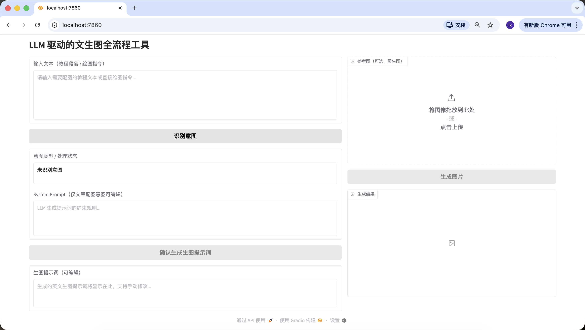

#### 단계 2️⃣: LLM 의도 인식 모듈 (Siliconflow API)

일상적으로 VLM으로 그림을 그릴 때 다음 세 가지 일반적인 입력 상황이 있을 수 있습니다.

1. 무의미한 내용, 예를 들어 "안녕하세요", "오늘 밥 먹었나요" 등, 대응하는 그림을 그릴 수 없습니다.
2. 아티클/긴 텍스트, 글자 수가 많고(약 200자 정도의 구조가 있는 아티클 등), 아티클의 구조와 내용을 먼저 이해한 후 이 텍스트를 완전히 개괄할 수 있는 이미지를 어떻게 생성할지 고려해야 합니다.
3. 직접 드로잉 지시, 예를 들어 "목욕하는 강아지를 그려줘" 등, 요구사항이 이미 매우 구체적으로 서술되어 있어 바로 이미지를 생성할 수 있습니다.

앞의 방법과 동일하게, 아래 프롬프트를 Trae 대화창에 복사해 구현하고, 앞의 단계에서 획득한 API를 입력합니다.

```Plain
모듈 2: LLM 의도 인식 모듈 (Siliconflow API)
1. 작업 목표
이미 구현된 Gradio 인터페이스를 바탕으로 「의도 인식」 버튼에 클릭 로직을 추가하고, Siliconflow API를 호출해 의도 인식을 완료한 후 컴포넌트 상태를 연동합니다.

2. 기술 스택 요구사항
Gradio 4.0.0+ Blocks 기반
의존성: requests>=2.31.0, openai
모듈 1 인터페이스 + 본 모듈 로직을 포함한 완전히 실행 가능한 Python 파일 출력

3. 핵심 비즈니스 규칙 (절대 벗어나지 말 것)
· 의도 분류 규칙 (3가지만, 숫자 + 설명 형식으로 엄격히 반환)
  1 = 무의미한 내용: 잡담·인사·무관한 대화만 있고, 드로잉 또는 삽화 수요 없음 (예: "안녕하세요" "오늘 뭐 먹었어요")
  2 = 아티클 / 긴 텍스트 삽화 수요: 완전한 아티클·튜토리얼·단락·설명문을 입력한 경우, 내용이 서술/설명/강의 성격이며, 이 내용에 삽화를 생성해야 하는 의도를 내포함. 사용자가 "이 글에 삽화를 넣어줘"라고 명시하지 않아도 됨
  3 = 직접 드로잉 지시: 사용자가 짧고 명확한 드로잉 명령을 입력한 경우, 긴 텍스트 배경 없이 직접 특정 내용을 그려달라고 요청함 (예: "Apple 스타일의 고양이를 그려줘")
· LLM 호출 제약 (실전 버전 템플릿 통합)
  API 주소: https://api.siliconflow.cn/v1/chat/completions
  모델: Qwen/Qwen2.5-7B-Instruct
  temperature=0.1
  통일 정의 코드:
python
실행
LLM_BASE_URL = "https://api.siliconflow.cn/v1"
LLM_API_KEY = ""  # 사용자가 직접 교체
LLM_MODEL = "Qwen/Qwen2.5-7B-Instruct"# 실전 검증된 의도 인식 템플릿 (코드에 고정)
INTENT_PROMPT_TEMPLATE = """你需要识别用户输入文本的意图，仅返回以下 3 类结果中的一种（格式：数字 + 中文描述）：
1 = 无意义内容；2 = 文章 / 长文本配图需求；3 = 直接绘图指令。

用户输入：{user_input}

识别结果：
仅提取返回结果中的数字和描述，禁止额外内容。"""

4. 컴포넌트 연동 규칙
· 결과 1: intent_status에 「1 = 무의미한 내용: 드로잉 수요 없음」 표시, system_prompt 비활성화 유지, confirm_prompt_btn 비활성화
· 결과 2: intent_status에 「2 = 아티클 / 긴 텍스트 삽화 수요: 입력 내용에 삽화 생성」 표시, system_prompt 활성화 및 기본 규칙 채우기, confirm_prompt_btn 활성화
· 결과 3: intent_status에 「3 = 직접 드로잉 지시: 지시에 따라 이미지 생성」 표시, system_prompt 비활성화 및 기본 규칙 채우기, confirm_prompt_btn 활성화

5. 예외 처리
API 예외, 파싱 예외 모두 친화적인 알림을 제공하고, 크래시 없이 컴포넌트를 초기 상태로 복원합니다.

6. 출력 요구사항
완전히 실행 가능한 코드를 생성하고, LLM_API_KEY만 교체하면 사용할 수 있으며, 로직이 명확하고 주석이 완전하며, 의도 인식 템플릿은 실전 버전을 엄격히 사용합니다.
```

이전의 http://127.0.0.1:7860 주소를 새로고침하고, 세 가지 상황을 올바르게 감지할 수 있는지 테스트를 시작합니다.

1. 무의미한 내용의 경우, "안녕하세요", "감사합니다" 등을 입력해 보면 정상적으로 인식되는 것을 확인할 수 있습니다.


2. 아티클/긴 텍스트의 경우, 여기서는 AI가 생성한 인공지능을 설명하는 텍스트를 선택했습니다. 자신의 논문 단락을 사용해 테스트해 볼 수도 있습니다.

```Plain
人工智能正在以前所未有的深度和广度重塑教育生态系统。通过自适应学习算法，AI系统能够构建每个学生的认知图谱，实时追踪他们的知识掌握轨迹，并动态调整教学内容的难度和呈现方式。在传统课堂环境中，教师往往难以同时满足不同学习风格和能力水平的学生需求，而基于深度学习的教育平台可以分析学生在交互式模拟实验中的行为模式，识别他们在量子力学或微积分等复杂概念理解上的微妙障碍，并提供精准的认知支架。

高级自然语言处理引擎驱动的虚拟导师不仅能够解构开放性问题，如"如何评价法国大革命对现代民主制度的影响"，还能引导苏格拉底式对话，激发批判性思维。当学生撰写关于气候变化对极地生态系统影响的论文时，AI写作助手可以分析其论证逻辑的严密性，指出数据引用中的时效性问题，并建议更精准的科学术语。在特殊教育领域，计算机视觉技术使AI能够识别自闭症谱系儿童在社交互动中的非语言线索，调整干预策略，而情感计算算法则帮助检测在线学习时的挫折感，及时提供鼓励性反馈。

然而，这种技术融合引发了一系列伦理困境。算法偏见可能无意中边缘化特定文化背景的学生，数据采集的透明度问题引发了对学术隐私的关切，而过度依赖自动化评分系统可能削弱教师对学生思维过程的深层理解。更复杂的是，当AI开始生成高度逼真的虚拟实验室体验时，我们需要重新定义"实践经验"在教育中的价值。未来教育的范式可能演变为人类教师专注于培养创造力、同理心和道德判断力，而AI系统则承担知识传递、技能训练和个性化评估的职能，形成一种协同进化的教育共生体，既能发挥机器的计算优势，又能保留人类教育的独特温度.
```

마찬가지로 감지에 성공했습니다.


3. 직접 드로잉 지시의 경우, 여기서는 "고양이를 그려줘"를 입력했으며, 마찬가지로 정확하게 감지되었습니다.

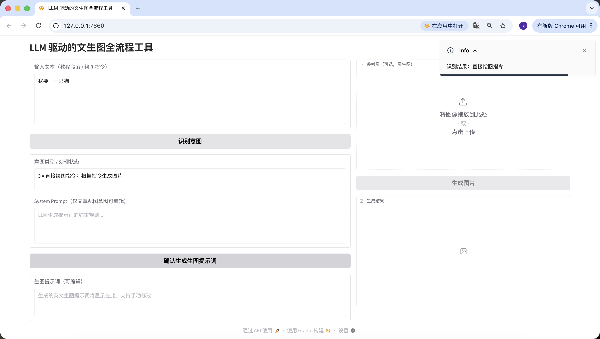

여기까지 두 번째 단계인 의도 인식을 성공적으로 구현했습니다.

#### 단계 3️⃣: 이미지 생성 프롬프트 생성 모듈 (LLM 2차 호출)

의도 인식 후, 아티클이나 긴 텍스트의 경우 매우 중요한 단계가 하나 더 있습니다. 바로 그림 그리기 프롬프트를 생성하는 것이며, 이것이 바로 이 에이전트의 핵심입니다.

```SQL
모듈 3: 이미지 생성 프롬프트 생성 모듈 (LLM 2차 호출)
1. 작업 목표
의도 인식을 바탕으로 「이미지 생성 프롬프트 확인 생성」 버튼 로직을 구현합니다. LLM을 호출해 텍스트를 드로잉에 적합한 영문 시각 프롬프트로 최적화하고, 편집 입력란에 채운 후 「이미지 생성」 버튼을 연동합니다.

2. 기술 스택 요구사항
모듈 2와 동일, 출력 완전한 코드 = 모듈 1 + 모듈 2 + 본 모듈
모듈 2에서 정의한 LLM_BASE_URL, LLM_API_KEY, LLM_MODEL을 공용으로 사용하며, 새 비밀키를 추가하지 않습니다.

3. 핵심 비즈니스 규칙 (실전 버전 프롬프트 조합 로직 통합)
· 프롬프트 생성 입력 규칙 (반드시 엄격히 따를 것)
  이미지 생성 프롬프트 생성은 단순 문자열 연결이 아니라 표준 Chat 메시지 목록을 구성합니다. 코드 구조는 다음과 같습니다:
python
실행
messages=[# System 역할: 웹 페이지에서 사용자가 최종 확인/편집한 system_prompt 내용{"role": "system", "content": final_system_prompt},# User 역할: 처리할 데이터를 담고 작업 목표를 명확히 함{"role": "user", "content": f"请为以下内容生成视觉提示词：\n\n{user_input}"}]
  의도 2일 때: System 내용은 사용자가 편집한 system_prompt 최종 버전을 사용
  의도 3일 때: System 내용은 비활성화 상태에서 채워진 기본 규칙을 사용
  user_input은 사용자가 최초로 input_text 입력란에 입력한 원본 텍스트입니다.
· 실전 검증된 System Prompt 프리셋 (코드에 고정)
python
실행
SYSTEM_PROMPT_DEFAULT = """你现在是一个创建NanoBanana画图提示词的助手。
需要根据我的内容处理，我这个图片的作用是能说明这一段在说什么，并且让大家知道这段话的上下结构就是整体说的是什么意思。
里面可能会类似PPT有一些讲解（如：左上角展示核心观点，右下角展示数据）。
设计风格要求：简约，Apple设计思维（Apple Design Philosophy）。
约束：请直接返回NanoBanana可用的英文提示词，不要返回任何解释、前缀或多余的废话。"""
· LLM 호출 제약
  모듈 2와 동일한 LLM_BASE_URL, LLM_API_KEY, LLM_MODEL 공용
  temperature=0.7 (프롬프트의 창의성과 적합성 보장)
  max_tokens=200 (출력 길이 제한, 프롬프트 제약 충족)
  위의 표준 Chat 메시지 목록 구조를 엄격히 사용하고, 문자열 연결 금지
· 입출력 예시 (핵심 참고)
  입력 예시 1 (아티클 삽화 의도): 원본 텍스트: 「AI가 교육을 어떻게 변화시키는가: 인공지능 기술의 발전으로 교사의 역할이 지식 전달자에서 안내자로 바뀌고, AI 도우미가 학생의 개인화 학습을 보조하며, 교실에서 인간-기계 협업이 일상화되고 있다.」 최종 System Prompt: SYSTEM_PROMPT_DEFAULT (미수정) 예상 출력: "Minimalist illustration, Apple Design Philosophy, 1024x1024. Top left shows 'AI + Education' core concept, bottom right shows data of teacher-student-AI collaboration, soft color palette, clean lines, no redundant elements."
  입력 예시 2 (직접 드로잉 지시): 원본 텍스트: 「Apple 스타일의 고양이를 그려줘, MacBook 옆에 앉아 있는」 최종 System Prompt: SYSTEM_PROMPT_DEFAULT (비활성화 상태) 예상 출력: "Minimalist cat, Apple style, 1024x1024, sitting next to a silver MacBook, clean white background, soft shadows, geometric shapes, no extra details."
· 프롬프트 출력 강제 제약
  순수 영문, 중문 없음
  Apple Design Philosophy/Apple style + 1024x1024 반드시 포함
  길이 50~200자, 코드 내 검증
  추가 설명·접두사·불필요한 내용 없이 프롬프트 본문만 반환

4. 컴포넌트 연동 규칙
생성 성공: generation_prompt 입력란에 프롬프트 채우기, generate_btn 활성화, intent_status에 「프롬프트 생성 성공, 수정 후 이미지 생성 가능」 추가
생성 실패: 구체적인 원인 알림 (예: API 호출 실패, 길이 미달), generate_btn 비활성화 유지, generation_prompt 입력란 빈 상태
사용자가 generation_prompt 입력란을 수동 수정/비우는 경우:
  비울 때 generate_btn 자동 비활성화
  비어 있지 않을 때 generate_btn 활성화 유지

5. 예외 처리
API 호출 실패: 「프롬프트 생성 실패: {구체적인 오류 정보}」친화적 알림, 크래시 없음
프롬프트 검증 실패: 원인 명확히 알림 (예: "Apple style 미포함" "길이 40자만"), 재시도 허용
응답 파싱 실패: 「LLM 반환 결과 파싱 불가, 재시도 하세요」알림

6. 출력 요구사항
완전히 실행 가능한 코드, LLM_API_KEY만 교체하면 사용 가능
코드 구조 명확, 주석 완비, 인터페이스 미관 간결
표준 Chat 메시지 목록 구조 엄격 구현, 파라미터와 예시 로직 일치
프롬프트 길이, 내용 검증 로직 포함, 오류 알림 친화적
```

마찬가지로 두 번째 단계의 텍스트를 복사해 감지를 진행합니다.

주목할 점은, 여기서 이미지 생성 프롬프트를 생성하는 System Prompt를 사전 설정했다는 것입니다.

> 당신은 현재 Nano Banana 드로잉 프롬프트를 생성하는 도우미입니다.
> 내 내용에 따라 처리가 필요하며, 이 이미지의 역할은 이 단락이 무엇을 말하는지 설명하고, 이 텍스트의 전체 구조가 전반적으로 무엇을 의미하는지 알려주는 것입니다.
> 내부에는 PPT와 유사한 설명(예: 왼쪽 상단에 핵심 관점 표시, 오른쪽 하단에 데이터 표시)이 있을 수 있습니다.
> 디자인 스타일 요구사항: 심플, Apple 디자인 철학(Apple Design Philosophy).
> 제약: Nano Banana에서 사용 가능한 영문 프롬프트만 직접 반환하고, 어떠한 설명, 접두사, 불필요한 내용도 반환하지 마세요.

다른 사전 설정 템플릿으로 교체하고 싶다면, 앞의 프롬프트에서 수정하거나 Trae에서 대화를 통해 직접 수정할 수 있습니다.


하위 코드를 수정하는 것 외에도, 웹 페이지에서도 빠르게 편집할 수 있습니다. 예를 들어, 여기서 "앞에 Pic Prompt를 추가해줘"라는 문장을 추가하면, 새로 생성된 프롬프트 앞에도 해당 내용이 포함된 것을 확인할 수 있습니다. 이러한 설계는 이미지 생성 프롬프트의 System Prompt를 빠르게 수정하고, 스타일을 빠르게 전환할 수 있도록 하기 위한 것입니다.


#### 단계 4️⃣: Nano Banana 텍스트-이미지 / 이미지-이미지 모듈

드디어 마지막 단계입니다. 이미지 생성 모델을 연결하지 않으면 완전한 에이전트가 아닙니다!

```Bash
모듈 4: Nanobanana 텍스트-이미지 / 이미지-이미지 모듈 (최종 버전)
1. 작업 목표
「이미지 생성」 버튼 로직을 구현합니다. 실제 Nanobanana API를 호출하고, 텍스트-이미지 / 이미지-이미지를 지원하며, Base64를 파싱해 이미지를 표시합니다.

2. 기술 스택 요구사항
Gradio 4.0.0+ Blocks 기반
의존성: requests, pillow, base64, io, re
완전한 코드 = 모듈 1+2+3 + 본 모듈

3. 핵심 API 설정 (실전 검증 고정)
고정 코드 설정:
python
실행
# 코드에 고정된 API 설정
NANOBANANA_API_URL = "https://api.zyai.online/v1/chat/completions"
NANOBANANA_MODEL = "gemini-2.5-flash-image"
NANOBANANA_API_KEY = ""  # 사용자가 직접 교체
인증 방식: Header Authorization: Bearer {NANOBANANA_API_KEY}

4. 이미지 전처리 요구사항 (반드시 구현) image_to_base64_data_uri(ref_image_path) 함수를 구현합니다. 핵심 로직:
PIL 이미지를 PNG 형식으로 변환
1024x1024 해상도로 자동 크기 조정
투명 채널을 흰색 배경으로 변환
Base64로 인코딩, 반환 형식: data:image/png;base64,...

5. 요청 구성 규칙 (실전 버전 분기 로직 엄격히 따를 것)
· 핵심 함수 정의: generate_image(prompt, ref_image_path) 함수를 구현합니다:
  입력 파라미터: prompt (generation_prompt 입력란 내용), ref_image_path (ref_image 업로드 파일 경로)
  반환: PIL Image (result_image에 표시) 또는 오류 알림
· 로직 분기 1: 순수 텍스트-이미지 (ref_image_path가 비어 있는 경우)
python
실행
messages = [{"role": "user", "content": prompt}]
· 로직 분기 2: 이미지-이미지 (ref_image_path에 값이 있는 경우)
python
실행
# 먼저 이미지 전처리 함수를 호출
image_base64 = image_to_base64_data_uri(ref_image_path)
messages = [{"role": "user","content": [{"type": "text", "text": prompt},{"type": "image_url", "image_url": {"url": image_base64}}]}]

6. 응답 파싱 요구사항 (두 가지 형식과 반드시 호환) choices[0].message.content에서 이미지 Base64를 추출합니다. 지원 형식:
구조화된 JSON으로 반환된 image_url 필드
Markdown 형식
Base64 인코딩을 통일 추출하고, 디코딩 후 PIL Image로 변환해 반환합니다.

7. 컴포넌트 연동 및 예외 처리
생성 성공: PIL Image를 result_image에 표시, intent_status에 「이미지 생성 성공」알림
생성 / 파싱 / 업로드 실패: intent_status에 명확한 텍스트 알림 표시 (예: "Base64 파싱 실패" "API 호출 타임아웃"), 크래시 없음

8. 출력 요구사항
완전히 실행 가능한 코드, LLM_API_KEY와 NANOBANANA_API_KEY만 교체하면 바로 실행 가능, 전체 흐름 사용 가능, 분기 로직이 실전 버전과 엄격히 일치
```


정말 감격스럽습니다! 드디어 이 에이전트의 첫 번째 이미지를 성공적으로 생성했습니다. 생성된 이미지를 자세히 보면, 텍스트와 프롬프트와 일치하는 것을 알 수 있습니다. 여기까지 여러분은 자신만의 에이전트를 기본적으로 구현한 것입니다!

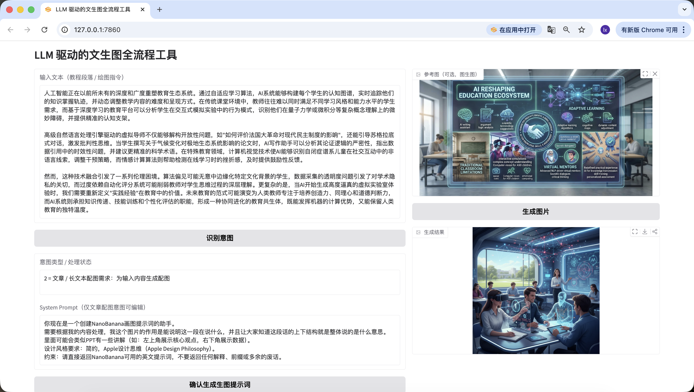

이미지-이미지 기능도 추가했습니다. 마음에 드는 이미지를 업로드하면 AI가 자동으로 스타일을 참고합니다.


한 가지 더 언급할 것은, 앞 단계에서 생성된 프롬프트도 웹 페이지에서 편집 가능하며, 최종적으로 버튼을 클릭하는 시점의 프롬프트를 기준으로 합니다. 여기서 "a cute cat"으로 바꿔도 최종 생성되는 이미지는 귀여운 고양이만 나타납니다.

## 제4장: 마무리


**드디어 다 썼습니다!**
솔직히 말하면, 저 스스로도 마지막 줄을 다 쓰고 나서 길게 한숨을 내쉬지 않을 수 없었습니다. 여기까지 따라온 여러분은 말할 것도 없습니다. 이 전체 흐름을 완벽하게 완주했다는 것 자체로 이미 대단합니다. 정말로 손을 키보드에 올려놓고 한 단계씩 해냈다는 것을 의미하니까요. Bravo 🎉 🥳 👏

이 내용을 작성하면서 저는 계속 이런 생각을 했습니다. 결국 우리가 남겨야 할 것은 무엇일까요? 정답은 모델 이름, 파라미터, 또는 어떤 고정된 방법이 아닙니다. 바로 여러분이 서서히 하나의 감각을 쌓아가도록 하는 것입니다. 어떤 일은 안심하고 AI에게 이해와 계획을 맡길 수 있고, 어떤 부분은 여러분이 방향만 결정하면 된다는 감각입니다. 이러한 역할 분담이 성립되면, 원래 복잡해 보이던 많은 생성 흐름이 순조로워지기 시작합니다.

되돌아보면, 이 길은 사실 그리 복잡하지 않았습니다. 해결하고 싶은 문제를 명확히 하고, 긴 텍스트를 언어 모델에 맡겨 분해하고, 정리된 시각 의도를 그림 그리기 모델에 넘겨 표현하고, 마지막으로 이 전체 흐름을 나만의 작은 도우미로 캡슐화합니다. 여기까지 오면, 여러분은 단순히 "모델을 사용하는" 것을 넘어 장기적으로 함께 일할 수 있는 시스템을 구축하고 있는 것입니다. 그것이 바로 이 튜토리얼이 가장 전달하고 싶은 것입니다.

하지만 여러분은 이미 정말 잘하고 있습니다! 여기까지 배운 여러분은 Vibe Coding에 대한 초보적인 이해를 갖추었을 것입니다. 자신에게 작은 휴식을 선물해 주세요!

<RelatedArticlesSection
  title="관련 아티클"
  description="'소재 생성'을 제품 흐름에 진정으로 연결하고 싶다면, 다음 챕터들을 계속 학습하세요."
  :items="relatedArticles"
/>
