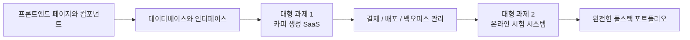

# 초중급 개발

**초중급 개발** 단계에 오신 것을 환영합니다! 여기에서는 풀스택 개발에 깊이 파고들어 프론트엔드 컴포넌트화, 데이터베이스 설계, 백엔드 API 개발과 배포·출시까지 마스터합니다.

## 무엇을 배우게 되나요

### 프론트엔드 개발

현대적인 프론트엔드 개발을 마스터하고, 컴포넌트 라이브러리와 디자인 도구 사용법을 배웁니다:

<NavGrid>
  <NavCard
    href="/ko-kr/stage-2/frontend/lovart-assets/"
    title="Lovart에서 출발해 나만의 에셋 제작 Agent 만들기"
    description="처음부터 Nanobanana와 Lovart를 활용해 고품질 디자인 에셋을 대량 생성하고, 의도를 인식하는 그림 Agent를 직접 구축합니다"
  />
  <NavCard
    href="/ko-kr/stage-2/frontend/figma-mastergo/"
    title="Figma와 MasterGo 입문"
    description="전문 UI 디자인 도구의 기본 작업과 디자인 시안에서 코드로 이어지는 협업 워크플로우를 마스터합니다"
  />
  <NavCard
    href="/ko-kr/stage-2/frontend/ui-design/"
    title="첫 번째 현대적 애플리케이션 만들기 - UI 디자인"
    description="현대적 애플리케이션의 UI 디자인 기초를 배웁니다"
  />
  <NavCard
    href="/ko-kr/stage-2/frontend/multi-product-ui/"
    title="UI 디자인 가이드라인을 참고해 페이지와 버튼 설계하기"
    description="주류 UI 디자인 가이드라인을 배워 더 명확한 페이지 계층과 버튼 계층을 설계합니다"
  />
  <NavCard
    href="/ko-kr/stage-2/frontend/llm-skills-beautiful/"
    title="LLM과 Skills로 인터페이스를 예쁘게 만들기"
    description="프롬프트와 플러그인을 실전 활용해 AI가 아름답고 독특한 인터페이스를 생성하도록 합니다"
  />
  <NavCard
    href="/ko-kr/stage-2/frontend/hogwarts-portraits/"
    title="함께 만드는 호그와트 초상화"
    description="실전 프로젝트: AI가 생성한 이미지를 결합해 인터랙티브한 호그와트 초상화 애플리케이션을 구축합니다"
  />
  <NavCard
    href="/ko-kr/stage-2/frontend/design-to-code/"
    title="디자인 프로토타입에서 프로젝트 코드로"
    description="디자인 도구의 프로토타입을 실제로 브라우저에서 실행 가능한 프론트엔드 코드로 변환하는 방법을 배웁니다"
  />
  <NavCard
    href="/ko-kr/stage-2/frontend/modern-component-library/"
    title="현대적 컴포넌트 라이브러리로 인터페이스 업그레이드하기"
    description="컴포넌트 라이브러리를 사용해 전문가급 인터페이스를 빠르게 구축하는 법을 배웁니다"
  />
</NavGrid>

### 백엔드 개발

API 설계, 데이터베이스 관리, 애플리케이션 배포 전략을 배웁니다:

<NavGrid>
  <NavCard
    href="/ko-kr/stage-2/backend/git-workflow/"
    title="Git과 GitHub 사용법 익히기"
    description="Git 버전 관리 시스템의 핵심 작업과 협업 워크플로우를 마스터합니다"
  />
  <NavCard
    href="/ko-kr/stage-2/backend/database-supabase/"
    title="데이터베이스에서 Supabase로"
    description="관계형 데이터베이스 기초를 마스터하고, 현대적 BaaS 플랫폼인 Supabase 사용법을 배웁니다"
  />
  <NavCard
    href="/ko-kr/stage-2/backend/ai-interface-code/"
    title="애플리케이션 백엔드 인터페이스 설계와 개발"
    description="AI를 활용해 백엔드 인터페이스 코드와 표준 인터페이스 문서 생성을 지원하여 개발 효율을 높입니다"
  />
  <NavCard
    href="/ko-kr/stage-2/backend/zeabur-deployment/"
    title="제품 프로토타입 배포하기"
    description="Zeabur를 사용해 풀스택 애플리케이션을 클라우드에 빠르게 배포하는 법을 배웁니다"
  />
  <NavCard
    href="/ko-kr/stage-2/backend/modern-cli/"
    title="IDE에서 CLI AI 프로그래밍 도구로"
    description="현대적 CLI 도구를 탐색하고 명령줄 환경에서의 개발 경험을 향상시킵니다"
  />
  <NavCard
    href="/ko-kr/stage-2/backend/stripe-payment/"
    title="Stripe 등 결제 시스템 통합하기"
    description="실전: 애플리케이션에 Stripe 결제 기능을 통합해 상업적 수익화를 실현합니다"
  />
</NavGrid>

### 대형 과제

앞의 챕터들이 "부품"을 배우는 과정이었다면, 대형 과제는 "부품을 조립해 실제로 돌아가고, 시연할 수 있고, 출시할 수 있는 제품으로 만드는 법"을 배우는 과정입니다.

**대형 과제 1 → 대형 과제 2** 순서로 진행하기를 권장합니다:

- **대형 과제 1**은 현대 SaaS에서 가장 흔한 핵심 흐름(로그인, 생성, 데이터베이스, 결제, 관리자 백오피스)을 먼저 끝까지 경험하게 합니다.
- **대형 과제 2**는 더 업무 시스템에 가까운 시나리오(역할 권한, 문제 은행, 시험, 제출 기록, 관리자 콘솔)로 안내합니다.

어느 것을 먼저 할지 모르겠다면, 아래 비교표를 바로 참고하세요:

| 프로젝트 | 중점적으로 익히는 것 | 가장 적합한 대상 | 최종 산출물 |
|------|------|------|------|
| 대형 과제 1: 카피 생성 웹사이트 | SaaS 페이지 구조, 사용자 로그인, AI 생성, Stripe 결제, 백오피스 관리 | 완전한 상업화 웹사이트를 처음 만드는 사람 | 가입·생성·결제·관리가 가능한 SaaS 프로토타입 |
| 대형 과제 2: 온라인 시험 및 관리 시스템 | 역할 권한, 문제 은행 모델링, 시험 흐름, 제출 기록, 채점과 통계 | "업무 시스템"을 제대로 완성해 보고 싶은 사람 | 학생용·관리자용을 갖춘 시험 플랫폼 |

어느 것을 하든, 대형 과제에서는 최소한 다음 3가지 산출물을 준비하기를 권장합니다:

- 실행 가능한 프로젝트 저장소
- 접속 가능한 데모 링크
- README와 시연 영상 한 편

<NavGrid>
  <NavCard
    href="/ko-kr/stage-2/assignments/copywriting-platform-supabase/"
    title="대형 과제 1: 첫 번째 SaaS 풀스택 애플리케이션 — 카피 생성 웹사이트"
    description="처음부터 AI 마케팅 카피 워크벤치를 구축하며 로그인, 생성, 결제, 백오피스 관리를 아우릅니다"
  />
  <NavCard
    href="/ko-kr/stage-2/assignments/exam-management-express/"
    title="대형 과제 2: 온라인 시험 및 관리 시스템"
    description="온라인 시험 시스템을 구축하며 자동 출제, 답안 작성, 백오피스 관리를 지원합니다"
  />
</NavGrid>

위 두 개의 메인 프로젝트를 이미 완료했거나, 자신의 기술 방향에 맞춰 포트폴리오를 만들고 싶다면, 아래 확장 주제 중 하나를 골라 깊이 파고들 수 있습니다:

<NavGrid>
  <NavCard
    href="/ko-kr/stage-2/assignments/modern-landing-page/"
    title="확장 과제: 현대적 웹 랜딩 페이지 프로젝트"
    description="가치 전달, 전환 경로, CTA 설계와 기본 이벤트 트래킹을 연습하며 실제 트래픽을 받아낼 수 있는 페이지를 만듭니다"
  />
  <NavCard
    href="/ko-kr/stage-2/assignments/custom-dify-agent-platform/"
    title="확장 과제: Dify 유사 에이전트 오케스트레이션 플랫폼"
    description="에이전트 관리, 대화, 로그와 권한 제어를 구현하며 최소 실행 가능한 AI 플랫폼을 만듭니다"
  />
  <NavCard
    href="/ko-kr/stage-2/assignments/travel-planning-agent-platform/"
    title="확장 과제: 스마트 여행 계획 Agent 오케스트레이션 플랫폼"
    description="구조화된 입력, Agent 오케스트레이션, 과거 계획 관리를 중심으로 실행 가능한 AI 여행 계획 제품을 만듭니다"
  />
  <NavCard
    href="/ko-kr/stage-2/assignments/movie-recommendation-springboot/"
    title="확장 과제: Spring Boot 영화 추천 시스템"
    description="Spring Boot, 평점·즐겨찾기, 설명 가능한 추천을 결합해 완전한 추천 시스템 프로토타입을 완성합니다"
  />
  <NavCard
    href="/ko-kr/stage-2/assignments/simple-grocery-microservices/"
    title="확장 과제: 신선식품 이커머스 마이크로서비스 시스템"
    description="서비스 분리, 게이트웨이 라우팅, 재고와 주문 협업을 연습하며 모놀리식에서 마이크로서비스로의 엔지니어링 사고를 경험합니다"
  />
  <NavCard
    href="/ko-kr/stage-2/assignments/traffic-data-visualization-go/"
    title="확장 과제: Go 교통 데이터 분석 및 시각화 플랫폼"
    description="데이터 수집, 윈도우 집계에서 트렌드 대시보드와 알림까지, 완전한 데이터 제품 프로토타입을 만듭니다"
  />
</NavGrid>

### AI 역량 확장

<NavGrid>
  <NavCard
    href="/ko-kr/stage-2/ai-capabilities/dify-knowledge-base/"
    title="Dify 입문과 지식 베이스 통합"
    description="Dify를 사용해 AI 애플리케이션을 구축하고 프라이빗 지식 베이스를 통합하는 법을 배웁니다"
  />
</NavGrid>

## 대상 독자

- 어느 정도 프로그래밍 기초가 있고, 풀스택 개발을 체계적으로 배우고 싶은 개발자
- 제품 관리자에서 풀스택 엔지니어로 전환하고 싶은 학습자
- 현대적 개발 도구와 워크플로우를 마스터하고 싶은 초중급 개발자
- 완전한 제품을 독립적으로 개발하고 싶은 창업자

## 사전 요구 사항

- 「초보자와 제품 프로토타입」 단계를 완료했거나 동등한 기초 지식을 보유
- 기본적인 HTML/CSS/JavaScript 개념을 이해
- AI 프로그래밍 도구에 대한 기초적인 이해

풀스택 개발에 깊이 파고들 준비가 되셨나요? 왼쪽 내비게이션을 클릭해 학습을 시작하세요!
