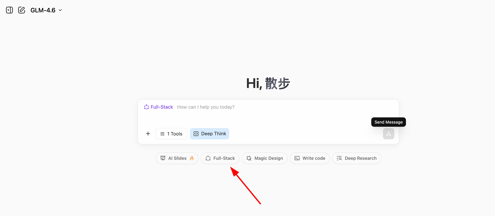
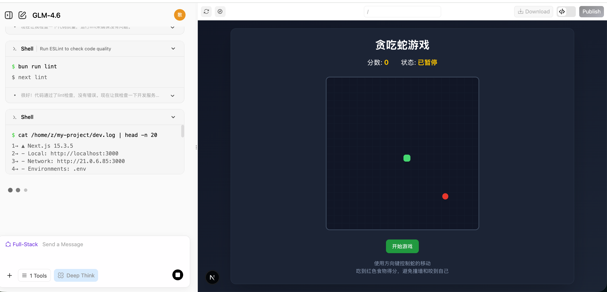
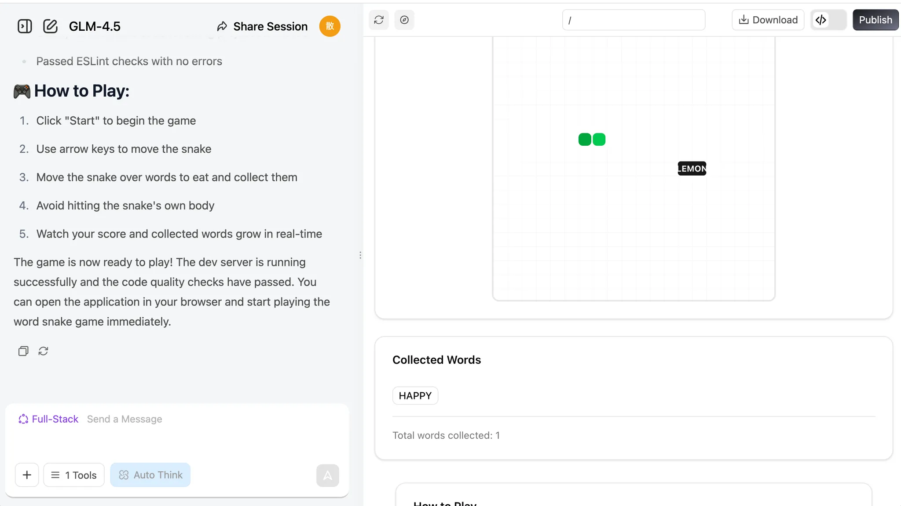
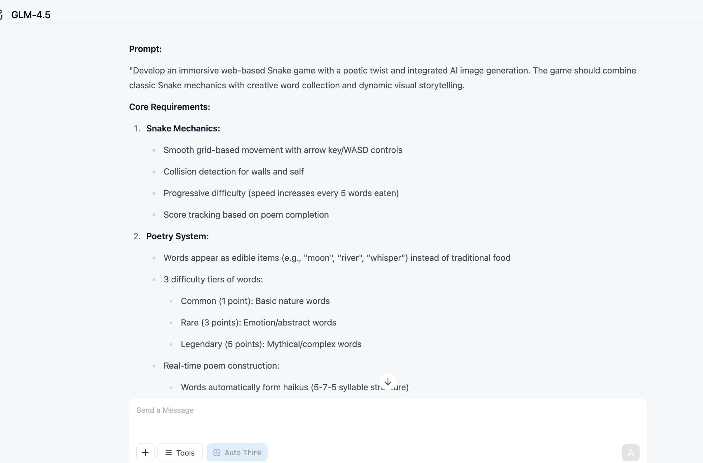
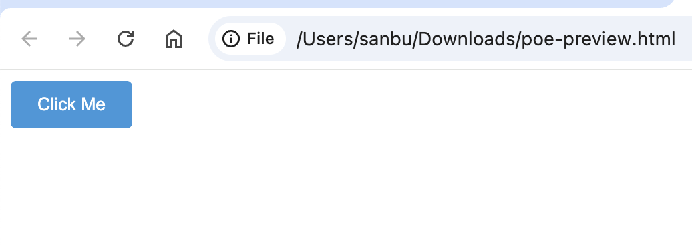
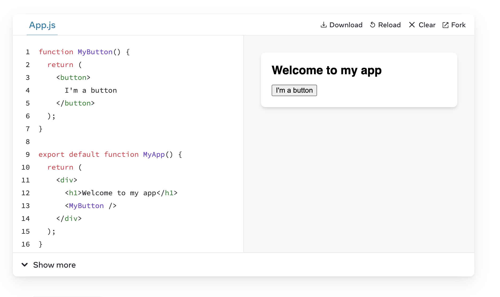
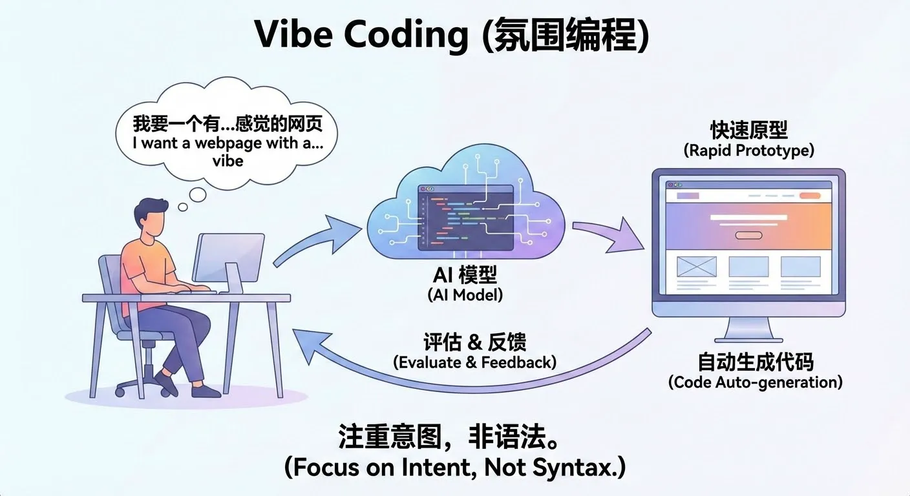

# 初级一：AI 时代，会说话就会编程

这是一个**基于项目制学习**的学习教程。我们鼓励你跟随步骤一步步操作，并尝试复现结果。
不要担心犯错或修改内容，重要的是请记住： 

🎉 **完成比完美更重要**。

## 1. 普通人的困境与机会

很多人脑子里有一堆产品点子：  
一款帮自己记账的小工具、一个记录孩子成长的网页、甚至一款小游戏。  
但一想到「要写代码」「要找程序员」，就直接劝退。

- 想法很多，但不会实现，只能停留在脑海或 PPT 里
- 找人合作太贵、太慢，还要不断对齐需求、沟通细节
- 自己学编程，翻开教程就被各种概念和环境配置劝退

AI 出现之后，第一次给了「普通人」一个新的路径：  
你不一定要会写代码，但你可以学会 **对 AI 说清楚你想要什么**。

在这个路径里，最重要的能力不再是手写每一行代码，而是：

- 把需求讲清楚
- 懂一点产品和交互
- 懂一点「和 AI 协作」的节奏

这门课的目标，就是帮你练成这样一种新本领：  
**会说话，就能做应用。**

## 2. AI 能帮你做到什么程度

在这一节，我们只回答一个问题：  
**如果你不会写代码，AI 现在到底能帮你做到什么程度？**

整体上，你可以把当前的大模型能力理解为：

- 能做：简单的网页应用、内部小工具、数据可视化面板、一些小游戏等
- 暂时做不了：复杂业务系统、多人协作的大型产品、对安全合规要求极高的生产系统
- 质量层面：用来「自用」「演示」完全没问题，要直接做成商用产品，通常还需要人工补充和打磨

下面，我们就用「AI 贪吃蛇」这个例子，看看 AI 具体能帮你做到什么。

### 2.1 1 分钟做一个贪吃蛇游戏

我们将学习如何用最基础的 **vibe coding** 技巧创建一个现代版的 AI 贪吃蛇游戏。我们将让蛇吃掉文字字符而不是豆子。最后让游戏根据吃掉的文字字符生成一首诗，并画一幅画。
通过这个实际案例你能够理解全新编程方式的核心理念：如何学会用自然语言清晰地表达需求。

首先打开网页 [z.ai](https://chat.z.ai/)，`z.ai` 是由智谱 AI（中国领先的大语言模型公司之一）开发的 AI 平台，其核心能力由智谱自研的 GLM 系列大模型提供支持。该平台集成了多项 AI 功能，包括幻灯片生成、海报设计和全栈开发等。在本教程中，我们将重点介绍其全栈开发模块的使用。



输入我们的简单需求后点击 **全栈开发** 按钮，你可以实时观看网页的完整创建过程。通常只需泡一杯咖啡的时间，网页便会自动生成完毕！

```
帮我做一个贪吃蛇游戏：
1. 用方向键控制蛇的移动
2. 吃到食物后蛇会变长，分数增加
3. 撞到墙壁或自己的身体就游戏结束
4. 要有开始和重新开始按钮
5. 界面要简洁好看
```


生成结束后，你能看到右侧出现可浏览的网页界面。你可以上下滚动浏览页面内容，或点击页面顶部的 🧭 按钮切换至全屏模式查看效果。
> 其中顶部从左到右按钮的作用依次为：箭头按钮展开侧边对话历史栏，铅笔按钮用于新建一个对话，循环箭头按钮用于刷新页面，指南针按钮负责切换至全屏模式，Download 按钮用于下载项目，<> 按钮用于切换代码视图，Publish 按钮用于发布项目。



如果你想查看该网页的源代码，可以点击右上角的代码图标查看完整代码。


### 2.2 对话编程能做什么不能做什么

如果你什么都不配，只跟一个对话式 AI 聊天，它究竟能把事情做到哪一步？  
答案通常是：**能帮你把一个小而完整的东西做出来，但需要你亲自决定做到什么程度就够了**。

#### 最适合做小应用和工具

从刚才的贪吃蛇开始，你已经看到了一个模式：  
只要你愿意把画面说清楚，AI 就能在几轮对话内，帮你拼出一个可以打开、可以点击、可以玩的完整网页。

这类生成任务具有几个共同特征：

- 范围清晰：一页网页、一个简单工具、一个小玩法  
- 结果可见：你能立刻在浏览器里验证是否按预期工作  
- 纠错简单：发现问题后，可以在后续对话中直接指出并要求修正

在这个范围内，可以将 AI 理解为一位执行力较强的辅助开发者。  
你的主要工作不是亲自编写代码，而是持续用自然语言描述期望的体验，并在每一轮反馈中明确修改方向。

#### 大型项目需流程辅助

但只靠聊天，总有做不到的地方。

一旦问题长成下面这种形态，AI 往往就很难凭几段对话端到端搞定：

- 要连后端、连数据库、连第三方服务，还要考虑权限、安全、并发
- 有很多业务规则，需要长时间维护、多人协作、线上稳定运行
- 结果不是一页网页，而是一整套系统，要和公司现有流程打通

在这些场景下，不能再简单依赖多轮对话自动完成整体设计。  
你需要做的是：

- 先把问题拆成一连串具体的步骤和状态（也就是一个工作流）
- 在每一步，用对话式 AI 帮你产出这一小段该怎么实现的代码或方案
- 再由你负责把这些步骤串联起来、接好接口、做测试和上线

所以，更现实的心智是：  
**对话式 AI 负责帮你把每一个小步骤做得又快又省力，  
而你负责决定有哪些步骤 这些步骤怎么连在一起。**


当你发现「AI 好像什么都能写」的时候，另一个常见问题也会冒出来：  
它写出来的东西，**到底能不能用？能用到什么场景？**

一个简单的经验是：

- 原型 / Demo / 内部自用小工具：非常适合交给 AI 先打一版
- 面向真实用户的大型产品：通常需要人类工程师做架构、抽象和长期维护
- 牵涉强安全、强合规的系统（支付、风控、医疗等）：目前阶段不建议「一键生成就上线」

站在现在这个时间点，你可以放心地把 AI 当成一个**快速做 Demo 和自用工具的搭档**：  
只要你愿意多测试、多迭代，多问几轮「这个地方哪里不对，帮我修一下」，质量一般都完全够用。


## 3. 动手：你的第一个 AI 原生应用

在前一部分，我们已经用 AI 快速做出了一个可以玩的贪吃蛇原型，也大致知道了 AI 能做什么、不能做什么。接下来，轮到你亲自上手，完成自己的第一个 AI 原生应用。

这里我们还是以「AI 贪吃蛇」为例，一步步把它做出来、玩起来、再改造它。

### 3.1 AI 原生贪吃蛇

在一开始，我们可以用最简单的方式与大模型对话，这将帮助我们快速获得产品原型。我们可以直接在聊天框中输入：

> **💡 示例提示词：** 帮我做一个贪吃蛇游戏
>
> 

> **💡 示例提示词：** 帮我做一个贪吃蛇游戏，它应该支持
>
> 1. 我可以吃不同的单词，它们会被收集在一个盒子里
>    

> **💡 示例提示词：** 帮我做一个贪吃蛇游戏，它应该支持：
>
> 1. 我可以吃不同的单词，它们会被收集在一个盒子里
> 2. 当蛇吃了8个单词时，llm 应该根据这些单词创作一首诗，我们可以根据需要重新混合这首诗。
> 3. 当诗完成后，下一步将自动根据这首诗创建一幅图像。
>
> 

注意，在开发过程中，我们可能会遇到不尽如人意的问题，例如点击按钮没有任何反应、使用功能时报错、功能未按预期工作，或者前端页面与预期设计不符。

在这种情况下，我们需要进一步向模型提问，以帮助修复这些意外问题。


### 3.2 给游戏添加新功能

完成基本功能后，我们可以尝试给我们的程序添加一些新花样！如果你觉得蛇吃单词或字符的过程有点枯燥，你可以让蛇吃不同颜色的单词，并相应地改变蛇的颜色。

你还可以为“吃”的过程添加特效，或者引入触发特效的魔法单词——比如增加蛇的速度或大小。另一个想法是每当蛇吃一个单词时就让模型生成一首诗和一幅图，而不是等到它吃掉八个单词。

如果觉得这些有挑战性，你可以直接向语言模型求助！它可以提供创意建议，让你的游戏更有趣。试一试吧！

```JavaScript
1. "单词解锁世界" 机制
每当蛇吃掉一个单词，LLM 会对该单词进行诗意联想（例如，“树”→“森林”、“绿荫”），图像模型会即时为该单词生成一个小艺术品。这些图像逐渐拼凑成一个独特的、玩家创造的全景图，所以玩家每次游玩都在“作画和写诗”。

2. "诗歌拼图" 玩法
蛇吃掉的每个单词都会触发 LLM 生成简短的诗句，图像模型生成插图。这些诗句和图像像拼图一样组合在一起，在回合结束时形成一首 AI 协作的诗和画。

3. "魔法单词" & "故事分支"
特殊的“魔法单词”（例如，“风”、“夜”、“梦”）不仅触发 LLM 生成诗歌，还会改变场景的情绪或主题——将生成图像的风格转变为夜晚、暴风雨或梦幻般的氛围。
分支故事：LLM 在开始时给出一个主题或谜语（例如，“秋天的回忆”）。玩家的单词选择直接影响故事和诗歌的演变，图像模型实时更新背景和视觉效果。

4. "实时互动生成"
每个单词之后，LLM 生成一行对话或描述，游戏中的 NPC 可以对玩家“说话”，或者环境可以相应地改变。
蛇的外观或游戏中的障碍物可以根据吃掉的单词在视觉上发生变化，这要归功于图像模型。

5. "创作 & 分享"
玩家可以在会话结束时保存并分享他们 AI 创作的诗歌和图像，炫耀他们独特的“AI 协作”。
“最美诗歌+艺术”、“最有创意单词组合”等排行榜，鼓励重玩和创造力。

6. "按句贪吃蛇" 挑战
反向模式：LLM 给出一句诗或一个谜语，玩家必须引导蛇按顺序吃掉单词来重构句子。吃错单词会通过图像生成模型触发有趣或艺术性的后果。

7. "主题关卡" & "风格选择"
游戏开始时，玩家选择一个主题（例如，“童话”、“科幻”、“唐诗”），LLM 和图像模型都会调整单词选择、诗歌风格和视觉效果以匹配，使每次运行都感觉新鲜。

8. "现场共创"
当吃掉一个特殊单词时，LLM 可以提示玩家输入短语或选择风格，然后 AI 生成相应的诗句和插图，使其成为真正的人类-AI 共创。

9. "AI 彩蛋 & 成就"
某些单词组合被 LLM 识别为特殊主题或内部笑话（例如，“月亮”、“桂花”、“河岸”），触发稀有的诗句和插图，奖励探索。

10. "成长的故事"
随着蛇的成长，LLM 生成一个连续的故事诗，图像模型创建一个无缝的长卷或全景图，所以玩家同时在“写作、绘画和玩耍”。
```

此外，我们还可以要求 LLM 帮你直接生成项目级的提示词。在上一节中，我们只自己写了贪吃蛇游戏的提示词。现在让我们尝试让大模型生成一个带有整体框架和实现路径的提示词（你可以直接用 z.ai 生成）：

> 我想让 AI 生成一个网页贪吃蛇游戏，需要一个更完整的提示词，让生成结果更令人印象深刻和有趣。请生成相应的提示词。当前目标是：生成一个贪吃蛇游戏，需要实现吃不同单词生成诗歌的功能，并且应该包含图像生成模块。

z.ai 的回复将会是这样的：



我们可以使用这个提示词在全栈开发模式下重新生成项目：


### 3.3 尝试制作其他小游戏

除了贪吃蛇（游戏），我们可以让想象力尽情驰骋。

创造任何我们想创造的东西，甚至尝试搞砸一切！然后重头再来！

```YAML
1. AI 艺术画廊平台
   描述：一个展示 AI 生成艺术作品的在线画廊，用户可以上传、分享和评论 AI 艺术作品。
   功能：用户账户系统、艺术作品上传和展示、评分系统、分类浏览、AI 生成工具集成。
   技术亮点：React/Vue 前端、Node.js 后端、MongoDB 数据库、AI API 集成。

2. 复古游戏档案馆
   描述：一个致敬经典游戏的网站，包含游戏历史、玩法指南和在线可玩复古游戏。
   功能：游戏数据库、时间轴展示、在线模拟器、用户评论、游戏收藏功能。
   技术亮点：响应式设计、WebGL/Canvas 游戏实现、RESTful API、用户认证系统。

3. 可持续生活追踪器
   描述：一个帮助用户通过环保提示和社区挑战来追踪和减少碳足迹的网站。
   功能：个人碳足迹计算器、目标设定、进度追踪、社区挑战、环保知识库。
   技术亮点：数据可视化、移动端优化、社交功能、推送通知。

4. 虚拟厨房助手
   描述：一个基于 AI 的烹饪指导平台，提供个性化食谱推荐和分步烹饪说明。
   功能：食谱数据库、食材识别、个性化推荐、烹饪计时器、营养分析。
   技术亮点：图像识别 API、机器学习推荐系统、语音控制、实时视频指导。

5. 地下音乐发现平台
   描述：一个专注于独立和新兴艺术家的音乐流媒体平台，提供独特的发现体验。
   功能：音乐流媒体、艺术家资料、个性化推荐、播放列表创建、社区评论。
   技术亮点：音频流处理、推荐算法、社交功能、音乐可视化。

6. 极简任务管理系统
   描述：一个具有禅意美学的任务管理工具，专注于简单和高效的任务组织。
   功能：任务创建和分类、优先级设置、进度追踪、团队协作、数据分析。
   技术亮点：极简 UI 设计、拖放功能、实时同步、跨平台兼容性。

7. 科幻写作工坊
   描述：一个为科幻作家提供创意工具和灵感的平台，包括世界观构建辅助和角色开发工具。
   功能：故事结构工具、角色资料、世界观构建模板、写作统计、社区反馈。
   技术亮点：富文本编辑器、数据可视化、协作编辑、AI 辅助创作。

8. 个人知识图谱
   描述：一个帮助用户构建个人知识网络，可视化并连接各种想法和信息的工具。
   功能：节点创建和连接、标签系统、搜索功能、导入/导出工具、可视化图表。
   技术亮点：图数据库、数据可视化算法、Markdown 支持、跨设备同步。

9. 虚拟植物园
   描述：一个互动植物百科全书，用户可以探索植物世界并创建虚拟花园。
   功能：植物数据库、3D 植物模型、生长模拟、园艺指南、社区展示。
   技术亮点：3D 渲染、季节变化模拟、AR 集成、植物识别 API。

10. 编程挑战竞技场
    描述：一个面向程序员的在线竞赛平台，具有各种难度级别的编程挑战。
    功能：挑战问题、代码编辑器、自动评估、排行榜、学习路径。
    技术亮点：代码沙箱环境、实时评估系统、算法可视化、社交学习功能。
```

还有... 如果你喜欢玩游戏，让我们一起尝试创造游戏吧！

```SQL
1. 3D 开放世界 RPG
   描述：一个具有广阔开放世界、任务和角色成长的奇幻 RPG。
   功能：昼夜循环、动态天气、技能树、多人合作、制作系统。
   技术亮点：Three.js 或 Babylon.js 用于 3D 渲染、服务器端游戏逻辑、角色自定义、存档系统。

2. 第一人称射击 (FPS) 竞技场
   描述：一个快节奏的多人 FPS，具有各种游戏模式和地图。
   功能：团队死斗、夺旗、武器自定义、排位赛。
   技术亮点：WebGL/Three.js 用于 3D 图形、多人网络代码、命中检测、语音聊天。

3. AI 国际象棋和多人游戏
   描述：一个功能齐全的国际象棋平台，具有 AI 对手和在线对战功能。
   功能：AI 难度级别、残局挑战、锦标赛模式、回放分析。
   技术亮点：国际象棋逻辑库、WebSocket 用于实时对战、ELO 排名系统、反作弊。

4. 麻将在线多人游戏
   描述：一个具有在线多人游戏和计分功能的传统麻将游戏。
   功能：多种规则集、私人房间、排名系统、回放功能。
   技术亮点：牌匹配逻辑、实时多人游戏、大厅系统、分数追踪。

5. 回合制策略游戏
   描述：一个具有网格战斗和单位管理的战术策略游戏。
   功能：战役模式、遭遇战、单位升级、战争迷雾、多人对战。
   技术亮点：网格移动系统、AI 决策、回合同步、存档/读档系统。

6. 计时赛赛车游戏
   描述：一个专注于计时赛和赛道记录的 3D 赛车游戏。
   功能：多条赛道、汽车自定义、幽灵回放、排行榜。
   技术亮点：3D 汽车物理、赛道编辑器、回放系统、在线排行榜。

7. 卡牌对战游戏 (卡组构建)
   描述：一个策略卡牌游戏，玩家构建卡组并与对手战斗。
   功能：卡牌收集、卡组构建、排位赛、赛季活动。
   技术亮点：卡牌游戏逻辑、匹配系统、AI 对手、卡牌动画。

8. 大逃杀 (俯视 2D)
   描述：一个俯视 2D 大逃杀游戏，具有缩小的游戏区域和战利品机制。
   功能：单人和小队模式、武器多样性、局内事件、排行榜。
   技术亮点：实时多人游戏、区域缩小逻辑、战利品生成系统、匹配。

9. 恐怖生存游戏 (第一人称)
   描述：一个具有资源管理和逃生机制的第一人称恐怖游戏。
   功能：氛围环境、解谜、敌人 AI、多重结局。
   技术亮点：动态照明、声音设计、敌人寻路、存档系统。

10. 音乐节奏游戏 (3D)
    描述：一个 3D 节奏游戏，玩家随着音乐节拍击打音符。
    功能：多种难度级别、赛道编辑器、自定义歌曲支持、排行榜。
    技术亮点：音频分析、节拍同步、3D 音符轨道、输入时机检测。
``` 


# 📚 Assignment

- 完成一份属于自己的 AI 原生的贪吃蛇游戏。
- 若有余力，根据更多参考案例实现不同种类好玩的 AI 原生游戏。

这就是完整的教程！你可能需要 **4 小时** 才能完成所有内容并构建你自己的贪吃蛇游戏。不要着急——探索、实验并享受这个过程。推荐你读完下列附录，用于补充基础知识：

# 附录

## 附录 1：我们需要前端开发知识吗？

**不需要，但懂一点会让你如虎添翼。**

在 Vibe Coding 时代，你不需要手写每一行代码，也不需要背诵复杂的语法。你核心的任务是：**学会如何向 AI 提需求，以及在代码报错时，如何把错误信息准确地喂给 AI。**

但是，如果你能了解一点点前端开发的“黑话”（基本概念），你就能更精准地指挥 AI，让它一次性生成你想要的效果，而不是来回拉扯。

你不必成为专家，只需要在“玩”的过程中顺便捡起这些知识碎片。

### 1. 前端基础三件套

传统的前端开发，主要由三个角色组成。你可以把一个网页想象成一个人：

*   **HTML**：决定了页面上有“什么”。
    *   比如：这里有个标题，那里有个按钮，中间放张图。
    *   没有 CSS 和 JS，网页就像一副只有骨头的骷髅，虽然结构完整，但很难看且不会动。
*   **CSS**：决定了页面“长什么样”。
    *   比如：按钮是蓝色的，圆角的；文字是居中的，字号是 16px。
    *   它负责美颜，让骨架变得漂亮得体。
*   **JavaScript**：决定了页面“能做什么”。
    *   比如：点了按钮会弹窗；数据加载时会转圈圈；贪吃蛇会动。
    *   它让网页活了过来，能和用户互动。

**看个简单的例子：**



1.  **HTML** 搭建骨架：
    ```HTML
    <button>点我</button>
    ```

2.  **CSS** 穿上衣服：
    ```CSS
    button {
      background-color: #3498db; /* 蓝色背景 */
      color: white;              /* 白色文字 */
      border: none;              /* 去掉边框 */
      padding: 10px 20px;        /* 撑大一点 */
      border-radius: 4px;        /* 圆角 */
    }
    ```

3.  **JavaScript** 注入灵魂：
    ```JavaScript
    document.querySelector('button').onclick = function() {
      alert('你点了我！');
    }
    ```

当你点击按钮，浏览器就会弹出一个提示框。这就是三者协作的结果。

### 2. 为什么要用现代框架（React/Vue）？

随着项目越来越复杂（比如像 Instagram 或 Twitter 这样的大型应用），如果还只用上面的“三件套”手搓代码，就会变得非常痛苦：几千行代码混在一起，改一个按钮可能崩掉整个页面。

这时候，现代前端框架（如 **React** 和 **Vue**）就登场了。

它们带来了三个核心进化：

1.  **组件化（搭积木）**：把网页拆成一个个独立的“积木块”（组件）。导航栏是一块，按钮是一块，评论区是一块。写好一块，到处复用。
2.  **状态管理（自动更新）**：以前数据变了，你得手动改界面；现在你只管改数据，框架会自动帮你刷新界面。
3.  **标准化（AI 更爱）**：框架有严格的规范和结构，这让代码更清晰。



**💡 核心建议：让 AI 直接生成 React 代码**

在本教程（以及未来的开发中），我们强烈建议你**直接要求 AI 使用 React 编写代码**。

为什么？因为 **AI 写 React 比写纯 JavaScript 写得更好**！

*   **结构清晰，不易出错**：React 强制的组件化结构，让 AI 生成的代码逻辑更严密，不容易出现“改了东墙倒西墙”的低级错误。
*   **修改方便**：如果你想加个功能（比如“排行榜”），在 React 里通常只是加一个组件，而在纯 JS 里可能要改乱七八糟的一堆逻辑。
*   **生态丰富**：React 有海量的现成组件库。你需要一个“炫酷的图表”或“高级的日期选择器”，AI 可以直接调用成熟的库，瞬间实现专业级效果。

**记住这句咒语：**
在接下来的对话中，不妨直接对 AI 说：“**请用 React 帮我实现这个功能，界面要美观现代。**”

## 附录 2：到底什么是 Vibe Coding
>
💡 什么是 Vibe Coding？计算机科学家 [Andrej Karpathy](https://karpathy.ai/)（OpenAI 的联合创始人之一，特斯拉前 AI 负责人）于 2025 年 2 月提出了 **vibe coding** 一词。这个概念指的是一种依赖于 LLM 的编码方法，允许程序员通过提供自然语言描述而不是手动编写代码来生成可工作的代码。



点击这里查看更多关于 vibe coding 的细节：[https://www.ibm.com/think/topics/vibe-coding](https://www.ibm.com/think/topics/vibe-coding)

点击这里查看更多关于 Karpathy 的分享内容：[https://karpathy.bearblog.dev/blog/](https://karpathy.bearblog.dev/blog/)

### 如何假装自己是 Vibe Coding 大师

实际上，在真正的 vibe coding 过程中，我们通常不会使用很多复杂的提示词。也许我们在开始时需要为整个程序提供一个具体且适度复杂的提示词，但在那之后的每一步，你可能只需要以下类型的提示词：

```JSON
"代码里有个 bug，请修复它。"
"我不要部分代码，给我完整的修改后的代码。"
"你的代码还是有问题。"
"请再次修改并给我完整的修正后的代码。"
"刚才还能运行，为什么现在不能运行了？"
"你没理解我的意思吗？不要改我原来的代码。"
"不要添加任何调试功能。"
"不要做我没让你做的事。"
"我让你实现的功能在哪里？"
"你听不懂我说的话吗？"
"我只要一个函数。"
"我告诉过你参考我之前的代码。"
"请不要添加不必要的注释。"
"请不要修改我原始代码的基本逻辑。"
"帮我修改代码。"
"基于我的代码修改..."
"不要改我的变量名！！！"
"不要改原来的函数名！"
"不要乱动我的变量。"
"不要添加额外的功能。"
"不要只生成框架，生成完整的代码。"
```

这听起来可能有点夸张，但实际上，这些就是我们在日常工作中可能使用的提示词。由于大语言模型的上下文长度限制，或者有时因为它们的指令遵循能力不是很强，模型可能会忘记对话早些时候讨论的内容。

或者，由于训练数据集的风格，大模型倾向于以其训练数据的风格回答。例如，有些人说话很严肃，有些人喜欢添加很多修饰，而有些大模型喜欢在代码中添加很多注释或不必要的模块。

这就是为什么我们需要在开始时明确设定界限，例如：不要添加新模块，不要包含太多注释。每个大模型都有自己的风格，我们只能通过实际使用找到我们最喜欢的那个。

## 附录 3：模型上下文

模型上下文就像 AI 的 **短期记忆**。它是 AI 记住的当前对话中的所有文本。这使你能够提出后续问题并进行自然的对话，因为 AI “记得”你刚才在谈论什么。没有上下文，你问的每个问题都将是一个全新的、独立的对话。

每个模型都有不同的有效上下文长度，通常从 **32k 到 128k** tokens 不等。如果你想让大语言模型一次性阅读一篇很长的文章，或者有许多材料和对话希望 LLM 参考，你可能会发现 LLM 经常忘记长文本中的一些重要内容，或者你可能会注意到对话过程中主题逐渐偏移，这是由上下文限制引起的现象。

因此，对于模型，我们也关注上下文。然而，值得注意的是，上下文越长，资源消耗越大，收取的费用也越高。在行业中，有许多压缩上下文的方法，我们将在随后的学习中一一介绍。

## 附录 4：指令遵循能力

指令遵循能力指的是 **AI 理解并准确执行你提供的命令的能力**。它不仅仅是回答问题，而是根据你的具体要求完成任务，例如“将这篇文章总结为三个要点”、“用正式的语气写回复”或“翻译这个词并在句子中使用它”。

具有强指令遵循能力的模型将完全按照你的指示完成这些操作，而不会执行任何不必要的额外操作。

例如，当我们希望 LLM 将一篇文章总结为三个关键点时，我们不希望它给我们五个；当我们希望它从文章中提取某些关键要素（如作者、时间及发生的事件）时，我们不希望它遗漏任何要素。

因此，我们希望 LLM 拥有足够强的指令遵循能力，因为这带来了稳定性及 **可复现性**，使它们成为工业应用中的重要组成部分。
