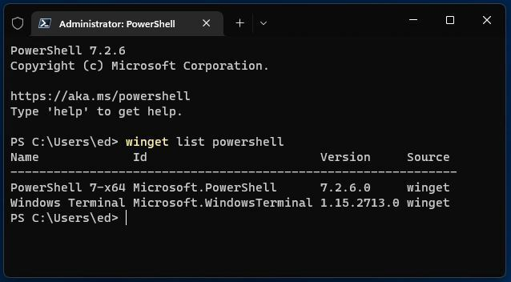
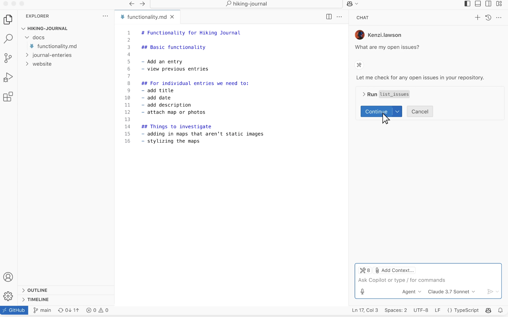
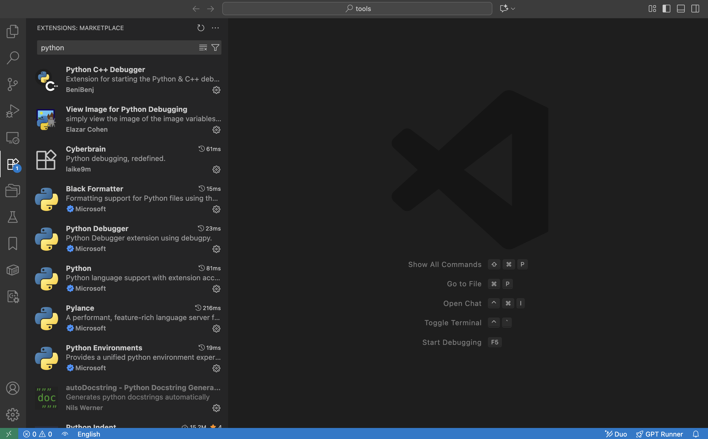
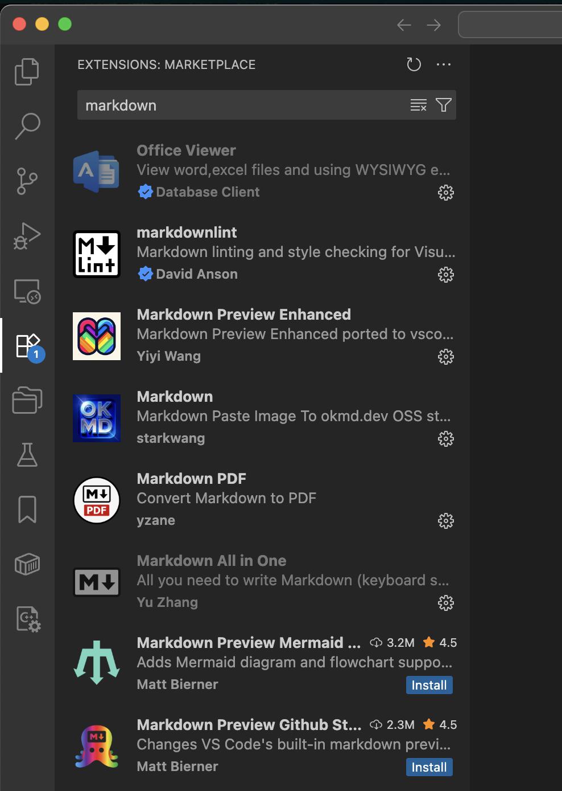
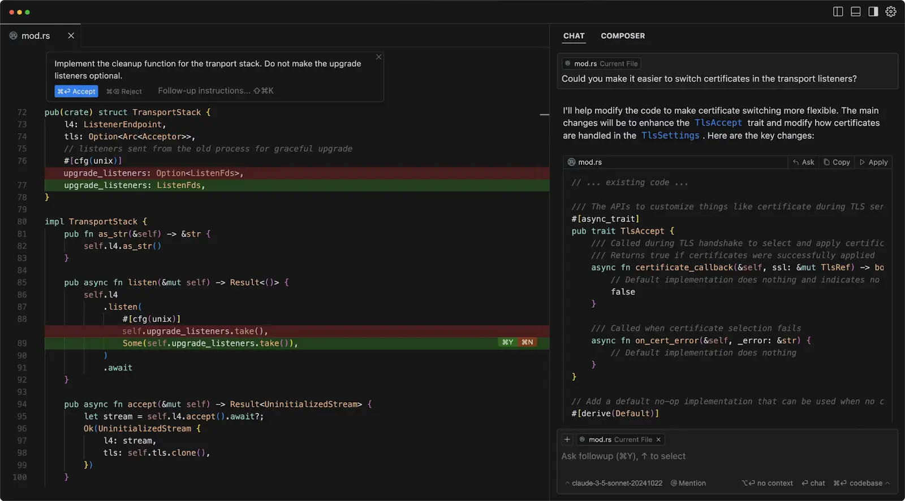
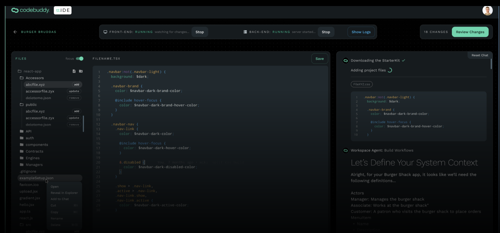
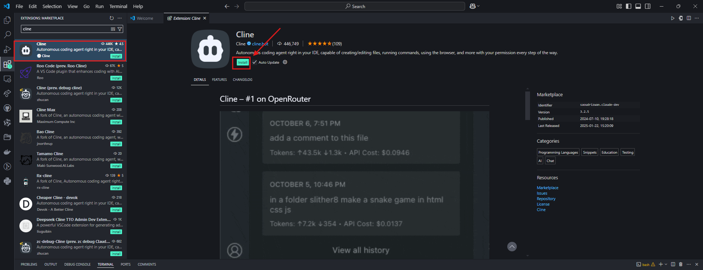
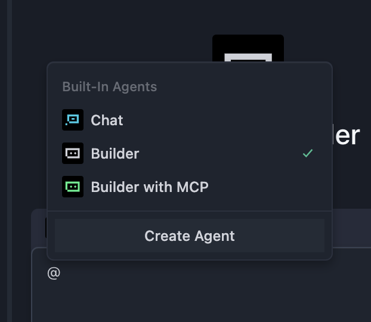

# 初级二：认识 AI IDE 工具

# 本章导读

还记得上一章里，你用 AI 生成的第一个贪吃蛇游戏吗？它说明：只用自然语言，你已经可以让 AI 搭出一个完整、可运行的原型。与此同时，在 z.ai 这样的网页 IDE 里进行开发时，你可能也体验到一些限制：项目一变大，代码管理和调试就不那么顺手，对话次数有最终上限。

这些问题主要来源于工具形态本身，而不是 AI 能力的不足。本章将围绕本地开发环境展开讲解：你将学会从 z.ai 过渡到本地的开发环境，学会在自己的电脑上搭建完整的开发环境，理解什么是 IDE、什么是 AI IDE，以及如何在日常开发中高效地使用它们。

最后，我们会在本地 AI IDE 中复现类似 z.ai 贪吃蛇游戏的实战流程，完成一个由你亲自设计的小游戏。

- 预计时间：约一天，可分多次完成
- 预期产出：使用 Trae 产出 1 个你自创的 AI 原生小游戏

## 2.1 写代码需要什么环境和工具

从“能不能写代码”，到“能不能把一个项目长期、稳定地维护下去”，对环境和工具的要求是完全不同的。

理论上，只用系统自带的记事本或者 Word 文档也能写代码——它们本质上都是能输入纯文本的工具。对于刚刚试着写几行代码、完成一次性的小实验来说，这样做勉强可行。

但一旦进入持续开发，问题就会立刻暴露出来：看不到语法高亮，错误位置只能靠肉眼去找；没有自动补全，每个标识符都要从头敲到尾；缺少项目结构视图，文件一多就很难迅速定位；代码运行出错时，也缺乏调试工具协助排查。这些“缺失”，会让开发变得既低效又容易出错。

> 这里提到的几个概念简单解释一下，方便还不熟悉计算机术语的同学理解：
>**语法高亮：** 编辑器会根据代码的语法，把不同类型的内容用不同颜色显示，比如关键字是蓝色、字符串是绿色，这样更容易看清代码结构，也更容易发现拼写或语法错误。
>**自动补全：** 当你只敲出代码的一部分单词或函数名时，编辑器会自动联想后面的内容，帮你补全，或者列出候选项，让你点一下就行，既省力也能减少输错。
>**标识符：** 给代码里的各种“东西”起的名字，比如变量名、函数名、类名等，就像给不同文件夹贴上“图片”“作业”“账单”这样的标签，方便后面找到和使用。
>**项目结构视图：** 用树状或列表的方式，把一个项目里的所有文件和文件夹展示出来，你不用在电脑里一层层点路径，只要在侧边栏点一下文件名，就能快速打开对应代码。
>**调试工具：** 专门用来帮你查错的工具。它可以让代码一行一行地执行、在中途暂停、查看每个变量当前的值，从而找到“到底是哪一步出了问题”，而不是只能反复打印日志、到处猜。

因此，当目标从“试着写几行代码”升级为“做一个可以长期维护、持续迭代的项目”时，仅有一个能高亮语法的代码编辑器还不够，你通常需要选择并熟悉至少一款 IDE，把它作为自己的主要开发环境。我们会在接下来详细介绍什么是 IDE。

## 2.2 什么是 IDE，为什么需要 IDE

在最早期的编程时代，我们只需要在一个简单的文本文件里写好程序，再用专门的语言处理器去读取并打包执行文件即可。但随着代码量越来越大、项目结构越来越复杂，人工管理大量文件、手动编辑庞大的项目变得越来越困难。开发者迫切需要一种工具，能够高效管理和切换大量代码文件，支持多种编程语言的语法高亮，并可以快速定位和调试问题。于是，集成开发环境（IDE，Integrated Development Environment）就应运而生了。

你可以把 IDE 理解成一种专门用来“编辑、管理、运行和调试”各种应用源代码的程序。在真正打包发布之前，不同语言写出来的程序本质上只是特定格式的代码文件而已，你可以用普通文本编辑器打开它们，也可以用 IDE 打开。早期的计算机几乎完全通过终端来操作（只用键盘就能完成所有操作，几乎不需要鼠标），所以早期的 IDE 外观也非常“原始”——除非你额外安装插件来实现简单的交互式界面。



终端界面（Terminal） 图片来源：https://en.wikipedia.org/wiki/File:Emacs-screenshot.png

一个非常知名、功能成熟的“内置 IDE”叫做 `Vim`。在很多服务器上，你都可以直接用它来编辑文件（服务器通常没有显示屏，只能通过键盘远程操作）。


只用键盘操作无法忍受，所以我们需要能使用鼠标操作的现代 IDE 。现代 IDE 通常具有更加美观直观的图形界面，并提供更强大的编辑、运行和调试能力。一个典型的 IDE 通常包含以下核心组件：

* **源代码编辑器（Source Code Editor）**：专门用于编写和编辑代码的文本编辑器，一般具备语法高亮、代码自动补全、实时错误提示等功能。
* **构建与运行工具（编译器 / 解释器）**：IDE 内置编译器或解释器，可以将开发者写好的源代码转换成计算机可以执行的机器代码。
* **调试器（Debugger）**：用于测试和排查代码错误的工具。它支持逐行执行代码、查看变量状态、设置断点等，帮助开发者定位并修复程序中的问题。

除此之外，现代 IDE 往往还内置版本控制工具（如 Git）和项目管理工具等实用功能。当下最流行的 IDE 之一是微软出品的 **[Visual Studio Code (VS Code)](https://code.visualstudio.com/)**。它轻量、可扩展性极强，因此被广泛使用。当然，也有很多开发者推荐 JetBrains 家的专业 IDE，比如用于 Python 的 PyCharm、用于 C/C++ 的 CLion 等，它们对特定语言提供了更深入、更完整的支持。但从入门友好度和通用性角度出发，我们更推荐初学者优先选择 VS Code 作为主要开发工具。



Visual Studio Code（简称 VS Code）是由微软开发的一款免费、开源且功能强大的现代代码编辑器。自 2015 年发布以来，凭借优异的性能和灵活性，它迅速成为全球最受欢迎的开发工具之一。

VS Code 的核心理念之一是“一切皆插件”。不同编程语言可以用来编写不同类型的程序，而每种语言都有自己独特的语法高亮规则和导航能力（比如“跳转到定义”“查找引用”等）。要让一个 IDE 原生支持所有语言几乎是不可能的——从逻辑上讲，你会需要为每一种语言单独准备一个 IDE 才行。

VS Code 巧妙地通过“插件机制”解决了这一问题。比如，如果你要写 Python，就安装 Python 插件，它会提供 Python 专属的语法高亮、自动补全和代码导航功能；如果你要写 C/C++，则可以安装对应的 C/C++ 插件来获得相应支持。在不安装任何插件的情况下，VS Code 本质上只是一个“高级的文本文件管理器”；当你为某种语言安装了对应插件之后，它就会“变身”成该语言的理想开发工具。



除了编写代码以外，你甚至可以把 VS Code 当作编辑 Markdown 文档的工具来使用。



总之，你可以在 VS Code 的扩展市场中浏览和下载各类扩展，为不同类型的文件提供更好用的编辑体验，也可以根据需要搜索不同语言和调试工具的插件，尝试它们如何提升你的工作效率。

最后，我们用一句话来总结 IDE 的意思：`IDE 是一种提供开发环境的软件，它提供了一整套工具，帮助开发者高效写代码和运行程序。`

## 2.3 AI IDE 和普通 IDE 有什么不同

普通 IDE（比如原版 VS Code）本质上是一套“工具箱”：  
可以打开项目、写代码、运行和调试，也能装插件，但前提是你需要自己知道要做什么、怎么做：

- 报错时，自己读提示、自己查哪一行有问题；  
- 想加新页面或新接口，自己找对应文件、自己写代码；  
- 想配置环境或打包，自己查文档、按步骤操作。

但在 AI IDE 里，你可以直接使用大语言模型帮助你进行编码和修改文件：

- 直接说“做一个登录页”，它先生成基础代码结构；  
- 把报错信息和相关代码丢给它，让它先分析原因并给出修改建议；  
- 在你确认后，让它自动新建文件、批量改代码，处理跨文件的体力活。

例如，你可以选中一段代码，让它“重构一下”或“加注释”；也可以在侧栏里问“这个项目是怎么设计的？”，通过 `@文件名` 或 `@整个项目` 指定参考范围，用一句话自动完成新建文件、写代码和运行的繁琐操作。


在最新版 VS Code 中，已经内置了一个大语言模型助手。你可以直接针对整个代码仓库、某个文件，甚至某个函数与模型对话。你也可以像之前在 Web 端使用自动写代码工具一样，将需求以提示词的形式发给内置的编码 Agent，让它自动帮你实现所需功能、创建文件、修改代码、配置环境等。

你可以下载安装 VS Code，在点击右上角的侧边栏入口，打开 AI 功能区域，体验这些能力。


不过，VS Code 并不是 AI 能力最强的 IDE。对于需要大量 AI 辅助编码的场景，我们往往希望使用“更聪明、效率更高”的工具——好的 AI IDE 能显著节省写代码和改 Bug 的时间。下面我们会介绍几款目前比较流行的 AI IDE，你可以根据个人喜好选择任意一款 AI IDE 使用。

由于 VS Code 是开源的（任何人都可以下载源码并自行编译），目前市面上绝大多数 AI IDE 都是在 VS Code 基础上二次开发而来。所以你不必担心要“学习很多种 IDE”——**只要你熟悉了 VS Code 的基本用法**，迁移到这些 AI IDE 并不需要重新学习。

一般而言，对于不同 AI IDE 之间的差异，主要集中在四个方面：价格；可使用的模型种类（部分高级模型在某些地区可能受限）；Agent 的能力（在协助写代码时的智能程度和执行能力）；以及运行速度与性能。你可以根据实际测试效果进行选用，适合自己的才是最好的。

> 典型的 AI IDE 一般具备以下核心能力：
> * 智能代码生成与补全：在传统 IDE 中，我们通常是输入几个字符来补全变量名或函数名；在现代 AI IDE 中，你可以写几行伪代码或者简单说明需求，让 IDE 自动补全完整的逻辑，甚至根据指令直接生成一大段甚至整块代码。
> * 代码理解与问答：IDE 能够理解并回答关于某段代码、某个文件，甚至整个工程目录结构的问题。  
> * 代码重构与优化：IDE 可以根据你的意图，重写或优化指定代码片段的实现逻辑。
> * 自动生成测试：IDE 可以自动生成针对不同函数和模块的测试代码，方便你进行有针对性的测试。
> * Agent 式任务执行：智能 Agent 可以自动生成、打包、安装、运行和修改代码，在很多任务上可以部分替代初级软件工程师的工作。

### Trae


Trae 是字节跳动推出的一款 AI 编程助手，支持 100 多种编程语言，并能集成到主流 IDE 中。它的功能包括：用自然语言生成代码、自动调试、把设计稿转换为 React/Vue 组件等。在 2025 年 8 月的更新之后，Trae 新增了智能依赖导入、重命名建议、任务清单管理等功能；SOLO 模式也开始支持后端代码生成和技术架构文档编辑。

### Cursor

Cursor 是 Anysphere 开发的一款 AI 代码编辑器，基于 VS Code 定制，重点优化了大规模代码仓库和多文件协同的场景。它支持 GPT-4o、Claude 3.7 等模型；2025 年推出的 Claude Max 模式可以处理数百万行代码级别的项目。专业版取消了请求次数限制，非常适合复杂的企业级项目。

目前，Cursor 可以说是“带前端界面的 AI IDE”中综合体验最好的一款之一，用户数量庞大，功能迭代频率也很高。它最大的缺点是价格较高——专业版大约需要每月 20 美元。



### Qoder

Qoder 是阿里巴巴推出的一款强调“透明协作”和“增强上下文工程能力”的 AI IDE。它通过 Action Flow 支持把任务拆解成多个步骤，并实时跟踪 AI 的执行过程；还支持多模型动态路由和任务状态机管理，非常适合在中大型项目中做架构治理和对遗留系统进行“反向工程”分析。


### CodeBuddy

CodeBuddy 是腾讯云推出的一款 AI 编程工具，强调对中文指令的支持以及企业级合规能力。它提供代码补全、批量代码审查和多模型切换等功能；其中的 Craft 智能体可以实现多文件代码生成和 API 集成。企业版支持私有化部署，并通过了三级等保认证，适合金融、医疗等对数据安全要求较高的行业。



### VS Code + Cline

Cline 是 VS Code（Visual Studio Code）的一款 AI 编程 Agent 插件，可以通过配置不同的 API 端点来灵活切换所使用的大模型。Cline 支持多模态输入、MCP 工具扩展以及成本监控，所有操作都需要用户确认后才会执行。它非常适合用于快速验证想法，或与现有开发流程集成。基础功能是免费的，企业版则支持在私有环境中部署模型。




## 2.4 实战：用 AI IDE 在本地生成贪吃蛇游戏

前面讲的主要是“概念”和“差异”。这一小节，我们通过一次完整的实战，把抽象概念落到具体操作上：**新建一个空文件夹 → 用 AI IDE 打开 → 在侧边栏聊天，让它用 React 帮你从零生成一个贪吃蛇游戏。** 这里以上面介绍的 Trae 为例，首先需要安装和简单理解什么是 Trae。

### 准备工作：安装并了解 Trae

#### 什么是 Trae

Trae 的全称可以理解为 “The Real AI Engineer”，是一款由字节跳动开发的自适应 AI 集成开发环境（IDE）。它是在流行的 VS Code 基础之上构建的，这意味着，如果你之前已经习惯了 VS Code，那么在使用 Trae 时，无论是界面布局还是基础操作都会感到非常熟悉、舒适。

Trae 的核心目标是成为开发者的“智能编程伙伴”。通过深度集成 AI 能力，它可以自动处理大量重复性工作，为你提供更直观、更高效的开发体验。它并不仅仅是一个“代码补全工具”，而是希望贯穿整个开发工作流，从创建项目、编写代码、调试、测试到部署都提供帮助。

#### 安装 Trae

Trae 分为国际版和中国版。国际版需要能够访问海外网络，但可以使用 GPT-5 等最新的海外模型；中国版则主要支持国内最新的大模型，例如 GLM、Qwen、Kimi 等。

国际版下载地址：https://www.trae.ai/
中国版下载地址：https://www.trae.cn/

#### Trae 界面简介

简单来说，Trae 和 VS Code 看起来几乎一模一样。


右侧的侧边栏就是 Copilot 交互窗口，也可以理解为 Agent 窗口。如果你暂时看不到它，可以点击 Trae 右上角的侧边栏图标将其打开。


打开侧边栏之后，你会看到一个 `Builder` 选项，这就是 Agent 模式。简单理解，它相当于 z.ai 的“本地版”，可以帮你操作本机环境，安装运行环境、打开网页等。


点击 “Builder” 后，你会看到 “Chat” 模式和 “Builder with MCP” 模式：

* **Chat 模式**：主要用于和当前文件夹里的代码对话，或者当作普通聊天模型来使用。（你可以通过左上角的 “File” 菜单打开一个文件夹，在这个文件夹中进行编辑操作。在这种情况下，Builder 创建或修改的文件都只会发生在这个文件夹内部。）
* **Builder with MCP 模式**：为 Agent 提供了更多可用工具（例如把语言模型和其他软件联通起来、查询天气等）。你可以简单理解为：MCP 能让语言模型更方便地调用各种外部工具。



在下面的区域，你还会看到模型选择选项，点击即可修改当前使用的大模型。在中国版中，你可以选择使用 Kimi k2 或 GLM 等国内模型；如果你使用的是国际版 Trae，还可以选择 ChatGPT 或 Claude 等海外模型。不过，由于国内大模型发展非常快，Kimi、Qwen、GLM 等在很多任务上的实际体验已经接近 Claude 3.5 或 3.7，对日常开发来说已经完全够用。


以上就是对 Trae 的一个简单介绍。接下来，我们可以回顾一下之前在 z.ai 中做过的操作，并尝试在 Trae 中做同样的事情。

### 第一步：新建空文件夹并用 AI IDE 打开

在正式动手之前，我们首先需要准备一个干净的项目工作目录。
以本小节示例为例，可以在本地新建一个名为 snake-game-react 的空文件夹。

随后，打开已安装好的 AI IDE，在启动界面选择打开文件夹或Open Folder，将该空文件夹作为项目根目录导入；也可以直接将文件夹拖入 IDE 窗口完成打开。此时，左侧资源管理器中不会出现任何代码文件，表示我们正从一个完全空白的项目状态开始。

### 第二步：在侧边栏聊天，让 AI 用 React 设计贪吃蛇游戏

接下来，打开 AI 聊天侧边栏：一般是按 `Ctrl+L` 或点击右侧聊天图标。然后在聊天里输入一个足够清晰的提示：

>请你用 React 架构实现贪吃蛇游戏，包含键盘控制、吃到食物变长加分、撞墙或撞到自己时显示“游戏结束”并支持重新开始。实现后帮我启动这个项目。自动安装没安装的环境。

注意，此时你需要把 AI 当做一个智能机器人来操作，他不仅可以帮助你写代码，还能帮助你启动写好的代码，甚至安装缺失的环境依赖。你完全可以把它当做一个万能的操作工具，所有想要实现的目的都可以首先尝试用语言描述操作，让它给出建议或尝试是否能解决问题。

### 第三步（可选）：向 AI 追问代码实现细节

如果你懂一些代码但不太懂前端，你可以尝试这么做：在同一个聊天窗口里，让 AI 用“讲故事”的方式，带你看懂关键部分，比如这样提问：

- “请用我能听懂的方式，从上到下讲一遍：这个贪吃蛇游戏每一步是怎么动起来的？”  
- “蛇现在在屏幕上的每一节身体，是用什么样的数据记住的？你可以打个比方，让我能想象出来。”  
- “游戏里是怎么做到‘一小段一小段往前移动’的？是隔一段时间就执行一次吗？请举个生活中的例子帮我理解。”  
- “当蛇吃到食物时，你在代码里做了哪几步操作？是在哪一段代码里判断‘吃到了’？”  
- “你是在哪里判断‘撞墙’和‘撞到自己’的？请指出具体代码，并用口语解释给我听。”

如果你看到某个文件名（比如 `SnakeGame.tsx`），却完全不知道它在干什么，可以直接说：

> “请把 `SnakeGame.tsx` 这个文件分成几块给我讲一讲：  
>  第一块负责什么，第二块负责什么……尽量用少一点专业词，让我能听懂。”

在回答这些问题时，AI 可能会提到一些新名词，比如“状态”“定时器”等。你可以顺势继续追问：

- “你刚才说的‘状态’具体指什么？能不能打个生活中的比方？”  
- “你说的‘定时器’在这里是干嘛用的？如果没有它，会发生什么？”

通过这种“边看代码，边追问”的方式，你不需要一下子记住所有术语，但可以一步一步搞清楚三件事：

1. 游戏里**有哪些数据**（例如：蛇的身体、食物的位置、当前分数）；  
2. 这些数据是**什么时候会变化**的（例如：蛇移动一格、吃到食物、游戏结束）；  
3. 每一种变化，**是由哪一小段代码负责**。

通过这个方式，你可以很快理解 AI 写的代码每一段到底是什么意思。

### 第四步：让 AI 把画面变好看一点

在核心玩法可以正常运行的前提下，我们可以尝试可以进一步改进游戏界面和体验。比如可以在对话中提出修改界面的需求：

- 将游戏区域调整到页面中央，而不是贴在左上角；  
- 使用较浅的背景颜色，使蛇和食物更加醒目；  
- 放大并突出分数显示；  
- 帮我把界面变得更漂亮，用蓝色装饰整个界面
- 在游戏结束时，在画面中央显示“游戏结束”的提示，并提供“重新开始”按钮。

AI 会按照这些说明修改相关代码。修改成功后刷新浏览器，即可看到更新后的界面。如与预期仍有差距，可继续提出更细致的步骤进行修改，如果遇到报错，你可以将报错复制粘贴、截图粘贴给对话框中，让 AI 协助你修复漏洞问题。

## 2.5 界面上每个按钮是干什么的

虽然不同 AI IDE 的界面略有差异，但大部分都延续了 VS Code 的布局：
- 左侧：项目相关的工具栏
- 中间：代码编辑区
- 右侧：AI 聊天和辅助面板
- 底部：终端、问题列表、输出信息
- 顶部：菜单栏和命令入口

下面以“Trae”的界面为例，一次讲清楚 IDE 上每个按钮的功能。

### 左侧活动栏：项目相关的工具


常见的几个图标含义：
- 资源管理器（Explorer）  
  显示当前项目的所有文件和文件夹，是你最常用的面板。

- 搜索（Search）  
  在整个项目里查找和替换文本，比如把所有“得分”替换成“分数”。

- 源代码管理（Source Control）  
  和 Git 相关的功能：查看改动、提交记录、分支等。

- 运行和调试（Run and Debug）  
  用来设置断点、单步执行、查看变量值。  
  目前只需要知道“它负责查 bug”，先有印象即可。

- 扩展（Extensions）  
  IDE 的“应用商店”，安装各种插件和主题。

在 AI IDE 里，这一列通常会多出 1～2 个跟 AI 相关的入口，例如：
- AI 聊天面板按钮
- “让 AI 查看整个项目”的入口

### 中间编辑区：写代码的主战场

这里就是你真正“写代码、改代码”的地方。几个关键点：
- 多标签页：像浏览器一样，可以同时打开多个文件
- 分屏：把编辑器拆成两列或三列，方便对比和参考
- 智能提示：输入一半，IDE 自动补全变量名、函数名
- 语法高亮和错误提示：错误行会有下划线或小图标

AI IDE 在这里做的增强是：
- 自动补全更聪明：不仅补一行，直接给出完整实现
- 内联改写：你下一个自然语言指令，它在当前文件直接改

### 右侧 AI 面板：和助手对话的窗口

多数 AI IDE 会在右侧提供一个聊天区域，你可以：
- 像聊天软件一样发消息
- 用 `@文件名`、`@文件夹`、`@整个项目` 指定上下文
- 让它生成代码片段、解释某段逻辑、帮你设计结构

你可以把它理解为“内置在 IDE 里的 ChatGPT”，  
但因为它和项目深度集成，所以能做的事更多。

### 底部面板：终端、问题、输出

常见几个标签：
- Terminal（终端）  
  运行命令，比如启动开发服务器、安装依赖、执行脚本。

- Problems（问题）  
  以列表形式展示当前项目里的错误和警告，点一下就跳到对应行。

- Output（输出） / Debug Console（调试控制台）  
  显示各种工具和调试信息，目前可以只知道“出问题时来这里看”。

一个实用习惯是：  
**先看 Problems，解决明显错误；真的跑不起来，再看终端和输出。**

### 顶部菜单和命令面板：所有功能的总入口

你不需要背所有菜单，只要记住两个东西：
- 命令面板：  
  - 在 VS Code / Cursor 中，一般是 `Ctrl+Shift+P` 或 `Cmd+Shift+P`  
  - 打开后可以直接输入“格式化文档”“切换主题”“新建终端”等
- 快速打开文件：  
  - 通常是 `Ctrl+P` 或 `Cmd+P`  
  - 输入文件名的前几个字母，回车即可打开

当你不知道“某个功能在哪”的时候，  
**先打开命令面板，直接搜中文或英文关键词就行。**

---

## 2.6 怎么跟 AI 说话才有效

IDE 和 AI 都装好了，但真正决定效率的，其实是你“怎么说话”。

### 说清楚你的需求：从模糊到具体

先看三个不同层次的指令。

**层次一：模糊需求（不推荐）**

```text
做一个网页
```

AI 不知道这是登陆页、个人主页还是文章详情页，结果往往和你想象的差很多。

**层次二：具体需求（可以用）**

```text
做一个个人简历网页，包含姓名、照片、技能列表和联系方式
```

AI 至少知道要做什么类型的页面，但细节风格可能与你的预期不同。

**层次三：细节需求（最佳实践）**

```text
做一个个人简历网页：
1. 布局：左侧头像和基本信息，右侧技能和经历
2. 颜色：深蓝色主题，白色背景
3. 字体：现代无衬线字体
4. 响应式：在手机上要能正常显示
5. 动画：滚动时内容淡入
```

到这个程度，AI 基本上就能做出“八九不离十”的东西。

### 一个好提示词应该包含什么？

你可以记一个简单的“五要素”：

- 目标（What）  
  你想要的最终产物是什么？  
  例：个人网站、天气应用、记账小工具。

- 功能（Function）  
  用户可以在上面做什么？  
  例：输入城市查询天气、添加和删除账目、选择难度。

- 样式（Style）  
  整体风格和感觉如何？  
  例：简洁、极简、卡片式、深色、浅色等。

- 约束（Constraints）  
  有什么不能做、不能用的？  
  例：只用 HTML + CSS + JavaScript，不用后端，不用框架。

- 示例（Example）  
  有没有参考产品或网站？  
  例：类似“某某网站”的布局，或者附一张截图。

当你能在一句提示里同时给出这些信息，  
API 输出的质量会有明显提升。

### 用对节奏：先搞定“能跑起来”，再一点点加

和 AI 合作开发时，一个高效的节奏是：

1. 第一轮：只要能跑起来  
   ```text
   做一个贪吃蛇游戏，能用方向键控制，吃到食物会变长
   ```
2. 第二轮：基于初版提出改进  
   ```text
   很不错，不过：
   1. 加一个分数显示
   2. 撞墙时弹出“游戏结束”的提示
   3. 背景改成深色
   ```
3. 第三轮：继续提出增强  
   ```text
   再加两个功能：
   1. 难度选择（慢、中、快）
   2. 最高分记录，用 localStorage 保存
   ```

你不必一次把所有要求说完，  
**更自然、更高效的方式是“像跟人合作一样，一轮轮迭代”。**

### 善用 @ 引用：让 AI 真的“看懂你的项目”

在很多 AI IDE 中，你可以在聊天里用 `@` 指定上下文：

```text
@index.html 帮我在这个页面顶上加一个导航栏
```

```text
@style.css 把所有蓝色相关的样式统一改成绿色
```

```text
@整个项目 找出所有可能导致报错的地方，并给出修改建议
```

这样 AI 不再是“凭空想象”，而是基于你真正的代码来回答。

### 当 AI 生成的代码不工作时怎么办？

AI 并不是完美的，有 bug 非常正常。一个简单的处理流程是：

1. 先看错误信息  
   - 浏览器的 Console、终端输出、Problems 面板里都会有
   - 把完整错误信息复制给 AI，并附上相关代码
2. 学会用一点点调试手段  
   - 在关键位置加 `console.log` 看变量值  
   - 把日志结果贴给 AI，请它帮你判断原因
3. 让 AI 帮你“从简单版本开始重写”  
   - 先让它写一个最小可运行版本  
   - 确认能跑，再一步步加回需求

**不要把“AI 写错代码”当成失败，而要当成一次调试练习。**  
你会越来越熟悉错误信息，也会越来越会问问题。

---

## 小结与下一步

这一章，我们按照“模块二：认识 AI IDE 工具”的结构，回答了几个核心问题：
- 写代码到底需要哪些环境和工具
- IDE 是什么，为什么几乎所有程序员都在用
- AI IDE 相比传统 IDE 多了哪些“超级能力”
- 打开 IDE 后，那些面板和按钮分别负责什么
- 如何写出有效的提示词，让 AI 真正帮你省时间

你现在已经拥有了一间“装备齐全的办公室”，  
接下来要做的，就是学会在里面高效工作。

在下一章里，我们会把视角从“工具使用”转向“产品思维”：
- 不只是让代码跑起来  
- 而是从用户视角出发，做一个真正有人想用的原型

# 📚 作业：用本地 AI IDE 做一个更复杂的游戏

你已经用本地 AI IDE 做过一个贪吃蛇。现在请你再挑战一个更复杂一点的小游戏，完整走一遍“描述需求 → 生成项目 → 本地运行 → 调试迭代”的流程。

1. 选择一个比贪吃蛇更复杂的游戏：
   - 可以是“俄罗斯方块”“打飞机”“扫雷”“2048”之类  
   - 或者你自己想象的一个简单原创游戏
2. 必须用本地 AI IDE 来完成整个过程：
   - 新建一个空文件夹，用 AI IDE 打开  
   - 在侧边栏聊天里描述清楚你的游戏需求  
   - 让 AI 负责创建文件、搭建项目结构和实现主要逻辑  
   - 在本地启动开发服务器，确保游戏可以正常运行
3. 有基本的“可玩性”和反馈：
   - 至少包含开始、进行中、结束三种状态  
   - 玩家有明确的操作方式（键盘或鼠标）  
   - 屏幕上有清晰的得分或进度反馈
4. 至少进行 2 轮以上的迭代：
   - 第一轮让 AI 做出“能玩”的版本  
   - 第二轮以后，逐步提出具体改进（样式、难度、交互优化等）

# 附录：常见计算机术语速查表

这一部分不需要刻意背诵，更重要的是先在脑子里建立一个印象。

### 一、做界面时常见的词：居中、样式、布局、组件

当你在做网页 / App 界面时，最直接关心的是“东西摆在哪、长什么样”。

**1. 居中：东西摆在“视觉的中间”**

在界面设计里，“居中”就是把一个元素放在中间的位置，但要区分：
- 水平居中：左右居中，比如一个按钮在屏幕左右中线的位置
- 垂直居中：上下居中，比如一个弹窗在屏幕正中间

从实现角度看，居中背后其实是：
- 设置元素的宽高
- 设置外边距、内边距
- 设置对齐方式（如 flex 布局里的对齐选项）

所以，“居中”可以理解为：  
在“空间”这个问题上，告诉计算机这个东西要放在中间。

**2. 布局和对齐：一整块区域里的“整体排布”**

居中说的是“单个元素”放在哪；布局和对齐说的是“一组元素怎么排”。

常见的几个词：
- 布局（layout）：整体怎么摆，是上下堆叠、左右分栏，还是网格
- 对齐（align）：一列文字/按钮，是左对齐、右对齐还是居中
- 容器（container）：专门用来“装别的元素”的盒子，比如一整块卡片区域

你在 CSS 或前端框架里看到的很多类名，都是在描述布局方式：
- `flex` / `grid`：用某种布局系统管理一整行 / 一整块内容
- `justify-content` / `align-items`：这一行里的东西横向、纵向怎么对齐

**3. 样式：同一份内容，用不同“外观”展示**

内容是“写了什么”，样式是“看起来怎样”。  
在网页里，样式主要由 CSS 控制，比如：
- 字体：大小、粗细、颜色、行距
- 区块：背景色、边框、圆角、阴影
- 布局：是否居中、左右排列还是上下堆叠、元素之间的间距

当你说“把这个按钮变大一点、变成绿色、边角圆一点”，  
你其实就是在改这个按钮的样式，而不是改按钮本身的功能。

**4. 组件：可以重复使用的一块“小界面 + 小逻辑”**

在现代前端里，你会经常听到“组件”这个词：
- 一个按钮可以是一个组件
- 一个导航栏可以是一个组件
- 整个弹窗也是一个组件

组件通常包含三样东西：
- 这块界面长什么样（样式 + 布局）
- 里面有什么数据（例如按钮文字、当前是否高亮）
- 用户可以对它做什么（点击、输入、关闭等交互）

### 二、管数据时常见的词：变量、状态、存储

当你写一个稍微复杂一点的程序，就会遇到“怎么把信息留下来”的问题。

**1. 变量：给一块数据起名字，方便反复使用**

变量就是：
- 给一块数据起一个名字
- 以后可以用这个名字读它、改它

比如：
- 当前分数：`score`
- 玩家昵称：`playerName`
- 是否游戏结束：`isGameOver`

变量通常只在程序运行的时候存在，程序一关，变量就没了。

**2. 状态：系统“此时此刻”的关键信息**

在前端开发和 React 之类的框架里，“状态”这个词会经常出现。

它和变量的关系大致是：
- 变量：比较底层的称呼，任何命名的数据都可以叫变量
- 状态（state）：专门指“会影响界面展示、会随着时间变化”的那部分数据

比如一个游戏里的状态可能包括：
- 当前分数
- 当前关卡
- 蛇的身体位置
- 是否暂停 / 是否结束

当状态变化时，界面通常也要跟着更新。

**存储：信息放在哪里，过会儿还能拿回来**

简单说，存储就是：
- 把某个信息“放到某处”
- 稍后还能“按约定的方式拿回来”

在计算机里，常见的存储分为两类：
- 暂时的存储（程序运行时用）：  
  比如代码里的变量：当前分数、当前关卡、蛇的坐标。这些通常存在内存里，程序关掉就没了。
- 持久的存储（下次打开还在）：  
  比如硬盘上的文件、浏览器里的 localStorage，适合存“设置”“历史记录”“最高分”等。

### 三、写代码本身相关的词：语法、函数、模块、编程语言、框架

这两个词不直接指“应用长什么样”或“数据放哪里”，而是指：  
你用什么方式、用什么规则跟计算机说话。

**1. 语法：这门语言允许你“怎么说”**

语法就像中文里的语序、标点和句法，是“这门语言的写作规则”。

以 JavaScript 为例：
- 定义变量要用 `let` 或 `const`
- 代码块要用 `{}` 包起来
- 字符串要用引号 `"..."` 或 `'...'` 包起来

如果你违反了这些规则，就叫“语法错误”：
- 就像一句中文“主语、谓语、宾语乱放”，人能猜个大概，但计算机不能。

IDE 和 AI 做的很多“基础提醒”，其实就是在帮你检查语法：
- 在你写错地方标红
- 给出修正建议

**2. 函数：把一段逻辑打包成“可反复调用的一件事”**

函数的典型作用是：
- 给一段操作起个名字
- 以后可以在很多地方“叫它一次”，而不是每次重写

比如：
- 计算当前分数的函数
- 检查是否撞墙的函数
- 生成新食物位置的函数

你可以把函数理解为：“这是一件可以被重复执行的动作”。

**3. 模块：把相关的代码放到同一个文件 / 单元里**

随着项目变大，函数会越来越多，这时就需要“模块”来管理。

一个模块通常是：
- 一个文件，或者一个逻辑单元
- 里面放一组高度相关的函数和数据

比如：
- `snakeLogic.ts` 里专门放和贪吃蛇规则相关的逻辑
- `uiLayout.ts` 里放和界面布局相关的辅助函数

模块可以帮助你：
- 把项目拆成一个个小块
- 只在需要的时候引入对应模块

**4. 编程语言：人与计算机约定的一整套表达方式**

编程语言是比语法更大的一层概念。  
它不仅包括语法，还包括：
- 这门语言里有哪些“基本积木”（数据类型、内置函数等）
- 推荐用什么风格去组织代码（比如面向对象、函数式）
- 通常用来解决哪一类问题（写网页、写脚本、写系统底层等）

可以把它理解成：
- 语法：一句话内部怎么写才算对
- 编程语言：整门语言的体系，用来写完整的应用和系统

在 AI 时代，你可以先“不死磕语法细节”，让 AI 先给出代码；  
但大致知道“这门语言长什么样、适合干什么”，会让你更快看懂 AI 产出的东西。

**5. 框架：帮你约好一整套“写法和结构”的大工具**

在写网页和应用时，会经常听到框架（framework）这个词，比如 React、Vue 等。

一个框架通常会：
- 规定大致的项目结构（文件怎么组织）
- 提供一些约定俗成的写法（比如“组件”“状态”的使用方式）
- 帮你处理很多重复的底层细节（监听事件、更新界面等）

你可以先把框架理解为：“一整套别人已经总结好的套路和工具箱”，  
你按照它的规则来写，可以少踩很多坑。

### 四、用开发工具和调试时常见的词：bug、日志、调试、断点、智能补全

最后这组词，更多出现在“和 IDE 打交道”的场景里：写代码、改代码、查问题。

**1. bug：程序表现和“你心里想的”不一样**

在开发里，bug 一般指程序里的错误或异常行为，比如：
- 应该出现的东西没出现：按钮不见了、分数不更新
- 不该出现的东西出现了：页面报错、程序闪退、卡死
- 逻辑和预期不一致：分数加错、游戏还没结束就跳出“失败”

很多 bug 的根源是：
- 逻辑没考虑全（比如边界情况、极端输入）
- 条件或执行顺序写错
- 不同模块之间搭配不一致（数据格式、调用时机对不上）

你在 IDE 里看到的红色错误、控制台里的异常信息，  
都是在告诉你：“这里可能有 bug，需要你去查一查”。

**2. 日志：把关键数据打印出来，帮助你看清发生了什么**

在浏览器或终端里，你会看到很多由代码打印出来的信息，这就是“日志”（log）。

常见用途：
- 在关键步骤打印变量值（例如当前位置、分数）
- 在进入某个分支时打印一行提示（例如“进入 Game Over 状态”）

调 bug 的时候，经常会用 `console.log` 先看看“实际发生的”和“自己以为的”哪里不一致。

**3. 调试和断点：让程序慢下来，一步步看**

如果只用日志还看不出问题，可以用 IDE 里的调试功能：
- 断点（breakpoint）：在某一行打个标记，程序运行到这里会暂停
- 单步执行：从断点开始，一行行往下走，观察每一步变量的变化

调试的目的，就是：
- 把一整个复杂流程，拆成一小步一小步
- 找出“从哪一步开始，结果和预期不一样”

**4. 智能补全：工具在帮你“预判下一步要写什么”**

当你在 IDE 里刚打了几个字母，下面自动弹出一串候选项，这本身叫“补全”。  
智能补全是在此基础上更聪明的一种：
- 不只是根据前几个字母匹配已有名字
- 还会看你当前所在的文件、上下文环境、已经定义的变量
- 推测你“最有可能想写的那一段代码”

在 AI IDE 里，智能补全甚至可以：
- 直接补出一整个函数或一大段实现逻辑
- 自动贴合你当前项目的写法和命名风格

如果说 bug 是“程序出了问题需要你修”，  
智能补全就是“在你还没写完之前，工具先帮你往前多走几步”。

你可以把这两个词理解为：
- bug：开发过程里的“坑”和“错误”
- 日志 / 调试 / 断点：帮你“找坑”的工具
- 智能补全：开发过程里的“加速器”和“导航”

理解它们的角色，有助于你真正用好 IDE 和 AI，而不是只把它们当成一个“高级记事本”。

### 五、做网页 / App 时常见的词：前端、后端、接口、请求

虽然本章主要还是在本地做一些前端小游戏，但你很快就会遇到“前端 / 后端 / 接口 / 请求”这些词，这里先打个底。

**1. 前端：用户直接看到和操作的那一层**

前端通常指：
- 浏览器里看到的网页
- App 里实际展示的界面

它负责：
- 把数据“长得好看地”展示给用户
- 接收用户的输入（鼠标、键盘、触摸）
- 把用户的操作转换成下一步要做的事（比如发请求、更新界面）

你在本书里写的 React 组件、CSS 样式、布局逻辑，基本都属于前端。

**2. 后端：在“看不见的地方”处理数据和业务规则**

后端通常跑在服务器上，不直接被用户看到。  
它负责：
- 保存和读取数据（比如用户信息、订单、成绩）
- 实现业务规则（比如登录校验、权限判断）
- 对前端发来的请求做出回应

可以粗略理解为：
- 前端：门店的店员和装修
- 后端：仓库、账本、规则系统

**3. 接口 / API：前端和后端约定好的一套“说话方式”**

接口（API）是一套约定：
- 前端要“问问题”时，要发什么样的请求
- 后端会返回什么样的数据

比如：
- 前端发一个“获取当前用户信息”的请求
- 后端按约定返回：昵称、头像地址、积分等字段

这样不同的人写的前端和后端，也能靠同一套接口协同工作。

**4. 请求和响应：一问一答的来回**

当前端和后端通过网络沟通时，最常见的模式是：
- 前端发出“请求”（request）：我要什么
- 后端给出“响应”（response）：给你什么结果

在浏览器开发者工具的 Network 面板里，你能看到一条条请求和对应的响应。

以后当你让 AI 帮你写“调用某个接口”的代码时，你可以用这几个词更准确地描述你的需求：  
- “前端这边要发一个请求到这个接口”  
- “后端返回的数据结构长这样”  
- “把这个响应数据显示在这个组件里”
