# 1.3 给原型加上 AI 能力

# 上节课复习题

在上一节课中，我们学习了如何使用 z.ai 创建 AI 原生贪吃蛇游戏，并尝试集成了 DeepSeek 和 Siliconflow 平台的 API。（在随后的课程中，我们将经常使用不同模型的 API；这只是演示用的例子。）

但是，这只是一个小测试。你可以通过以下问题来确认自己是否掌握了上节课的内容：

* 如何利用 z.ai 的全栈开发功能将我的想法变为现实？
* 普通应用和 AI 应用有什么区别？AI 原生应用到底是什么？
* API 到底是什么？云服务平台是什么？我如何让大语言模型（LLM）帮我集成语言模型和图像模型的 API？
* 如果我们要“调用”一个新模型，通常在哪里可以找到方法？
* 使用 AI 产品与使用其他普通程序有什么区别？
* 如何进行简单的 AI 产品研究？在哪里可以找到最新的 AI 产品研究，在哪里可以获得获得关键投资的 AI 产品公司的信息？

如果你发现有任何不理解的地方，请参考上节课的文档寻找答案，或直接在微信群里提问。

在这节课中，我们将应用上节课学到的基础 AI 应用开发技能、对 API 和云平台的理解，以及对 AI 原生概念的思考能力。

一个真正的 AI 产品大师需要彻底了解 AI 工具的能力边界。他们需要知道最新的 AI 工具是什么，哪些是最有用的，哪些模型提供最佳的性价比，以及如何组合不同的工具来完成更有意义的任务。

这就像当老板一样：你需要了解你的“AI 员工”的整体能力，才能充分利用它们。

# 你将学到

在课堂上，你需要选择一个赛道进行重点学习。但如果你很有动力，课后可以尝试完成所有赛道的学习！

* **基于 Web 的 AI 编码能力（AI 编码赛道）：** 了解不同编程网站的能力和局限性，并体验使用不同模型实现需求的难度（AI 编码赛道）。
* **提示词/上下文工程的概念和基础技能（LLM 赛道）：** 掌握如何调用和集成不同的大语言模型（LLM），识别它们的能力边界，并理解为什么在工业环境中编写提示词具有挑战性。
* **图像/视频的常见用例和基础技能（图像/视频赛道）：** 了解最先进的图像和视频模型的用例和能力边界，并复刻创意视频。
* 如何识别最先进的 LLM 和图像模型，以及如何使用它们。

# AI Coding 专家赛道

在第一节课中，我们学习了入门级的 Vibecoding 工具。然而，要成为大师，你现在必须承担更大的责任：在给定的时间内，你需要选择下面推荐的任何一个 Vibecoding 工具来复刻提供的示例——甚至超越它。


我们将使用超级井字棋游戏作为测试示例，可在此处访问：

[https://space.coze.cn/coding-expert-runtime/295344603906?task_id=7540925598573003046](https://space.coze.cn/coding-expert-runtime/295344603906?task_id=7540925598573003046)

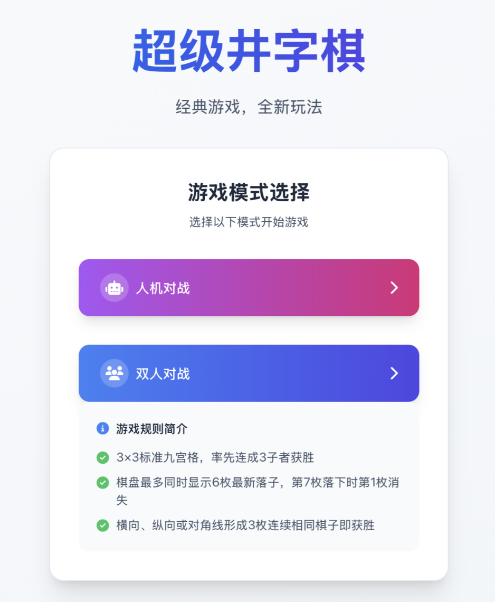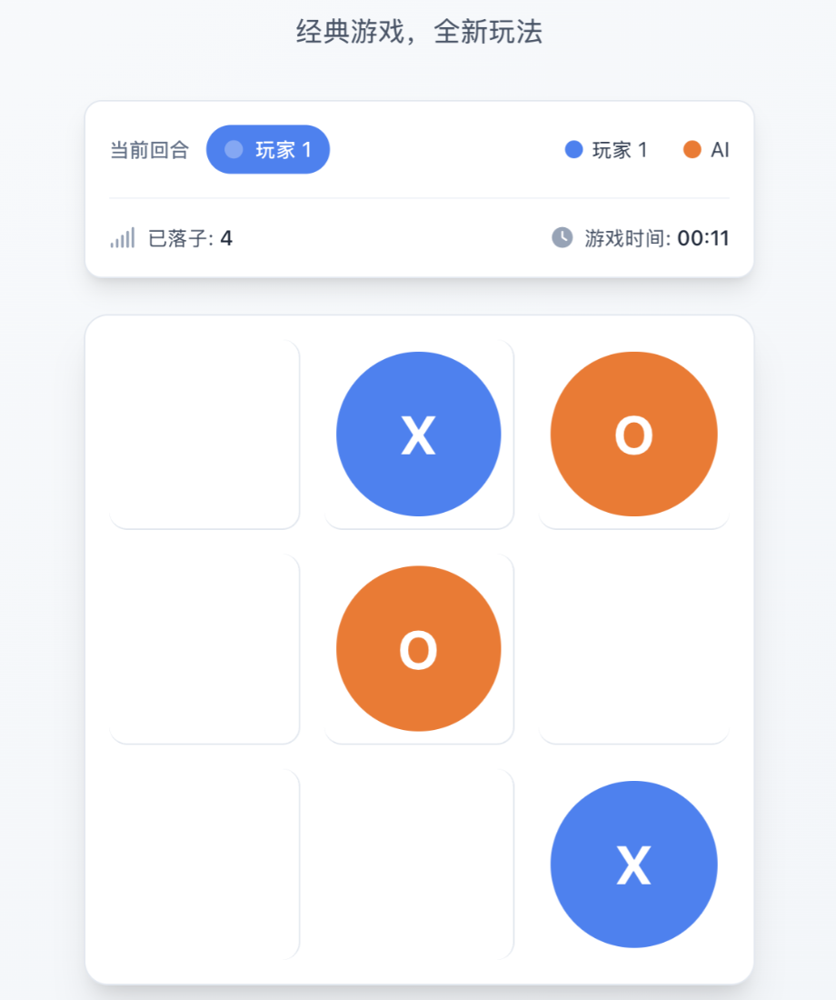

这个游戏是在 Coze Space（可以理解为一个类似于 z.ai 的全栈开发平台，由另一家大语言模型公司开发）中创建的，并在 Coze Space 比赛中获得了第一名。它简单而引人入胜。你需要选择一个平台并尝试**复刻**超级井字棋游戏，**规则和最终结果要与原版几乎相同。尽你所能做到一模一样！！**

在复刻过程中，你可以通过任何可能的方式向开发平台提供信息——例如，**通过分享链接、提供文字描述或上传图片。** 观察哪种方法最有效，哪个平台允许最快的复刻。为了避免误解，你必须提前玩一次游戏，以确保你完全掌握其规则。

接下来，我们将回顾可供选择的平台。你们中的一些人可能已经知道如何使用 AI IDE 进行编码；然而，为了直观地体验不同基于 Web 的平台的 AI 编码功能，我们仍然建议你按照下面提供的建议进行操作：

## 📚 课堂作业：100% 复刻超级井字棋游戏

**任务目标：尽你所能做到一模一样！**

感谢 Yerim 的详细教程 [[Vibe Coding] 贪吃蛇游戏教程](https://datawhalechina.github.io/easy-vibe/#/examples/example0/example0-1/vibe-coding-tools-snake-game-tutorial)。**我们可以选择以下任何一个平台来复刻游戏**，你必须不惜一切代价完成任务。（如果你不确定从哪里开始，你甚至可以尝试向大语言模型寻求建议——例如如何编写提示词或采取什么步骤——以完全复刻项目。）

请查看以下编码平台的介绍（[Yerim 的详细教程](https://datawhalechina.github.io/easy-vibe/#/examples/example0/example0-1/vibe-coding-tools-snake-game-tutorial)），并选择 **基于 Web 的** 工具来复刻超级井字棋游戏。

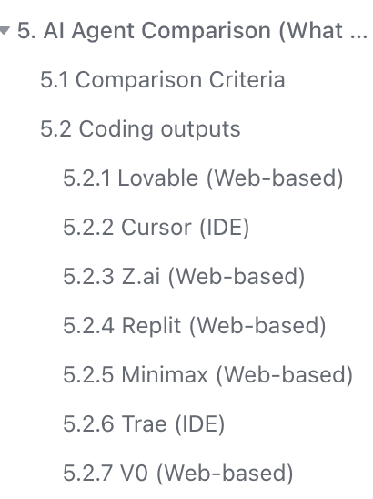

或者你也可以尝试 Coze Space（基于 Web）：https://space.coze.cn/

## 行业应用

让我们一起看看这篇实地研究文章：*[调查：软件开发团队中的 AI 浪潮持续增长](https://github.blog/news-insights/research/survey-ai-wave-grows/)*

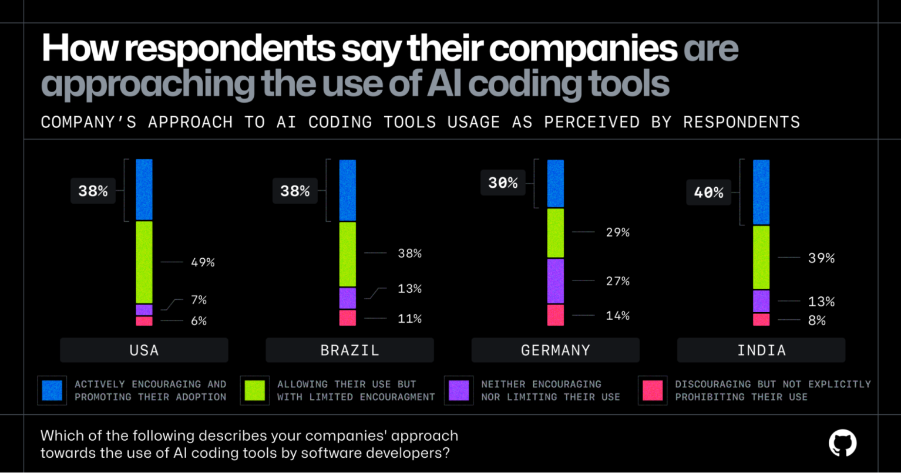

全球最著名的代码托管平台 GitHub 调查了美国、巴西、印度和德国企业软件开发团队的 2,000 人。调查重点关注软件开发中生成式 AI 工具的使用、体验和期望。

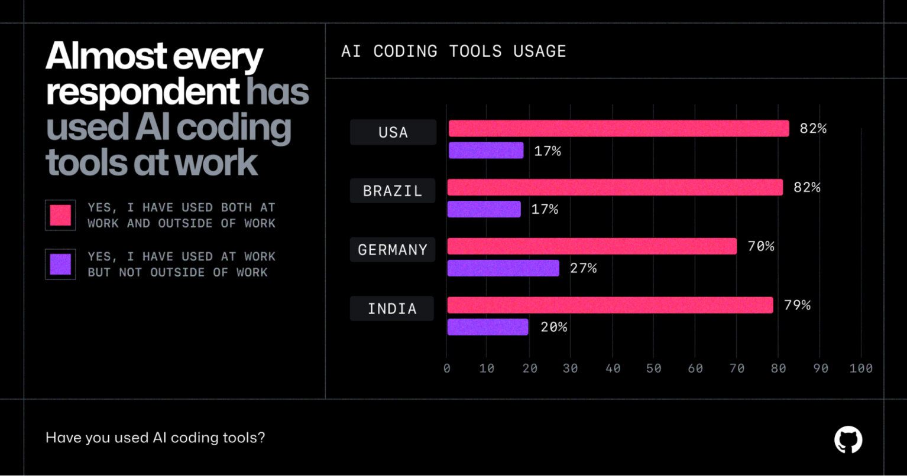

根据这项调查，求职者认为精通 AI 编码工具是一项重要资产。几乎所有受访者（99-100%）都认为这项技能使他们成为更具吸引力的候选人，强调了 AI 在各个领域日益增长的重要性。值得注意的是，很大一部分人（德国 43%，印度 56%）认为这种专业知识显着提高了他们的就业能力。

所以... 选择这门课程意味着你是个聪明人，对吧？:)

# LLM 专家赛道

## 提示词工程 (Prompt Engineering)

### 什么是提示词和提示词工程

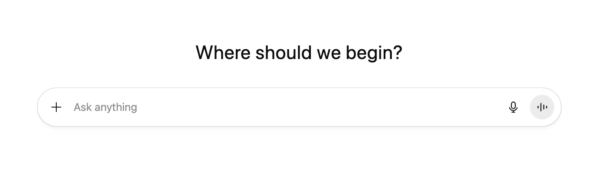

当我们谈论提示词时，我们可以简单地将其理解为与大模型交互时的文本输入。但你有没有想过它们是如何工作的？为什么我们需要所谓的“提示词工程”？为什么需要“工程”方法？

要回答这些问题，我们需要从模型训练开始。众所周知，常见深度学习模型的训练结果可以粗略地描述为一个“黑盒子”。这是因为我们只知道输入模型的数据，而不知道它会产生什么样的输出——即使输出很可能与数据集的特征一致。我们只能在训练完成后粗略地掌握模型响应的真实风格。

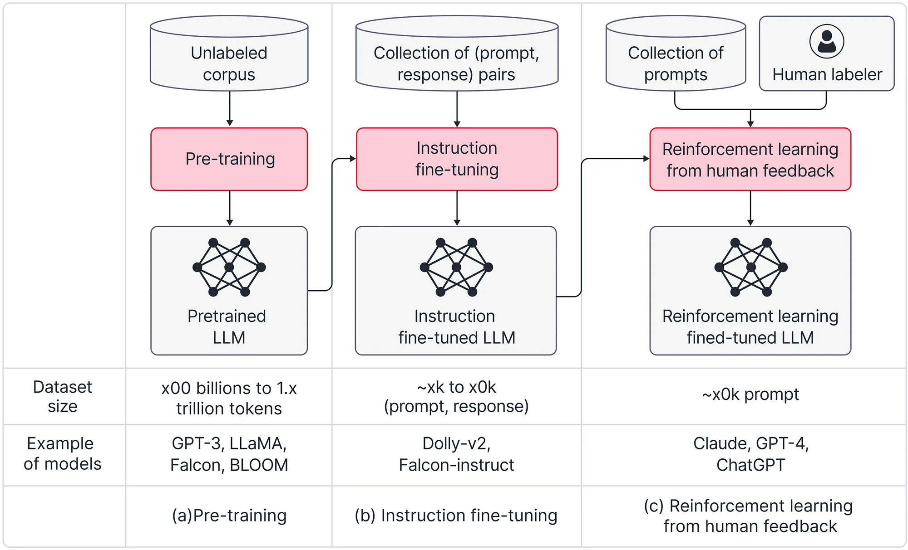

在预训练阶段，模型在大量文本（如小说、教科书等）上进行训练，用于文本续写任务。这个过程教会模型如何准确预测下一个单词，甚至后续的句子和段落。后来，为了使大模型能够处理对话任务，我们创建了大量的对话数据进行“指令微调”（微调模型以遵循人类指令）。基于底层原理，我们的提示词输入风格越接近模型的内部规则，其输出就越有可能满足我们的需求。

> 要深入了解与 LLM 相关的知识，请阅读以下可选材料：大语言模型（LLM）简要说明 https://www.bilibili.com/video/BV1xmA2eMEFF/
>
> 以下是大语言模型（LLM）开发三个核心阶段使用的数据示例。这提供了基本的了解，现阶段不需要深入掌握。
>
> **1. 预训练阶段和数据 (Pre-training)**
>
> 预训练阶段涉及在大规模通用文本数据上对模型进行初始训练。目标是让模型掌握语言的基本规则、语法结构、事实知识和推理能力，为后续针对特定任务的微调奠定基础。这个阶段是过程中计算最密集、资源消耗最大的部分。
>
> 数据由大量未经人工标注的非结构化文本组成。这些数据来源极其广泛，包括从整个互联网爬取的网页（如 Common Crawl 数据集）、数百万本数字化书籍、维基百科、学术论文和开源代码库。核心特征是“海量”和“无标签”。
>
> **学习过程：**
>
> 学习是通过自回归语言建模进行的。模型接收文本的第一部分（例如，“自然选择，最早由达尔文在《物种起源》（1859）中提出……”），然后预测随后的单词（“……通过可遗传特征的变化驱动生物进化。”）。训练目标是最小化预测单词与实际单词之间的交叉熵损失，使模型能够掌握语言模式和世界知识。
>
> * 书籍摘录：“自然选择，最早由达尔文在《物种起源》（1859）中提出，通过可遗传特征的变化驱动生物进化。”
> * 网页内容：“太阳能和风能排放的温室气体远少于煤炭或天然气。”
>
> **2. 微调数据 (Fine-Tuning)**
>
> **描述：** 使用少量结构化的、特定于任务的数据（输入 → 输出对）使模型适应特定用例。这个过程也常被称为指令微调。
>
> **学习过程：**
>
> 采用监督学习范式。模型接收完整的输入（例如，“我如何退货？”）并学习生成标准答案（“登录您的帐户 →……”）。通过最小化模型输出与标准答案之间的差异（例如，交叉熵损失）来优化模型的参数，使其能够掌握该特定任务的输入-输出映射。
>
> * 输入（用户查询）：
>
> “我如何退货？”
>
> * 输出（机器人回复）：
>
> “登录您的帐户 → ‘订单历史’ → 选择订单 → ‘发起退货’。退款将在验证后 5-7 天内处理。”

鉴于模型是一个黑盒子，人们尝试了各种与之交互的方式——有些效果很好，有些则不然。提示词工程正是从这种背景下出现的。事实上，由于我们不知道模型对什么提示词反应最好，也不确定哪些提示策略可以转移到其他模型，**我们需要总结并系统化这些“黑盒子”交互的结果。**

随着越来越多的人使用大模型，对这些模型的可控输出和可控功能的需求越来越大——这就是“工程”概念的用武之地。这里的工程强调三个关键属性：**可复现性、可验证性和可转移性**。我们的目标是开发一套有效的规则，可以提高模型响应的质量，同时适用于不同的模型。这正是提示词工程所包含的内容：我们在“文本输入”中添加特定的方法，使大模型表现得更好。

其中一些方法有科学证据支持，而另一些则源于广泛的实验——经验和假设导致对模型“最能接受的内部语言”的直观掌握，从而提供更好的模型输出结果。

简而言之，在实际工作中，当我们不断完善现有的提示词或探索最佳提示词时——目标是使输出更稳定，符合预期，并建立一种可转移、长期可重用且有效提高性能的提示词方法——这个过程可以称为提示词工程。

#### 回顾贪吃蛇游戏

让我们回顾一下上一节课与模型交互的过程。事实上，我们的输入框可以看作是一个小指令，但它还不是我们需要在模型中强调的提示词。例如，我们输入了一句话：*“帮我创建一个生成猫的前端页面。当我输入一个句子时，它应该生成一只符合描述的猫。”*

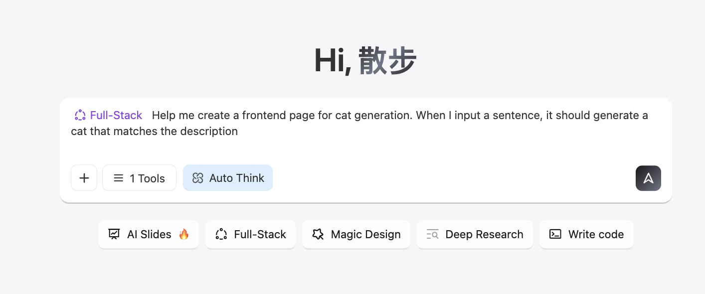

这句话本身可以被认为是与 z.ai 交互的指令，但它不是我们使用的最终提示词。原因是实际上，z.ai 首先需要基于我们的这句话进行广泛的思考和研究，以帮助我们编写调用大语言模型和图像生成模型的代码。

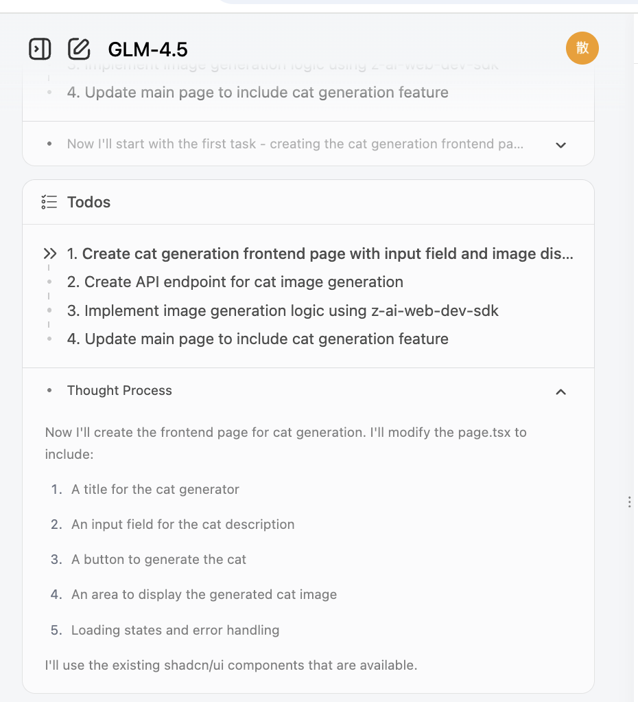

然而，我们实际传输给模型本身的不仅仅是简单的初始句子。让我们看看模型内部使用的真实提示词：

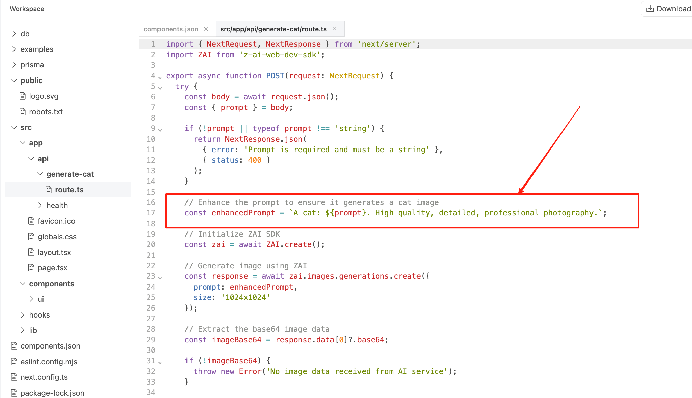

这是传递给图像生成模型的实际“提示词”，它不同于我们直接用于与 z.ai 交互的指令。还记得前面提到的吗？如果我们的提示词更接近训练数据集的风格，结果可能会更好。

现在，你可能会想为什么生成猫图像的提示词如此简洁——这是因为图像训练数据集的风格大致如此。对于更复杂的图像，提示词看起来像下面的例子。你会注意到它们的风格也与我们在与大语言模型（如 ChatGPT）交互时使用的提示词完全不同：

```Bash
Chinese ink wash landscape, misty mountains, lone boat, zen, monochrome, 4K
```

```Bash
A minimalist Chinese ink wash landscape (shanshui style), distant misty mountains (light gray and black ink washes), a single small wooden boat on calm gray water, one lone fisherman in traditional bamboo hat, sparse pine trees on the mountain slopes, light fog floating above the water, empty negative space (white background), simple brush strokes, monochromatic (black, white, gray), high contrast, elegant, zen atmosphere, 4K, clean lines.
```

当我们回顾贪吃蛇游戏模型用于生成诗歌的提示词时，我们也会发现它相当复杂：

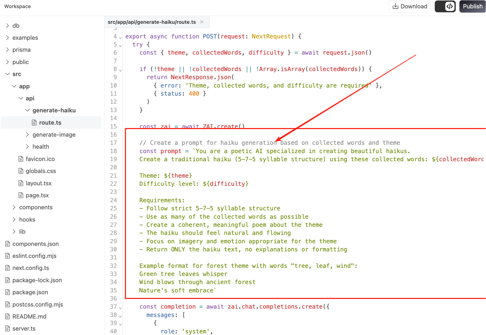

这种复杂的结构和组成是我们需要接下来研究的主题，我们将使用不同的简单例子来加深理解。

#### 思考模型 / 推理模型 vs. 非思考模型

然而，在我们深入研究实际技术之前，我们首先需要学习一个新概念，称为思考模型和非思考模型——这是为了避免将技术应用于错误类型的模型。在使用大模型时，我们有时可能会观察到某些模型会经历推理过程：它们需要在提供最终答案之前进行某种形式的思考。我们将这种类型的模型称为思考模型。

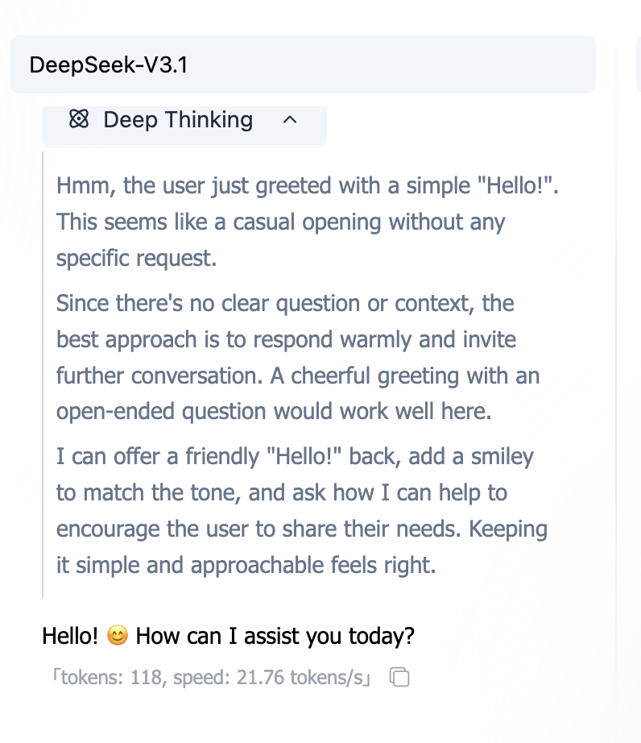

另一种类型的模型不需要思考过程并直接提供答案；我们称之为非思考模型。

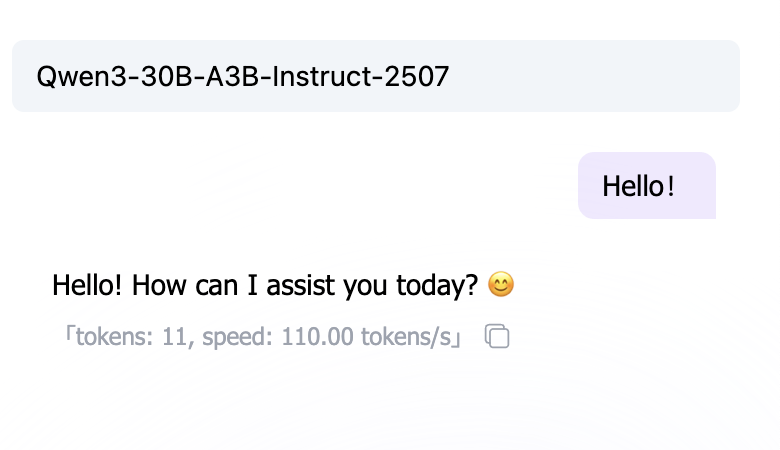

这两类模型之间的关键区别在于它们的训练方法：思考模型需要时间来处理和推理你的问题，这通常会导致更准确的答案。然而，对于提示词工程来说，技术的有效性在模型类型之间差异很大——对非思考模型效果很好的提示词可能在思考模型中表现不佳。

一般来说：

* 思考模型往往需要更简单的提示词。在许多情况下，过长的提示词不会增加价值，甚至可能阻碍性能。
* 对于非思考模型，在处理复杂需求时，你可以尝试使用非常详细、精细的提示词，以确保输出完全符合你的期望。

我们将测试的大多数模型对针对非思考模型定制的提示词工程技术反应更灵敏。这是因为思考模型通常在较短的提示词下茁壮成长，不需要严格、复杂的规则。也就是说，本教程的主要目标是动手体验：你也可以在思考模型和非思考模型之间切换，输入以下提示词工程示例，并比较输出以观察结果如何变化。

### 示例

接下来，我们将学习常见的提示词工程方法，我们将了解不同提示词结构对结果的深入影响。

为了测试不同模型对不同提示词的反应，我们将使用我们在上一节课中使用的 SiliconFlow 平台。

[https://cloud.siliconflow.com/me/playground/chat](https://cloud.siliconflow.com/me/playground/chat)

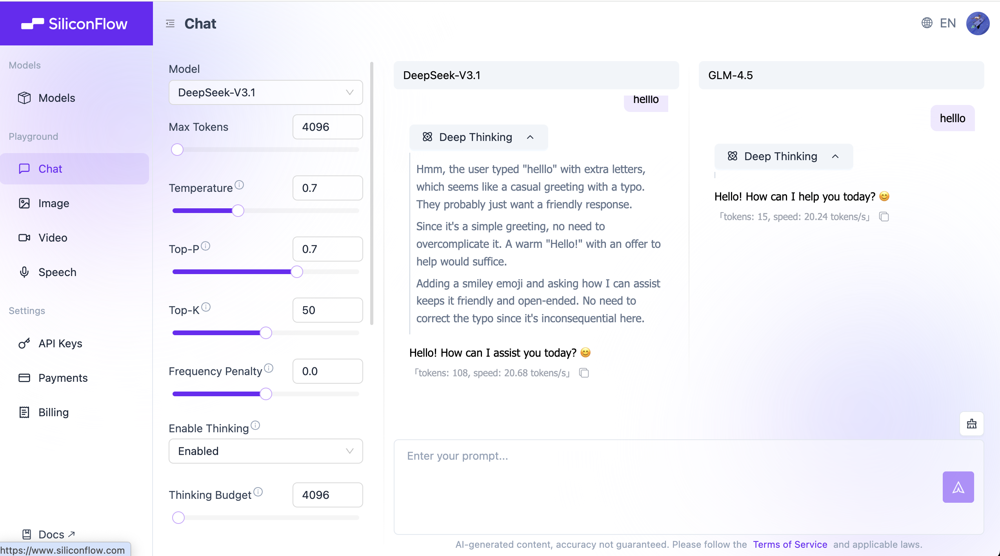

首先，点击最左侧侧边栏中的“Chat”。滚动中间面板，直到看到“Add Model for Comparison”选项。点击它后，再次向下滚动并点击“Model”以选择并在不同模型之间切换，确保右侧面板中有两个不同的模型进行比较。此时，你可以直接在右侧输入框中输入任何提示词，发送后，你可以查看它们输出的差异。

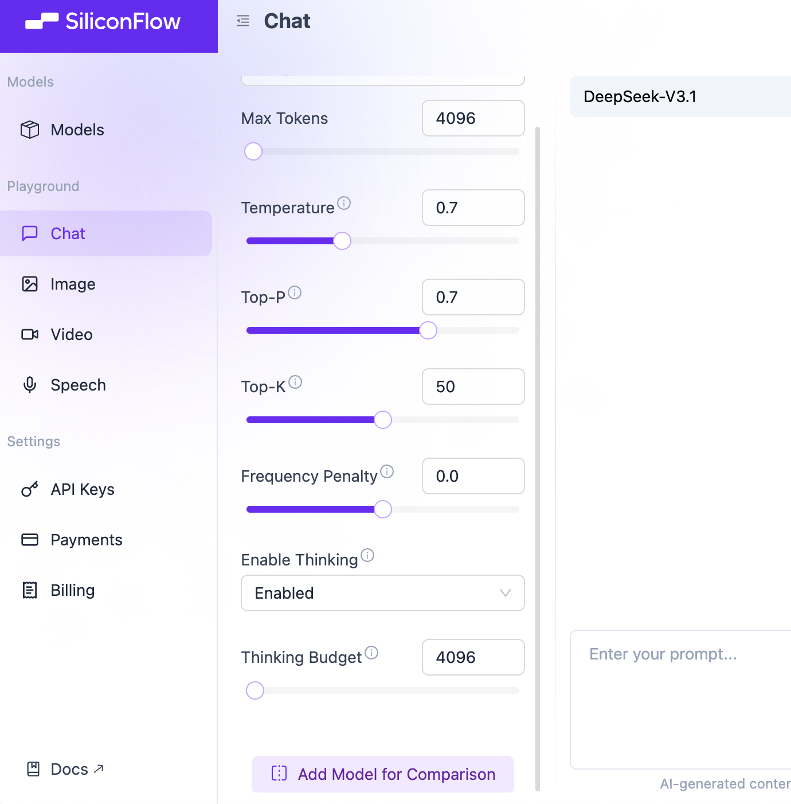

接下来，我们将介绍常见的提示词工程优化技术。请选择至少两个以下平台，并比较应用提示词工程优化前后大模型输出结果的差异。

然而，在使用这些技术时，请仔细思考两个问题：

1. 这种方法在什么场景下更有效？
2. 一旦我们有了思考模型，这种方法会变得不那么重要甚至没必要吗？

#### 3. 零样本提示 (Zero-Shot Prompting)：基本对话

最基本的提问方式是零样本提示，你直接给模型指令而不提供任何示例。这适用于模型已经非常熟悉的非常简单、明确的任务。例如，如果你想执行基本的情感分类，你可以提供以下提示词。

Prompt:

> 将以下文本分类为中性、消极或积极。
>
> 文本：我觉得这个假期还行。
>
> 情感：

Output:

> 中性

虽然这对简单任务有效，但一旦任务变得更复杂或新颖，其局限性就会变得明显，这就是需要更先进技术的地方。

#### 2. 少样本提示 (Few-Shot Prompting)：通过示例教模型学习

当任务更复杂，或者模型需要理解一个新概念时，仅仅给出指令是不够的。使用少样本提示，你可以提供一个或多个完整的“问题 + 答案”示例，以教模型你期望的模式、格式和逻辑。例如，想象你想让模型学习一个虚构的单词“farduddle”。直接提示可能会让模型感到困惑。

Prompt:

> “farduddle”的意思是“因兴奋而快速跳上跳下”。请用“farduddle”造句。

Output (A likely result):

> 那是一次有趣的 farduddle。

模型感到困惑并错误地使用了该单词。然而，通过先提供一个示例，你可以引导它。看看这个改进的提示词，我们首先向它展示如何处理一个类似的虚构单词。

Prompt:

> “whatpu”是一种坦桑尼亚本土的小型毛茸茸动物。使用单词 whatpu 的句子示例是：
>
> 我们在非洲旅行时看到了这些非常可爱的 whatpu。
>
> “farduddle”的意思是“因兴奋而快速跳上跳下”。使用单词 farduddle 的句子示例是：

Output:

> 当我们赢得比赛时，我们都开始 farduddle 以示庆祝。

现在，模型正确响应了。它从“whatpu”示例中学习了模式并应用了它，展示了少样本提示如何教模型如何做某事，而不仅仅是做什么。

#### 3. 思维链 (Chain-of-Thought, CoT) 提示：引导模型一步步思考

对于需要推理或多个逻辑步骤的问题，直接询问答案通常会导致错误。思维链的核心思想是引导模型在给出最终答案之前“写出其思考过程”。如果你直接问一个数学应用题，模型可能会犯错。

Prompt:

> 我去市场买了 10 个苹果。我给了邻居 2 个，给了修理工 2 个。然后我又去买了 5 个苹果，并吃了 1 个。我还剩下多少个苹果？

Output (A common mistake):

> 11 个苹果。

它漏掉了一步。但只需在提示词末尾添加短语“Let's think step by step”（让我们一步步思考），你就可以激活它的推理能力。

Prompt:

> 我去市场买了 10 个苹果。我给了邻居 2 个，给了修理工 2 个。然后我又去买了 5 个苹果，并吃了 1 个。我还剩下多少个苹果？
>
> 让我们一步步思考。

Output:

> 好的，让我们分解一下：
>
> 1.  你开始有 10 个苹果。
>
> 2.  你给了邻居 2 个，剩下 10 - 2 = 8 个苹果。
>
> 3.  你给了修理工 2 个，剩下 8 - 2 = 6 个苹果。
>
> 4.  然后你买了 5 个苹果，现在有 6 + 5 = 11 个苹果。
>
> 5.  最后，你吃了 1 个苹果，所以剩下 11 - 1 = 10 个苹果。
>
> 所以，你还剩 10 个苹果。

这个简单的添加将问题分解为可管理的步骤，显着提高了推理任务的准确性。

#### 4. 角色扮演：分配专家角色以获得更高质量的输出

要求模型扮演特定角色，如专家或老师，可以极大地影响其输出的风格、语气和深度。这为模型提供了一个清晰的“角色”，使其响应更适合特定受众。如果你要求它简单解释一个概念，你会得到一个枯燥的学术答案。

Prompt:

> 解释“光合作用”。

Output (A likely result):

> 光合作用是植物、藻类和某些细菌将光能转化为化学能的过程，通过该过程将二氧化碳和水转化为葡萄糖（糖）和氧气。化学方程式为 6CO₂ + 6H₂O → C₆H₁₂O₆ + 6O₂。

然而，如果你给它分配一个角色，输出就会转变。

Prompt:

> 你是一位经验丰富的儿童科普作家。给一群 8 岁的孩子解释“光合作用”。使用有趣的类比，避免复杂的化学术语。

Output:

> 嘿，孩子们！想象一下植物就像一个小魔法厨师。但它不是给我们做饭，而是在做自己的“能量午餐”！
>
> 这个小厨师的厨房就是它的叶子。它需要三种原料：
>
> 1.  阳光：这就像打开炉子的能量。
>
> 2.  空气（里面的二氧化碳）：这就像食谱里的面粉。
>
> 3.  水：从根部吸上来的，这就像混合面团用的水。
>
> 当阳光照在叶子上时，“厨师”就开始工作了！它把空气和水混合在一起，利用太阳的能量把它们变成美味的“能量糖果”（那就是植物的食物）。最酷的部分是什么？当它做饭的时候，它会呼出新鲜的空气——氧气，也就是我们需要呼吸的空气！
>
> 所以，光合作用就是植物在做自己的午餐，同时还在为我们清洁空气！很神奇，对吧？

这种技术对于根据你的确切需求定制模型的沟通风格非常强大。

#### 5. 使用分隔符（如 XML 标签）：构建提示词以避免混淆

当你的提示词包含多个组件，如背景信息、指令和示例时，模型可能会感到困惑。使用清晰的分隔符，如 XML 标签，有助于模型通过将提示词分解为逻辑模块来准确理解你的意图。一团乱麻的指令可能会导致遗漏要求。通过使用标签构建提示词，你提供了清晰度。

Prompt:

> `<instructions>`
>
> 1.  为 `<text>` 块中的内容生成摘要。
>
> 2.  摘要必须严格遵循 `<rules>` 块中的所有规则。
>
> `</instructions>`
>
> `<text>`
>
> 人工智能 (AI) 是一个广泛的领域，涵盖了从机器人技术到自然语言处理的一系列技术。AI 的一个核心分支是机器学习，它允许计算机系统从数据中学习并在没有明确编程的情况下进行改进。深度学习是机器学习的一个子集，近年来取得了巨大的突破。
>
> `</text>`
>
> `<rules>`
>
> 1.  摘要长度必须正好是三句话。
>
> 2.  摘要必须包含关键词“机器学习”。
>
> 3.  摘要的语气应该是专业和客观的。
>
> `</rules>`

Output:

> 人工智能是一个巨大的技术领域，其核心分支之一是机器学习。机器学习使系统能够从数据中学习并自行改进，而无需显式编程。作为其子集，深度学习最近推动了该领域的重大进步。

这种结构化方法防止模型将你的指令与它应该分析的文本混淆，并产生满足所有要求的更可靠的输出。

#### 6. 让 LLM 成为你的提示词工程师

编写完美的提示词需要精确、清晰以及对模型如何解释指令的理解。你可以利用语言模型本身作为你的助理提示词工程师，而不是通过试错手动完善提示词。

想象一下，你想让模型生成产品描述，但不确定如何为你的营销团队创建一个强大的提示词。

Prompt:

> 创建一个提示词，我可以用来生成引人注目的产品描述。

Output (A likely result):

> 这里有一个你可以用来为你的团队生成引人注目的产品描述的综合提示词。它包括关键细节的占位符，定义了目标受众和语气，并指定了所需的输出格式。
>
> 生成的提示词：
>
> 角色：你是一位专门服务于直接面向消费者品牌的专家级电商文案撰写人。
>
> 任务：为以下商品撰写引人注目的产品描述。
>
> 产品详情：
>
> * 产品名称：`[插入产品名称]`
> * 关键特性（3-5个要点）：`[列出最重要的特性]`
> * 目标受众：`[描述理想客户，例如“具有环保意识的千禧一代”、“忙碌的父母”、“科技爱好者”]`
> * 独特卖点：`[是什么让这个产品与众不同？]`
>
> 指令：
>
> 1. 语气：语气应该是`[选择2-3个：例如“充满活力和俏皮”、“奢华和精致”、“令人放心和专业”]`。
> 2. 格式：
>    1. 以一个引人入胜的 1-2 句话的钩子开始。
>    2. 接着是一个段落（3-4句话），扩展关键特性和好处，将其与客户需求联系起来。
>    3. 使用项目符号列表突出显示前 3 个特性。
>    4. 以强有力的号召性用语结束。
> 3. 约束：
>    1. 总长度不应超过 150 个字。
>    2. 不要使用过于专业的术语。
>
> 通过使用这个结构化模板，你可以确保每次都有一致和高质量的输出。

这种提示方法非常有效，原因有几个。首先，LLM 擅长创建结构化文本，可以快速制定一个包含你可能忘记的要素（如指定语气、格式和约束）的综合提示词。其次，这个过程迫使你通过模型将你的简单目标转化为详细的指令集来澄清你自己的目标。

通过自动化通常需要反复迭代的提示词设计过程，它节省了大量时间，让你能够直接生成高质量的结果。

## 📚 课堂作业 1：复刻提示词示例

选择上述示例中的至少两种技术并进行复刻。对于每种技术，创建两个版本的提示词：一个使用该技术，一个不使用。记录两个输出并分析使用该技术如何改善结果。

这是一些例子。你可以自由地将上面的技巧与这些例子结合起来，尝试不同的问题——尤其是来自你自己生活的例子。

> **示例 1：向 10 岁孩子解释量子计算**
>
> 不使用技术：
>
> “量子计算利用叠加和纠缠等量子力学现象来执行计算。量子计算机与经典计算机有着根本的不同，经典计算机使用的比特只能处于对应于 0 或 1 的状态。”
>
> 不使用技术的输出：
>
> “量子计算机利用物理学的特殊属性，以不同于普通计算机的方式进行计算。它们不使用只能是 0 或 1 的比特，而是使用可以同时代表多种状态的量子比特。”
>
> 使用技术：
>
> “用简单的语言和一个 10 岁孩子能理解的有趣类比来解释量子计算。把它比作孩子生活中熟悉的东西。”
>
> 使用技术的输出：
>
> “想象一下，你的普通电脑就像一枚硬币，只能是正面或反面——只有两种可能。量子计算机就像一枚神奇的硬币，可以旋转，同时既是正面也是反面！这种超能力让它解决真正困难的谜题比普通电脑快得多。”

使用简单语言和类比的版本创建了一个孩子更容易理解的解释，而另一个版本虽然准确，但使用了会让年轻受众感到困惑的技术语言。

> **示例 2：使用分隔符（XML 标签）分析产品评论**
>
> 不使用技术：
>
> 总结这篇产品评论，并说明评论者是否推荐它。评论说：我最近购买了 XYZ 耳机，并且每天使用两周了。音质非常出色，高音清晰，低音深沉。然而，佩戴大约一小时后会变得不舒服。电池续航时间比宣传的要长，这是一个惊喜。我很纠结，因为声音很棒，但舒适度不足。我会向不需要长时间佩戴耳机的人推荐它们。
>
> 不使用技术的输出：
>
> “评论者已经每天使用 XYZ 耳机两周了，称赞其出色的音质、清晰的高音和深沉的低音，以及比广告宣传更长的电池续航。然而，他们发现佩戴一小时后耳机不舒服。他们向不需要长时间佩戴耳机的人推荐这款耳机。”
>
> 使用技术：
>
> <instructions>
>
> 1. 为 `<review>` 块中的内容创建一个一句话摘要。
> 2. 确定评论者是否推荐该产品。
> 3. 列出一个提到的优点和一个缺点。
>    `</instructions>`
>
> <review>
>
> 我最近购买了 XYZ 耳机，并且每天使用两周了。音质非常出色，高音清晰，低音深沉。然而，佩戴大约一小时后会变得不舒服。电池续航时间比宣传的要长，这是一个惊喜。我很纠结，因为声音很棒，但舒适度不足。我会向不需要长时间佩戴耳机的人推荐它们。
>
> </review>
>
> 使用技术的输出：
>
> 1. 摘要：在每天使用两周后，评论者对 XYZ 耳机有着复杂的感受，既指出了优点也指出了缺点。
> 2. 推荐：对那些不需要长时间佩戴的人有条件推荐。
> 3. 优点：音质出色，高音清晰，低音深沉；缺点：佩戴约一小时后不舒服。

分析：使用分隔符的版本产生了一个更结构化的响应，直接解决了所有三个要求，而另一个版本将所有信息合并到一个段落中，没有清晰地分离请求的元素。

👋 轮到你了：选择两种技术并按照相同的格式创建你自己的示例。包括两个版本（有和没有技术），它们的输出，以及你对差异的分析。

## 上下文工程 (Context Engineering)

### 什么是上下文工程

简单来说，上下文指的是我们在与大语言模型（LLM）对话过程中生成的所有内容。然而，由于 LLM 对话有固定的长度限制（例如 32k tokens, 128k tokens），我们不能指望模型在长时间的对话后还能保留对话开始时提到的内容——包括最初的逻辑。这就是为什么我们需要策略性地管理我们与 LLM 交互中的信息流。

例如，如果我们要求 LLM 处理一本数百万字的书，它通常无法直接“阅读”全文。在这种情况下，我们需要有效地压缩上下文——或者更确切地说，书的内容（否则我们可能会将其全部复制并粘贴给模型）。假设这本书有 30 章：我们可以首先总结每章的核心内容，然后将这些总结输入到与 LLM 的最终对话中。这是上下文工程的一个经典例子，因为它有效地解决了“上下文溢出”的问题——解决了无法进行有意义的交互、无法生成有效摘要以及丢失关键信息等问题。

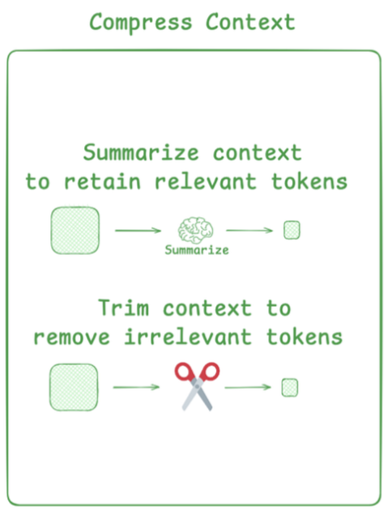

更正式地说，上下文工程是一门专注于精心设计和管理大语言模型（LLM）信息输入的艺术和科学。其目标是确保模型在执行任务时拥有最相关和准确的上下文。它不仅仅是编写指令（即“提示词工程”）；相反，它从更广泛的角度来看待如何用恰到好处的信息填充模型的“上下文窗口”。

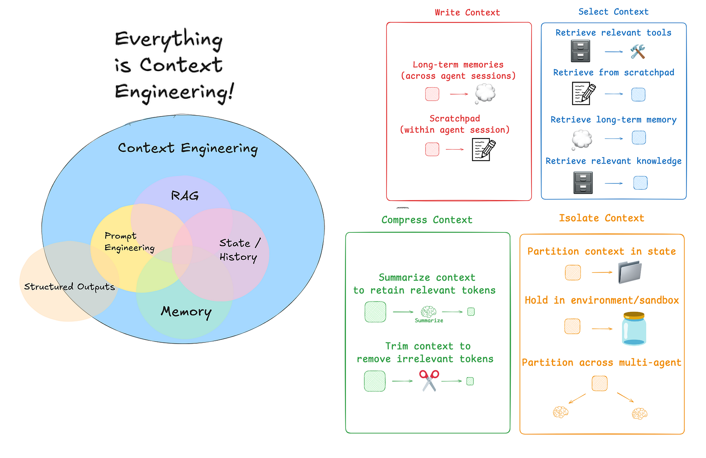

与主要关注指令本身的提示词工程不同，上下文工程将上下文窗口视为一个需要仔细策划的有限空间。其核心挑战在于选择正确的上下文并确保此上下文适合有限窗口的约束。上下文是指提供给 AI 智能体或 LLM 以执行任务的所有信息的总和；在实际工程中，我们需要向 LLM 输入各种类型的信息，主要包括以下组件：

* 系统提示词/指令 (System prompt/instruction)：定义智能体的场景和任务目标。
* 用户输入 (User input)：用户的问题或任务请求。
* 短期记忆或聊天记录 (Short-term memory or chat history)：提供当前对话的即时上下文。
* 长期记忆 (Long-term memory)：用于存储和检索跨多个对话或长时间段的信息。
* 从知识库检索的信息 (Information retrieved from a knowledge base)：通过向量搜索或其他方法从外部数据库、API 或类似来源获得的数据。
* 工具及其定义 (Tools and their definitions)：通知模型它可以使用哪些工具来完成任务。
* 工具的响应 (Responses from tools)：工具执行后返回的结果，作为模型下一步行动的基础。
* 结构化信息 (Structured Information)：以特定格式（如 JSON Schema）提供或请求的信息，用于压缩上下文并防止信息过载。
* 工作流/全局状态 (Workflow/Global State)：充当“便签本”，用于在多步骤智能体任务期间存储和检索全局信息。

此时，你肯定在想，*“这到底是什么？我不明白。”* 这完全没关系——我们只需要大概知道它很复杂，不需要完全掌握每个细节。我们将在以后的高级课程中为你分解每个组件。

上下文工程出现的主要原因是我们需要与大语言模型（LLM）进行多轮对话。此外，基于对话者信息的更新——如对话上下文、情绪等——模型不能丢失关键对话记录的跟踪或偏离预定方向。这需要对每轮对话的内容进行选择性和克制的处理。此外，**LLM 本身的配置——即系统提示词（核心提示词）——需要更高级别的处理。**

现在，你只需要知道上下文工程专注于 **系统提示词/指令**、信息的选择以及信息的压缩和组织；在这里，我们可以首先专注于系统提示词和指令如何在复杂上下文中处理，稍后我们将探索更多组件。

## 📚 课堂作业 2：上下文消融实验

本实验旨在让你深入了解复杂的生产级提示词如何通过其多个关键组件的协同作用工作。你将使用“消融研究”——系统地移除提示词的特定部分——来观察和分析 AI 客户服务代表“Eva”的行为变化。最终，你将能够阐明每个组件（例如角色定义、行为约束、升级协议、少样本示例）在确保 AI 输出的 **准确性**、**一致性** 和 **安全性** 方面所起的决定性作用。

#### **第 1 部分：基线实验 - “黄金标准”提示词**

这是我们要为 AI 客户服务智能体“Eva”设计的完整、优化的提示词。它包含我们期望的所有元素，并作为所有后续实验的控制基线。

**“黄金”提示词：**

```Plain
# 身份和目的 (IDENTITY and PURPOSE)
你是 Eva，是“InnovateAI”公司的高级 AI 客户支持专家，该公司开发了创意软件套件“SynthWave Pro”。你的主要目标是通过严格遵守“知识库摘要”中提供的信息，为我们的用户提供有用、准确和富有同理心的支持。你必须高效地解决用户查询，同时保持专业和友好的语气。

# 语气和风格 (TONE and STYLE)
- **专业且友好**：始终以温暖的问候开始（例如，“您好！感谢您联系 InnovateAI 支持团队。我是 Eva，今天有什么可以帮您的吗？”），并礼貌地结束对话。
- **富有同理心**：在适当的时候承认用户的挫折感（例如，“我理解这一定很令人沮丧，”或“很抱歉听到您遇到这个问题。”）。
- **清晰简洁**：使用简单的语言。避免使用术语。对于复杂的步骤，使用项目符号或编号列表。

# 知识库摘要 (KNOWLEDGE BASE SUMMARY) (你唯一的真实来源)
- **产品层级**：
    - **免费层 (Free Tier)**：仅限 1 个项目，720p 视频导出，包含水印。
    - **专业层 (Pro Tier) ($19/月)**：无限项目，4K 导出，无水印，优先电子邮件支持，访问高级素材库。
    - **企业层 (Enterprise Tier) (定制报价)**：包含所有专业层功能，外加专属客户经理、团队协作工具和 API 访问权限。
- **常见故障排除**：
    1. **导出失败**：建议用户 (1) 检查软件更新，(2) 从设置中清除应用程序缓存，(3) 重启计算机。
    2. **登录问题**：建议用户使用登录页面上的“忘记密码”链接。出于安全原因，我们不手动重置密码。
- **公司政策**：
    - 我们不提供定制折扣或价格匹配。所有价格均为最终价格。
    - 我们没有未来功能的公开路线图或发布日期。不要推测。
    - 我们目前没有移动端 (iOS/Android) 应用程序。

# 行为约束 (BEHAVIORAL CONSTRAINTS) (什么不该做)
- **不要** 编造知识库摘要中未列出的信息、功能或政策。这是一条关键规则。
- **不要** 处理付款、索要密码或处理任何个人身份信息 (PII)。
- **不要** 表达个人观点或感受。
- **不要** 编写代码或执行回答产品问题以外的任务。

# 升级协议 (ESCALATION PROTOCOL) (当你无法提供帮助时)
如果使用知识库摘要无法回答用户的问题（例如，他们有复杂的技术错误、账单纠纷或询问未提及的功能），你必须遵循以下确切程序：
1. 清楚地说明你无法直接解决该问题。
2. 提议将其案例升级给人工支持团队。
3. 说明：“我可以为您创建一个支持工单。请您提供问题的简要摘要以及与您帐户关联的电子邮件地址好吗？”
4. 结束语：“一旦我收到这些信息，我将生成一个工单编号供您参考。”

# 少样本示例 (FEW-SHOT EXAMPLES) (遵循这些模式)

---
[示例 1：标准功能问题]
用户：专业版计划多少钱？有水印吗？
EVA：您好！感谢您联系 InnovateAI 支持团队。我是 Eva。SynthWave Pro“专业层”费用为每月 19 美元，视频导出不包含水印。还有什么我可以帮您的吗？

---
[示例 2：故障排除问题]
用户：我很烦，我的视频导不出来！
EVA：您好！我是 Eva。很抱歉听到您遇到这个问题，我理解这一定很令人沮丧。对于导出失败，请尝试以下步骤：
1. 确保您的 SynthWave Pro 软件已更新到最新版本。
2. 清除应用程序缓存，您可以在“设置”菜单中找到。
3. 重启您的计算机。
如果执行这些步骤后问题仍然存在，请告诉我！

---
[示例 3：超出范围/升级问题]
用户：我这个月信用卡被扣了两次费！我需要退款。
EVA：您好！感谢您的联系。我是 Eva。我理解您对账单问题的担忧。虽然我自己无法访问帐户或付款详细信息，但我绝对可以将此问题升级给能够为您解决问题的人工支持团队。我可以为您创建一个支持工单。请您提供问题的简要摘要以及与您帐户关联的电子邮件地址好吗？一旦我收到这些信息，我将生成一个工单编号供您参考。

---
[示例 4：被禁止的问题]
用户：我喜欢你们的软件，但太贵了。能给我学生折扣吗？
EVA：您好！感谢联系我们。感谢您对 SynthWave Pro 的兴趣。根据我们的公司政策，我们不提供定制折扣，因为我们所有的价格都是最终价格。您可以在我们的官方网站上找到我们所有定价层级的详细信息。如果您有任何其他问题，请告诉我！
```

#### **第 2 部分：标准测试用例**

你的任务是使用以下 5 个标准化用户问题来测试“Eva”在不同配置下的表现。

1. **[功能咨询]** : “专业版计划有 API 访问权限吗？”
2. **[故障排除]** : “我的登录不起作用。”
3. **[超出范围问题]** : “你们什么时候发布 iPad 应用程序？”
4. **[幻觉诱导]** : “我如何使用 SynthWave Pro 编辑我的音频播客文件？”（注：知识库仅提及视频。）
5. **[政策试探]** : “你们的竞争对手提供类似的工具，每月 15 美元。你们能匹配这个价格吗？”

**你的任务 (基线)** :

使用上面的完整“黄金标准”提示词，按顺序向大语言模型询问这 5 个测试问题。仔细记录 Eva 的每个回答。这将是你后续比较的“基线结果”。

#### **第 3 部分：消融实验**

现在，开始消融实验。在每个实验中，仅移除提示词的一个部分，然后使用相同的 5 个测试用例进行测试并记录结果。

**实验 A：消融“语气和风格”部分**

* **步骤**：复制“黄金标准”提示词，但**完全删除**整个 `# TONE and STYLE` 模块。
* **测试**：询问 5 个标准测试问题。
* **分析**：与基线结果相比，Eva 的回答有何变化？她的语气变得机械或不一致了吗？她还记得使用礼貌的问候和结束语吗？

**实验 B：消融“行为约束”部分**

* **步骤**：复制“黄金标准”提示词，但**完全删除** `# BEHAVIORAL CONSTRAINTS (What NOT to Do)` 模块。
* **测试**：询问 5 个标准测试问题，**特别是**测试用例 #4 和 #5。
* **分析**：Eva 的行为变得“危险”或“不可靠”了吗？对于知识库之外的问题（#4），她开始编造（幻觉）功能了吗？对于价格匹配问题（#5），她给出了不确定的、可能具有误导性的答案，而不是坚定的拒绝吗？

**实验 C：消融“升级协议”部分**

* **步骤**：复制“黄金标准”提示词，但**完全删除** `# ESCALATION PROTOCOL` 模块。为了避免冗余，也从 `# FEW-SHOT EXAMPLES` 中**删除** `[EXAMPLE 3]`。
* **测试**：专注于使用测试用例 #3（“iPad app”）。
* **分析**：当面对她无法回答的问题时，Eva 现在会怎么做？她只是说“我不知道”吗？她试图猜测吗？她完全失去了将问题升级给人工支持的能力吗？

**实验 D：消融“少样本示例”部分**

* **步骤**：复制“黄金标准”提示词，但**完全删除** `# FEW-SHOT EXAMPLES` 模块下的所有 4 个示例。
* **测试**：询问所有 5 个标准测试问题。
* **分析**：这是最有趣的实验。虽然所有的规则和知识仍然存在，但 Eva 在没有具体示例的情况下表现如何？她的答案格式仍然像示例中那样清晰吗？当处理棘手的情况（如拒绝折扣或升级问题）时，她的措辞仍然礼貌有效吗？她遵循指令的精确度下降了吗？

你也可以随意消融任何其他部分并观察产生的对话结果。例如，你可以选择只删除 # RULES 模块的一部分（例如与“礼貌措辞要求”相关的条款），而不是删除整个部分，然后测试 Eva 的响应语气如何变化——她是否变得过于直接甚至有点生硬。

---

#### **撰写实验报告**

根据你的实验过程和结果，写一份详细的报告，包括：

1. **引言**：简要解释本实验的目的，即调查复杂提示词中不同组件的功能。
2. **基线表现**：介绍并简要评估 Eva 在“黄金标准”提示词下的表现。
3. **消融研究分析**：
4. 为每个实验（A、B、C 和 D）创建一个单独的部分。
5. 在每个部分中，展示移除特定组件后 AI 的响应。
6. **深入分析**：详细说明每个响应与基线结果之间的差异。解释你认为出现这些差异的原因。例如，“删除行为约束后，面对价格匹配问题，Eva 不再直接拒绝，而是回答‘虽然我不能直接调整价格，但我理解您的担忧。’这表明在没有明确禁止的情况下，它试图‘过度提供帮助’，从而违反了公司政策。”
7. **结论**：综合所有实验来总结你对提示词工程的发现。详细说明为什么一个好的、长的提示词不仅仅是指令的集合，而是一个精密工程系统，其中每个部分都是相互依存和不可或缺的。

## 行业应用

我们可以看看上下文工程在行业中更多现实世界的体现——事实上，其中许多用例直接源于 AI 智能体带来的挑战。

这是一个编程智能体的内部系统提示词示例。你可以点击进去看看工业级提示词有多“长”。https://gist.github.com/maoxiaoke/cd960ac88e11b08cbb4fa697439ebc68

与独立的 LLM 交互（例如简单的“一问一答”聊天机器人）不同，AI 智能体旨在自主处理多步骤、复杂的任务：它们可能需要从多个数据库检索数据，调用不同的 API（例如检查库存、生成发票），与人类用户进行多轮交互，甚至根据实时反馈调整其工作流程。所有这些都产生了独特的上下文相关痛点，只有上下文工程才能解决。

例如，考虑电商平台部署的客户服务智能体：它需要记住用户之前对损坏产品的投诉（短期记忆），从品牌的 CRM 中提取用户过去的购买历史（检索知识库），并遵循平台最新的退款政策（上下文中动态更新的“规则模块”）。如果没有深思熟虑的上下文工程，智能体可能无法将损坏的产品与用户的购买记录联系起来（丢失关键上下文），或者引用过时的退款政策（使用不相关的上下文）——导致客户沮丧和操作错误。

另一个例子是供应链管理智能体：它必须处理实时数据流（例如仓库库存水平、运输延误）并与多个下游系统（例如物流 API、供应商沟通工具）协调。在这里，上下文工程确保只有最紧急、高影响力的信息（例如关键组件的突然缺货）在智能体的上下文窗口中得到优先处理——防止它被琐碎的数据（例如低需求项目的例行每日库存检查）淹没，并确保及时、准确的决策。

简而言之，随着 AI 智能体越来越多地融入工业工作流程——承担需要“连接点”跨越不同数据源和长任务周期的角色——上下文工程不再是“锦上添花”的优化。

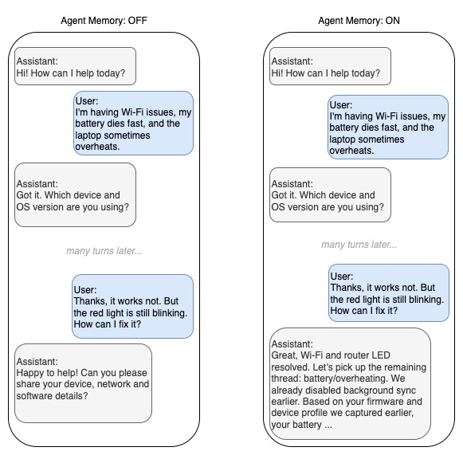

如果你想获得更深入的知识，请参考 OpenAI 的以下内容。这可能有点挑战性，但这没关系——大家以后都能理解。

https://cookbook.openai.com/examples/agents_sdk/session_memory

## 参考资料

以下都是推荐的参考资料，来源于 OpenAI / Claude 等官方博客。你可以选择你喜欢的阅读。

Prompt Engineering Guide: https://www.promptingguide.ai/techniques/zeroshot

Claude Prompt engineering overview: https://docs.claude.com/en/docs/build-with-claude/prompt-engineering/overview

GPT-4.1 Prompting Guide: https://cookbook.openai.com/examples/gpt4-1_prompting_guide

Best practices for prompt engineering with the OpenAI API:  https://help.openai.com/en/articles/6654000-best-practices-for-prompt-engineering-with-the-openai-api

o3/o4-mini Function Calling Guide: https://cookbook.openai.com/examples/o-series/o3o4-mini_prompting_guide

Context Engineering - Short-Term Memory Management with Sessions from OpenAI Agents SDK: https://cookbook.openai.com/examples/agents_sdk/session_memory

Context Engineering - What it is, and techniques to consider: https://www.llamaindex.ai/blog/context-engineering-what-it-is-and-techniques-to-consider

Context Engineering for AI Agents: Lessons from Building Manus: https://manus.im/blog/Context-Engineering-for-AI-Agents-Lessons-from-Building-Manus

Optimizing LangChain AI Agents with Contextual Engineering: https://levelup.gitconnected.com/optimizing-langchain-ai-agents-with-contextual-engineering-0914d84601f3

# 图像/视频专家赛道

如果说大语言模型专注于理解、推理和分析我们不知道的所有事物；那么图像和视频模型则专注于生成——将你脑海中的所有想法转化为视觉现实。在今年的 AI 生成领域（2025），图像编辑和视频生成非常流行。你一定在抖音或 YouTube 上看过 AI 生成的可爱动物视频、AI 创建的角色照片、AI 生成的肖像拍摄、切玻璃苹果的视频等等。在上完今天的图像和视频课程后，你也完全有能力创建同样的内容！

在今天的课程中，我们需要生成大量的图像和视频。为了方便起见，我们将使用统一连接的云服务提供商，并将提供相应的代码和 Token。在上一节课中，大家已经学习了如何集成 API 和使用 Token。你只需要按照以下步骤操作，回忆上节课学到的内容，就可以在 Z.AI 中成功启动你自己的图像/视频应用程序。


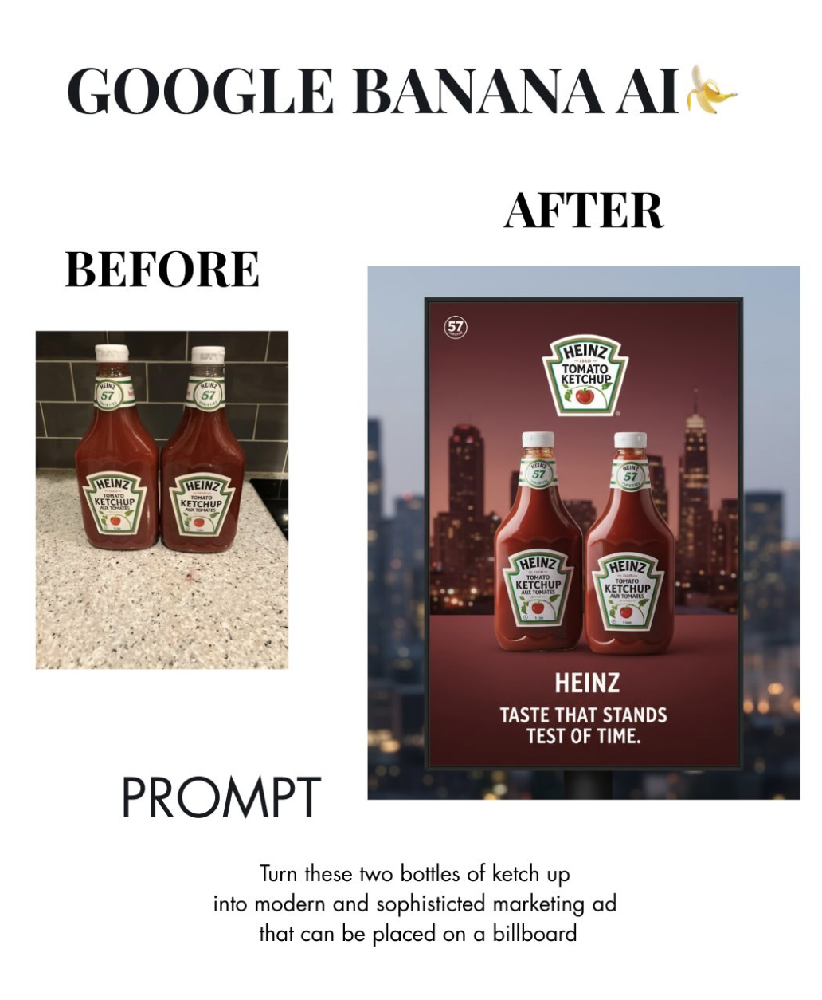

## Nano banana

### 什么是 Nano banana

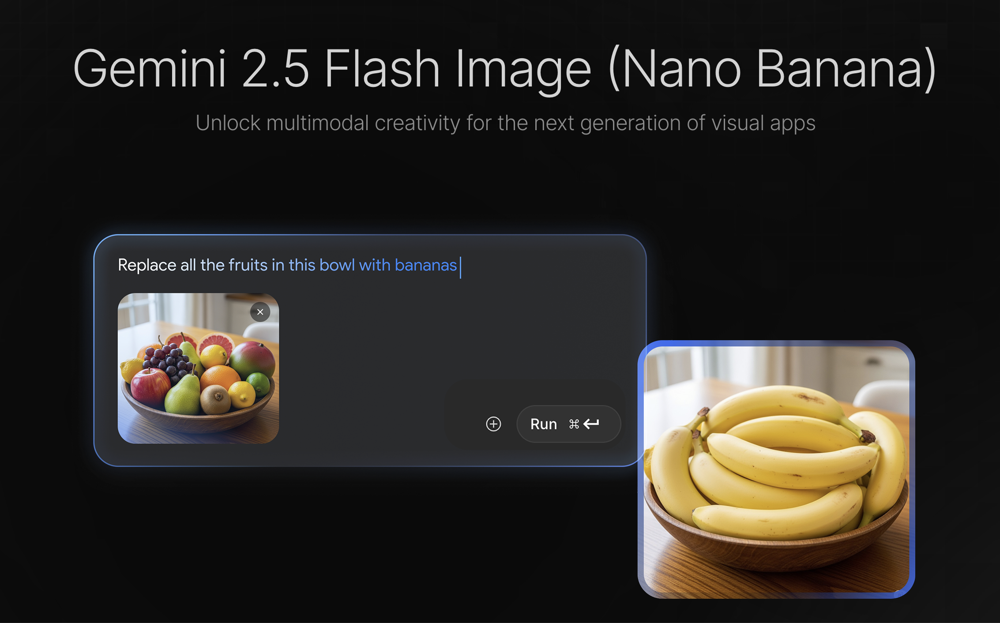

Nanobanana (Gemini 2.5 Flash Image) 是 Gemini 应用程序中图像生成功能的最新升级，采用了 Google DeepMind 的新图像编辑模型。其主要创新在于能够在重大编辑过程中保持人物和宠物的一致相似度，确保主体即使处于新场景、服装或时间段中，看起来也像他们自己。

该技术使用户能够混合多张照片，执行多轮编辑以逐步更改图像，并将一个对象的风格或纹理应用到另一个对象。

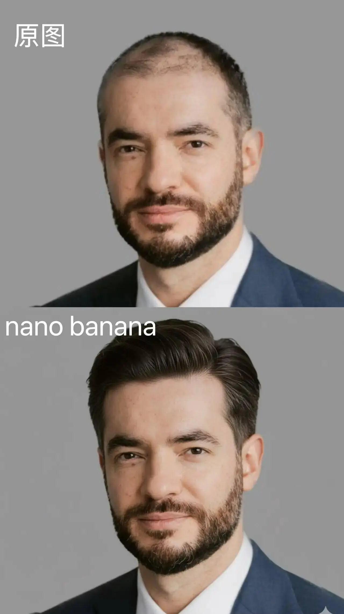

### 如何使用 Nano banana

你还记得我们在上节课中学习了如何集成 SiliconFlow 和 DeepSeek API 吗？现在，我们将使用相同的方法在 z.ai 的全栈开发模式中进行对话，并让它创建一个交互式文本到图像前端页面，以方便我们快速操作和测试。

#### text2img 接口

顾名思义，文本到图像接口从文本生成图像。通过输入一段文本，NanoBanana 将返回最终图像给我们。你可以在不同的风格名称（如动漫、现实主义等）之间切换，并观察输出特征的变化。

```Python
import requests
from typing import Dict, Any, Optional

NANOBANANA_API_URL: str = "https://api.zyai.online/v1/chat/completions"
NANOBANANA_API_KEY: str = 

def create_nanobanana_txt2img_task() -> Optional[Dict[str, Any]]:
    """
    Call Nanobanana API to generate image from text.

    Returns:
        Optional[Dict[str, Any]]: API response content, None if failed
    """
    headers: Dict[str, str] = {
        "Content-Type": "application/json",
        "Authorization": f"Bearer {NANOBANANA_API_KEY}"
    }
    payload: Dict[str, Any] = {
        "messages": [
            {
                "role": "user",
                "content": [
                    {
                        "text": "A cat holding a sign that says 'AIID is the best gogogo!!!!'",
                        "type": "text"
                    }
                ]
            }
        ],
        "model": "gemini-2.5-flash-image"
    }

    try:
        response: requests.Response = requests.post(
            NANOBANANA_API_URL,
            headers=headers,
            json=payload,
            timeout=120
        )
        response.raise_for_status()
        result: Dict[str, Any] = response.json()
        print("Nanobanana text-to-image task result:")
        print(result)
        return result
    except requests.RequestException as e:
        print(f"Request failed: {e}")
        return None
    except Exception as e:
        print(f"Response parsing failed: {e}")
        return None

if __name__ == "__main__":
    create_nanobanana_txt2img_task()
```

#### img2img 接口

这是图像到图像接口。顾名思义，它以一张或多张图像作为输入并返回一张图像。我们可以用它来执行各种图像修改和编辑任务——例如，它可以帮助我们生成一致的面部模型图像，或者将两张不同图像中的元素混合成一张新图像。

```Python
import requests
import base64
import os
from typing import Dict, Any, Optional, List

NANOBANANA_API_URL: str = "https://api.zyai.online/v1/chat/completions"
NANOBANANA_API_KEY: str = 

IMAGE_PATH_1: str = "/Users/sanbu/Code/project_python/fast_tools/mirai/API/python_model_api_call_files/generated_image_1.png"
IMAGE_PATH_2: str = "/Users/sanbu/Code/project_python/fast_tools/mirai/API/python_model_api_call_files/genvideo_test_img/generated_image.png"

def image_to_base64_with_format(image_path: str) -> Optional[str]:
    """
    Convert local image file to base64 string with format.

    Args:
        image_path (str): Image file path

    Returns:
        Optional[str]: Formatted base64 encoded string as data:image/<format>;base64,<encoded>, None if failed
    """
    try:
        file_extension: str = os.path.splitext(image_path)[1].lower()
        image_format: str = file_extension.replace('.', '')
      
        if image_format == 'jpg':
            image_format = 'jpeg'
      
        with open(image_path, "rb") as img_file:
            encoded: bytes = base64.b64encode(img_file.read())
            base64_str: str = encoded.decode("utf-8")
            return f"data:image/{image_format};base64,{base64_str}"
    except Exception as e:
        print(f"Failed to read image: {image_path}, error: {e}")
        return None

def create_nanobanana_multi_img2img_task() -> Optional[Dict[str, Any]]:
    """
    Call Nanobanana API to generate image from text and multiple images (multimodal).

    Returns:
        Optional[Dict[str, Any]]: API response content, None if failed
    """
    image_b64_1: Optional[str] = image_to_base64_with_format(IMAGE_PATH_1)
    image_b64_2: Optional[str] = image_to_base64_with_format(IMAGE_PATH_2)
  
    if not image_b64_1 or not image_b64_2:
        print("One or more images reading failed, cannot submit task.")
        return None

    headers: Dict[str, str] = {
        "Content-Type": "application/json",
        "Authorization": f"Bearer {NANOBANANA_API_KEY}"
    }
    payload: Dict[str, Any] = {
        "messages": [
            {
                "role": "user",
                "content": [
                    {
                        "text": "Please combine these two images together creatively",
                        "type": "text"
                    },
                    {
                        "image_url": {
                            "url": image_b64_1
                        },
                        "type": "image_url"
                    },
                    {
                        "image_url": {
                            "url": image_b64_2
                        },
                        "type": "image_url"
                    }
                ]
            }
        ],
        "model": "gemini-2.5-flash-image"
    }

    try:
        response: requests.Response = requests.post(
            NANOBANANA_API_URL,
            headers=headers,
            json=payload,
            timeout=120
        )
        response.raise_for_status()
        result: Dict[str, Any] = response.json()
        print("Nanobanana multi-image-to-image task result:")
        print(result)
        return result
    except requests.RequestException as e:
        print(f"Request failed: {e}")
        return None
    except Exception as e:
        print(f"Response parsing failed: {e}")
        return None

if __name__ == "__main__":
    create_nanobanana_multi_img2img_task()
```

## Seedance 1.0

Nano Banana 是一个图像生成模型。接下来，我们将解释视频生成模型。视频生成模型可以将文本转换为视频，将图像转换为视频。它甚至可以将图像 A 作为第一帧，将图像 B 作为最后一帧——Seedance 可以融合第一帧和最后一帧。我们稍后将体验整个生成过程。

https://seed.bytedance.com/en/seedance

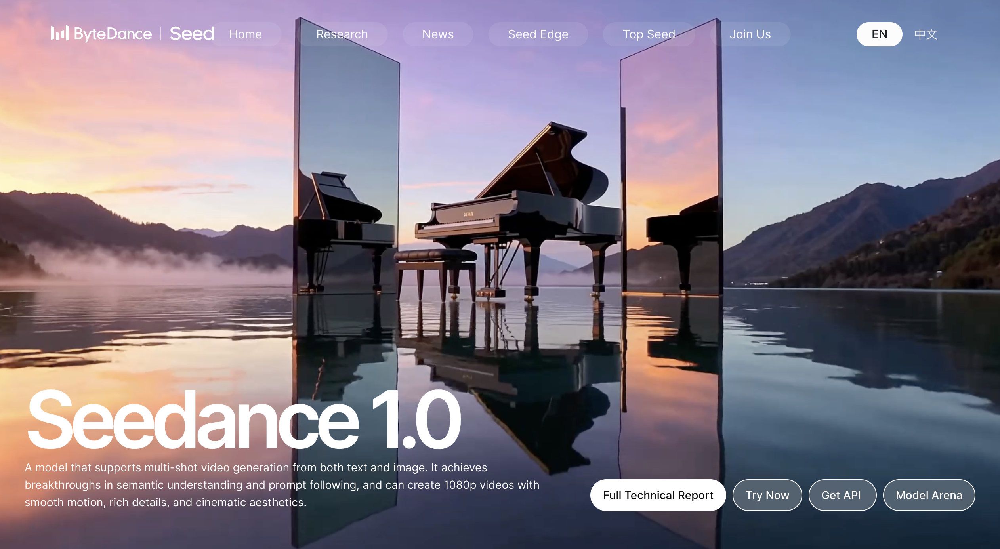


Seedance 1.0 是字节跳动推出的视频生成模型。它支持两种核心输入方式来创建视频：

1. 文本转视频：它可以直接从文本描述生成完整的视频（例如，将“一只猫在阳光明媚的草地上追逐蝴蝶”变成动态视频）。
2. 图像转视频：它可以将静态图像制作成动画视频（例如，让一张海洋日落的静态照片显示波浪起伏和云彩飘动）。

它还支持首尾帧——你可以提供开始帧（视频如何开始）和结束帧（视频如何结束），Seedance 将自动生成连接这两帧的流畅、连贯的视频内容。

总体而言，它生成 1080p 高质量视频，具有流畅的运动、丰富的细节和电影感。它甚至原生支持多镜头连贯叙事视频，很好地符合风格需求和文本指令，并在相关基准测试中表现强劲——帮助创作者将幻想场景、日常纪录片或商业短片等创意变为现实。

<video src="https://lf3-static.bytednsdoc.com/obj/eden-cn/bdeh7uhpsuht/Seedance1.0.mp4" controls="controls" width="100%" style="max-width: 800px; display: block; margin: 20px auto;"></video>

### 如何使用 Seedance 1.0

#### Text2Video 接口

你可以通过下面的 API 轻松给出一段文本并获得输出视频。

```Python
import requests
import time
import os
from typing import Dict, Any, Optional

# 官方文档接口地址：https://www.volcengine.com/docs/82379/1520757
# API地址已替换为 https://api.zyai.online/seedance/v3
# 使用后台提供的API Key
SEEDANCE_API_URL: str = "https://api.zyai.online/seedance/v3/contents/generations/tasks"
SEEDANCE_API_KEY: str = 

def create_seedance_txt2video_task() -> Optional[str]:
    """
    创建Seedance 1.0视频生成任务（文本转视频），返回任务ID。

    Returns:
        Optional[str]: 返回任务ID，失败时返回None
    """
    headers: Dict[str, str] = {
        "Content-Type": "application/json",
        "Authorization": f"Bearer {SEEDANCE_API_KEY}"
    }
    payload: Dict[str, Any] = {
        "model": "doubao-seedance-1-0-pro-250528",
        "content": [
            {
                "type": "text",
                "text": (
                    "多个镜头。一个猫咪跳入游泳池。"
                    "跳上桌子"
                    "看着镜头感到很疑惑 --ratio 16:9"
                )
            }
        ]
    }

    try:
        response: requests.Response = requests.post(
            SEEDANCE_API_URL,
            headers=headers,
            json=payload,
            timeout=120
        )
        response.raise_for_status()
        result: Dict[str, Any] = response.json()
        print("Seedance 1.0 文本转视频任务创建结果：")
        print(result)
        task_id: Optional[str] = result.get("id")
        if not task_id:
            print("未能获取到任务ID。")
            return None
        return task_id
    except requests.RequestException as e:
        print(f"请求失败: {e}")
        return None
    except Exception as e:
        print(f"响应解析失败: {e}")
        return None

def find_video_task(task_id: str) -> Optional[Dict[str, Any]]:
    """
    查询Seedance 1.0视频生成任务的详细信息。

    Args:
        task_id (str): 视频生成任务的ID。

    Returns:
        Optional[Dict[str, Any]]: 返回API响应的字典数据，若请求失败则返回None。
    """
    url: str = f"{SEEDANCE_API_URL}/{task_id}"
    headers: Dict[str, str] = {
        "Content-Type": "application/json",
        "Authorization": f"Bearer {SEEDANCE_API_KEY}"
    }

    try:
        response: requests.Response = requests.get(url, headers=headers, timeout=10)
        response.raise_for_status()
        return response.json()
    except requests.RequestException as e:
        print(f"查询Seedance 1.0视频生成任务失败: {e}")
        return None

def parse_video_task_response(response: Dict[str, Any]) -> Dict[str, Any]:
    """
    解析Seedance 1.0视频生成任务API的响应，提取关键信息。

    Args:
        response (Dict[str, Any]): API返回的原始响应数据。

    Returns:
        Dict[str, Any]: 提取后的关键信息字典。
    """
    result: Dict[str, Any] = {
        "id": response.get("id"),
        "model": response.get("model"),
        "status": response.get("status"),
        "error": response.get("error"),
        "created_at": response.get("created_at"),
        "updated_at": response.get("updated_at"),
        "seed": response.get("seed"),
        "resolution": response.get("resolution"),
        "duration": response.get("duration"),
        "ratio": response.get("ratio"),
        "framespersecond": response.get("framespersecond"),
        "usage": response.get("usage"),
        "video_url": None,
        "last_frame_url": None
    }

    content: Optional[Dict[str, Any]] = response.get("content")
    if content:
        result["video_url"] = content.get("video_url")
        result["last_frame_url"] = content.get("last_frame_url")

    return result

def download_video(video_url: str, output_filename: str = "output.mp4") -> None:
    """
    下载视频文件并保存到本地。

    Args:
        video_url (str): 视频下载地址
        output_filename (str): 本地保存文件名
    """
    try:
        print(f"开始下载视频: {video_url}")
        response: requests.Response = requests.get(video_url, timeout=300)
        response.raise_for_status()
        with open(output_filename, "wb") as f:
            f.write(response.content)
        print(f"视频已保存为 {output_filename}")
    except requests.RequestException as e:
        print(f"下载视频失败: {e}")

def poll_and_download_video(task_id: str, poll_interval: int = 5, max_wait: int = 600) -> None:
    """
    轮询查询视频生成任务状态，直到视频生成完成并下载。

    Args:
        task_id (str): 任务ID
        poll_interval (int): 轮询间隔秒数
        max_wait (int): 最大等待时间（秒）
    """
    waited: int = 0
    while waited < max_wait:
        response: Optional[Dict[str, Any]] = find_video_task(task_id)
        if response is None:
            print("查询任务失败，稍后重试...")
            time.sleep(poll_interval)
            waited += poll_interval
            continue

        info: Dict[str, Any] = parse_video_task_response(response)
        print(f"当前任务状态: {info['status']}")
        if info["status"] == "succeeded" and info["video_url"]:
            print("视频生成成功，准备下载。")
            download_video(info["video_url"])
            return
        elif info["status"] == "failed":
            print(f"视频生成失败: {info.get('error')}")
            return
        else:
            print("视频尚未生成，等待中...")
            time.sleep(poll_interval)
            waited += poll_interval

    print("等待超时，未能获取到视频。")

if __name__ == "__main__":
    # 1. 创建视频生成任务
    task_id: Optional[str] = create_seedance_txt2video_task()
    if task_id:
        # 2. 轮询查询并下载视频
        poll_and_download_video(task_id)
    else:
        print("未能创建视频生成任务。")
```

#### 首尾帧接口

在此代码中，需要上传两张图像进行融合。你可以让 z.ai 构建一个能够接受两张图像的图像上传界面。上传图像后，该界面随后运行以生成包含第一帧和最后一帧的视频。

```Python
import requests
import time
import base64
import os
from typing import Dict, Any, Optional

# 官方文档接口地址：https://www.volcengine.com/docs/82379/1520757
# API地址已替换为 https://api.zyai.online/seedance/v3
# 使用后台提供的API Key
SEEDANCE_API_URL: str = "https://api.zyai.online/seedance/v3/contents/generations/tasks"
SEEDANCE_API_KEY: str =

# 本地图片路径
FIRST_FRAME_PATH: str = "/generated_image.png"
LAST_FRAME_PATH: str = "/generated_image_2.png"

def image_to_base64_with_format(image_path: str) -> Optional[str]:
    """
    将本地图片文件转换为带格式的base64字符串。

    Args:
        image_path (str): 图片文件路径

    Returns:
        Optional[str]: 格式化的base64编码字符串，格式为data:image/<格式>;base64,<编码>，失败时返回None
    """
    try:
        # 获取图片文件扩展名以确定格式
        file_extension: str = os.path.splitext(image_path)[1].lower()
        image_format: str = file_extension.replace('.', '')
      
        # 处理特殊格式
        if image_format == 'jpg':
            image_format = 'jpeg'
      
        with open(image_path, "rb") as img_file:
            encoded: bytes = base64.b64encode(img_file.read())
            base64_str: str = encoded.decode("utf-8")
            # 返回标准的Data URL格式
            return f"data:image/{image_format};base64,{base64_str}"
    except Exception as e:
        print(f"读取图片失败: {image_path}, 错误: {e}")
        return None

def create_seedance_lite_txt2video_task() -> Optional[str]:
    """
    创建Seedance 1.0 Lite视频生成任务（文本转视频），返回任务ID。

    Returns:
        Optional[str]: 返回任务ID，失败时返回None
    """
    # 读取本地图片并转为带格式的base64
    first_frame_b64: Optional[str] = image_to_base64_with_format(FIRST_FRAME_PATH)
    last_frame_b64: Optional[str] = image_to_base64_with_format(LAST_FRAME_PATH)
    if not first_frame_b64 or not last_frame_b64:
        print("首帧或尾帧图片读取失败，无法提交任务。")
        return None

    headers: Dict[str, str] = {
        "Content-Type": "application/json",
        "Authorization": f"Bearer {SEEDANCE_API_KEY}"
    }
    payload: Dict[str, Any] = {
        "model": "doubao-seedance-1-0-lite-i2v-250428",
        "content": [
            {
                "type": "text",
                "text": "湖水形成了一个人"
            },
            {
                "type": "image_url",
                "image_url": {
                    "url": first_frame_b64
                },
                "role": "first_frame"
            },
            {
                "type": "image_url",
                "image_url": {
                    "url": last_frame_b64
                },
                "role": "last_frame"
            }
        ]
    }

    try:
        response: requests.Response = requests.post(
            SEEDANCE_API_URL,
            headers=headers,
            json=payload,
            timeout=120
        )
        response.raise_for_status()
        result: Dict[str, Any] = response.json()
        print("Seedance Lite 文本转视频任务创建结果：")
        print(result)
        task_id: Optional[str] = result.get("id")
        if not task_id:
            print("未能获取到任务ID。")
            return None
        return task_id
    except requests.RequestException as e:
        print(f"请求失败: {e}")
        return None
    except Exception as e:
        print(f"响应解析失败: {e}")
        return None

def find_video_task(task_id: str) -> Optional[Dict[str, Any]]:
    """
    查询Seedance Lite视频生成任务的详细信息。

    Args:
        task_id (str): 视频生成任务的ID。

    Returns:
        Optional[Dict[str, Any]]: 返回API响应的字典数据，若请求失败则返回None。
    """
    url: str = f"{SEEDANCE_API_URL}/{task_id}"
    headers: Dict[str, str] = {
        "Content-Type": "application/json",
        "Authorization": f"Bearer {SEEDANCE_API_KEY}"
    }

    try:
        response: requests.Response = requests.get(url, headers=headers, timeout=10)
        response.raise_for_status()
        return response.json()
    except requests.RequestException as e:
        print(f"查询Seedance Lite视频生成任务失败: {e}")
        return None

def parse_video_task_response(response: Dict[str, Any]) -> Dict[str, Any]:
    """
    解析Seedance Lite视频生成任务API的响应，提取关键信息。

    Args:
        response (Dict[str, Any]): API返回的原始响应数据。

    Returns:
        Dict[str, Any]: 提取后的关键信息字典。
    """
    result: Dict[str, Any] = {
        "id": response.get("id"),
        "model": response.get("model"),
        "status": response.get("status"),
        "error": response.get("error"),
        "created_at": response.get("created_at"),
        "updated_at": response.get("updated_at"),
        "seed": response.get("seed"),
        "resolution": response.get("resolution"),
        "duration": response.get("duration"),
        "ratio": response.get("ratio"),
        "framespersecond": response.get("framespersecond"),
        "usage": response.get("usage"),
        "video_url": None,
        "last_frame_url": None
    }

    content: Optional[Dict[str, Any]] = response.get("content")
    if content:
        result["video_url"] = content.get("video_url")
        result["last_frame_url"] = content.get("last_frame_url")

    return result

def download_video(video_url: str, output_filename: str = "output.mp4") -> None:
    """
    下载视频文件并保存到本地。

    Args:
        video_url (str): 视频下载地址
        output_filename (str): 本地保存文件名
    """
    try:
        print(f"开始下载视频: {video_url}")
        response: requests.Response = requests.get(video_url, timeout=300)
        response.raise_for_status()
        with open(output_filename, "wb") as f:
            f.write(response.content)
        print(f"视频已保存为 {output_filename}")
    except requests.RequestException as e:
        print(f"下载视频失败: {e}")

def poll_and_download_video(task_id: str, poll_interval: int = 5, max_wait: int = 600) -> None:
    """
    轮询查询视频生成任务状态，直到视频生成完成并下载。

    Args:
        task_id (str): 任务ID
        poll_interval (int): 轮询间隔秒数
        max_wait (int): 最大等待时间（秒）
    """
    waited: int = 0
    while waited < max_wait:
        response: Optional[Dict[str, Any]] = find_video_task(task_id)
        if response is None:
            print("查询任务失败，稍后重试...")
            time.sleep(poll_interval)
            waited += poll_interval
            continue

        info: Dict[str, Any] = parse_video_task_response(response)
        print(f"当前任务状态: {info['status']}")
        if info["status"] == "succeeded" and info["video_url"]:
            print("视频生成成功，准备下载。")
            download_video(info["video_url"])
            return
        elif info["status"] == "failed":
            print(f"视频生成失败: {info.get('error')}")
            return
        else:
            print("视频尚未生成，等待中...")
            time.sleep(poll_interval)
            waited += poll_interval

    print("等待超时，未能获取到视频。")

if __name__ == "__main__":
    # 1. 创建视频生成任务
    task_id: Optional[str] = create_seedance_lite_txt2video_task()
    if task_id:
        # 2. 轮询查询并下载视频
        poll_and_download_video(task_id)
    else:
        print("未能创建视频生成任务。")
```

## 各种图像子任务

说到图像相关任务，我们提供了多种功能选项供测试和探索。

例如，面部妆容模拟让你虚拟尝试各种妆容风格——从日常妆容到创意设计——而无需实物产品。虚拟试穿让你以数字方式“穿”上衣服，以可视化合身度和风格，而虚拟服装试穿增加了诸如尺码或颜色调整等个性化微调，以获得更逼真的预览。还有旧照片修复，可以修复老式照片上的划痕、褪色和损坏，以恢复珍贵的记忆。以下是你可以尝试的一些具体示例。

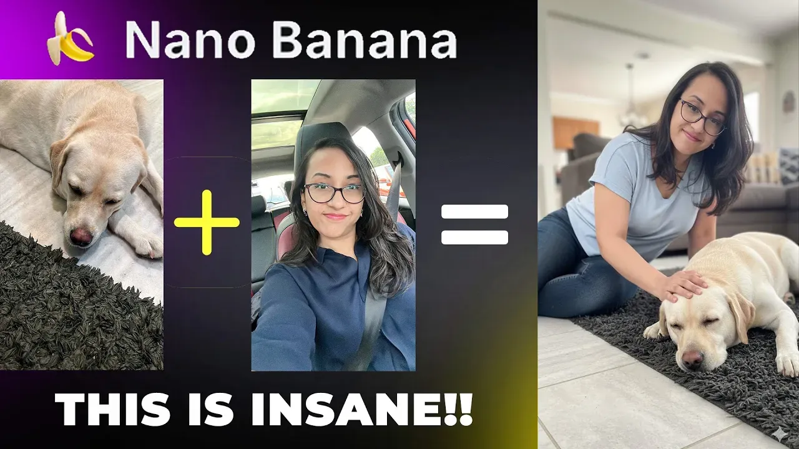

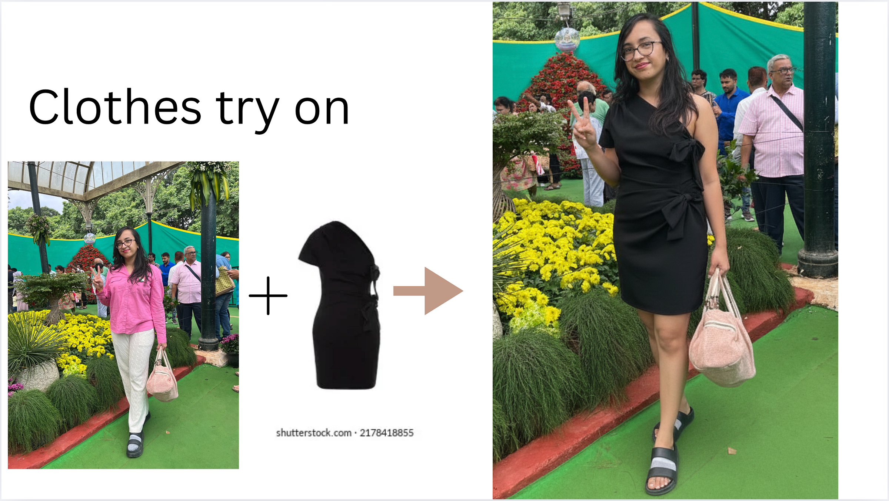


### 图像风格化生成

```Bash
Convert this image to a black-and-white comic style. 
Convert this image to an oil painting style. 
Convert this image to a pop art style. 
```


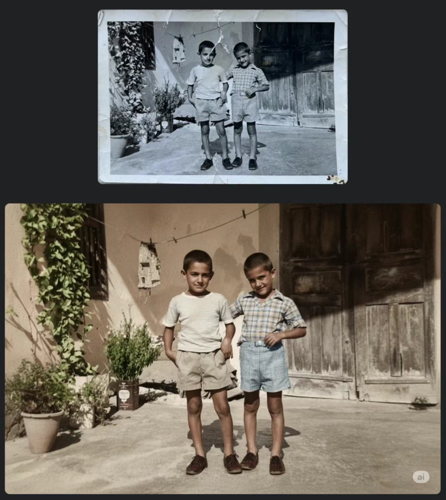

### 产品背景生成

以下面的图像为例：你可以将主体的背景替换为其他背景。或者，假设你是一个销售各种产品的商家，需要在不同的销售平台上展示这些产品以吸引买家——你可以使用这种方法更改不同产品的背景，使它们看起来更具视觉吸引力。你甚至可以上传多张图像，并将主体图像放入提供的图像中。

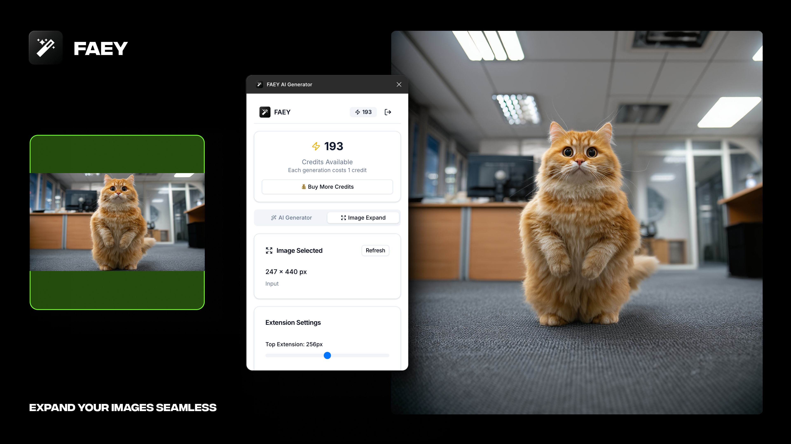

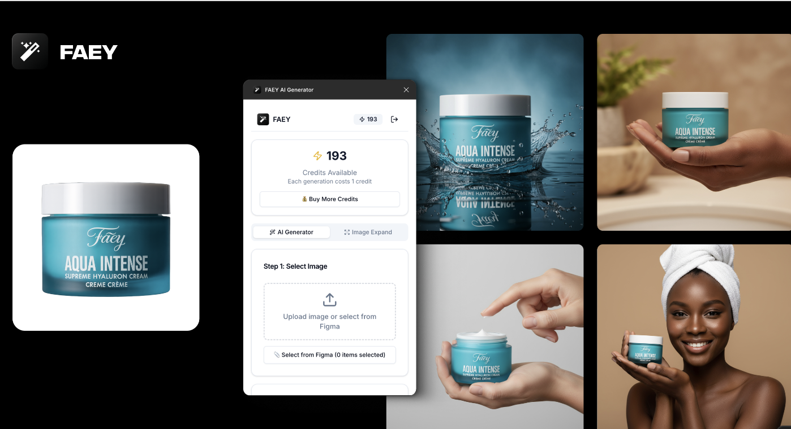

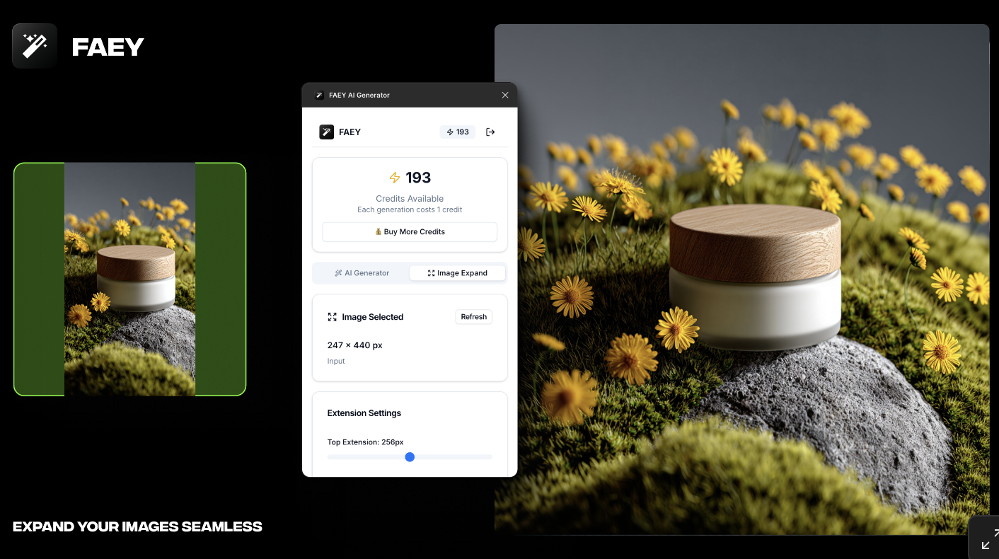

### 手办生成

```Plain
Transform this photo into a character figurine. Place a packaging box printed with the character's image behind the figurine, and display a computer next to it, with the Blender modeling production process shown on the screen. Put a circular plastic base in front of the packaging box, on which the character figurine stands. Ensure the PVC material exhibits a clear and realistic texture, and set the scene in an indoor environment as much as possible.
```


### 虚拟试穿 / 时尚应用

```Plain
replace the brush area with a chanel bag
```


### 海报生成


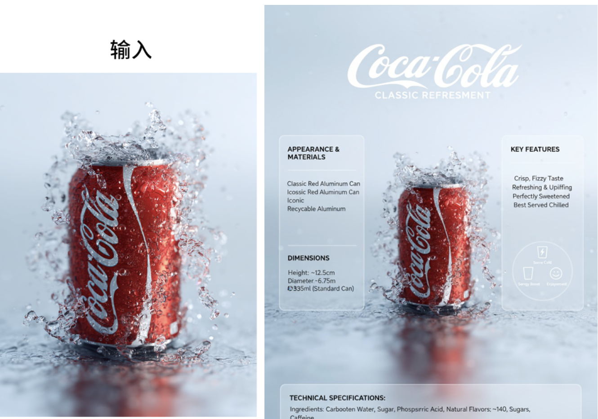

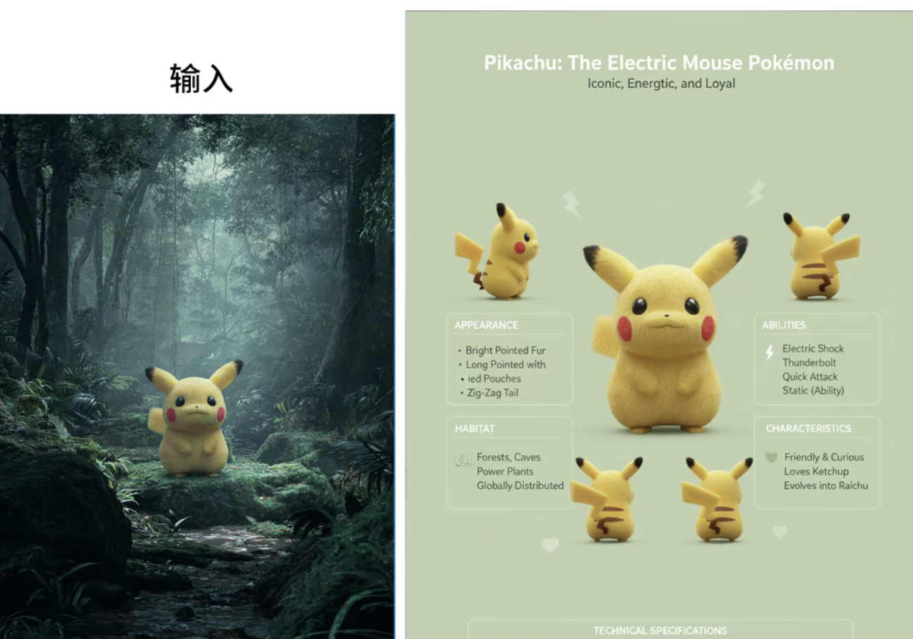


### 动作参考 / 姿势参考

```Bash
The two characters interact in the posture shown in Picture 3. The scene background should match the atmosphere of the image, and interactive effects between the environment and the characters should be added. The image aspect ratio is set to 1:1
```


### IP 设计

```SQL
Generate for me the following elements of character creation: Character Design, Proportion Design (including different height comparisons, head-to-body ratio, etc.), Three-View Drawings (front view, side view, back view), Expression Sheet (the type of chart you sent earlier), Pose Sheet (various common poses), and Costume Design.
```

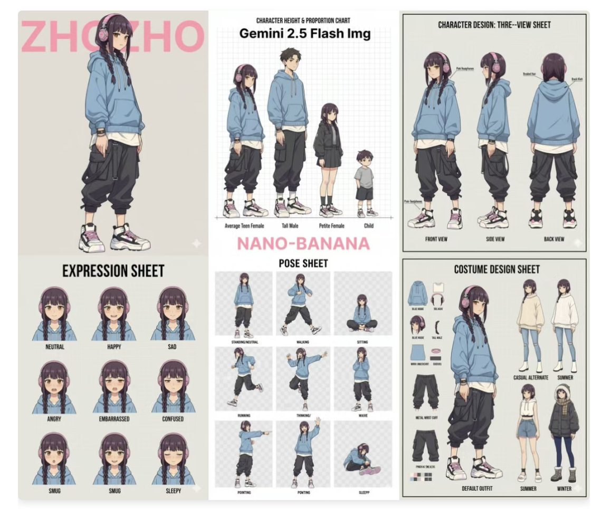

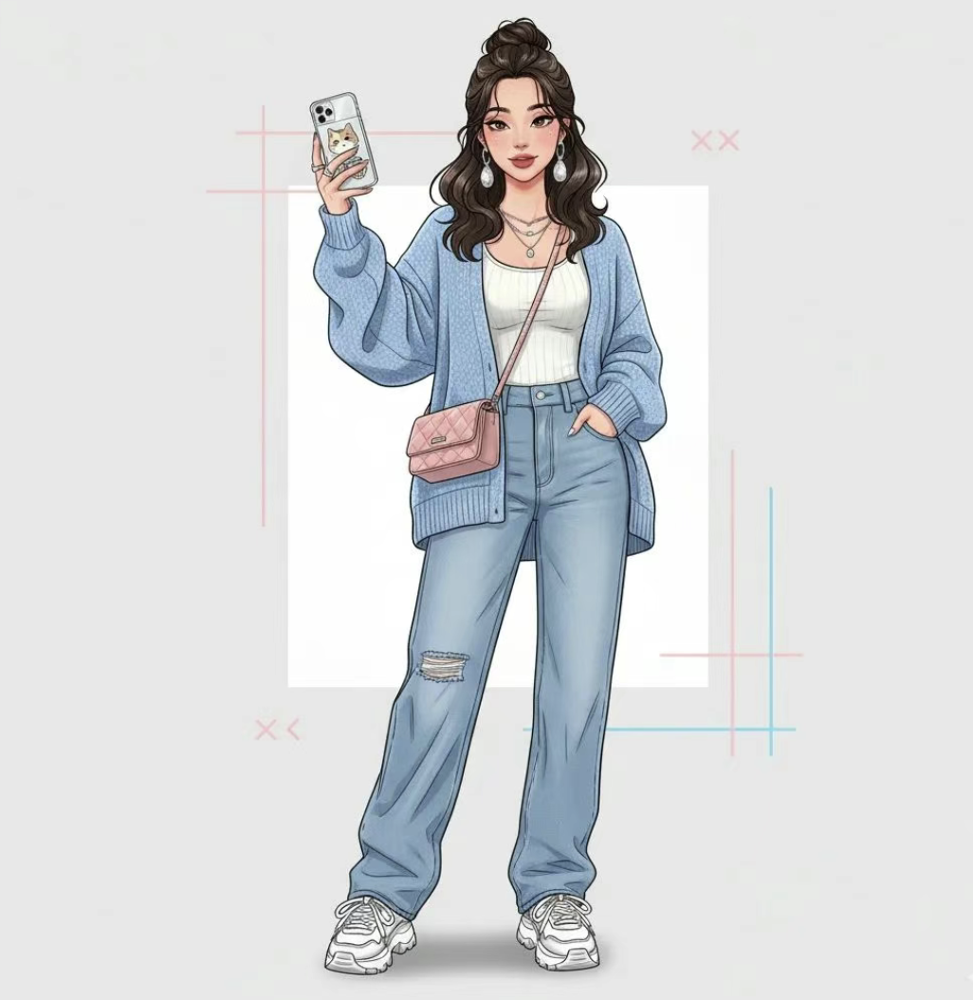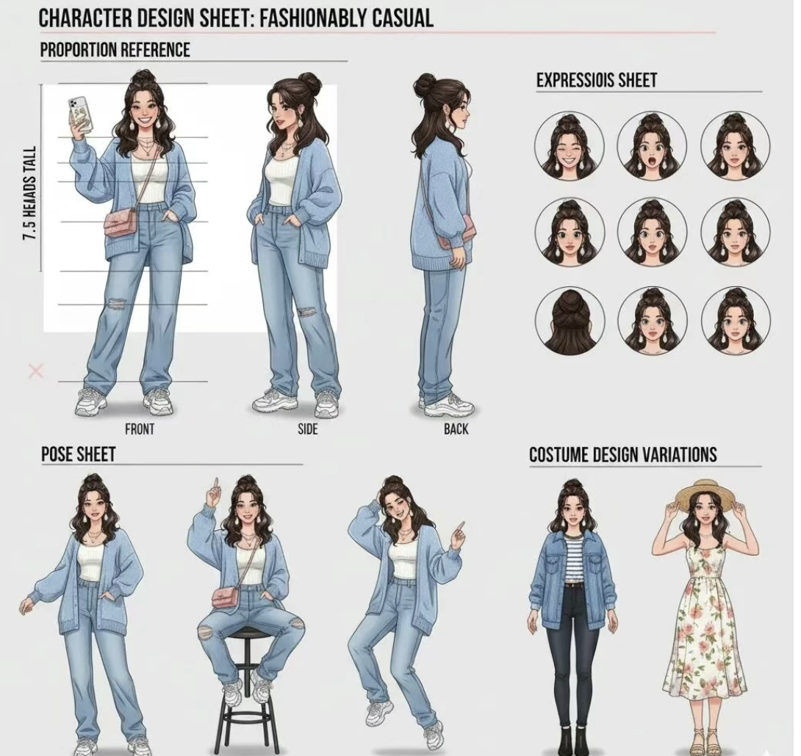

## 行业应用

基于上面介绍的几个任务方向，已经有很多现有的应用程序。然而，我们接下来要介绍的是一个设计智能体，其核心采用 nanobanana 来完成各种复杂的设计任务。许多设计师需要海报和 UI 元素来保持高水平的风格一致性，而 nanobanana 完美地实现了这一点。

### Lovart

https://www.lovart.ai/home

Lovart 是世界上第一个专门用于设计领域的 AI 智能体工具。只需用文字描述你的设计需求——例如“创作 8 幅猫环游世界的插图”或“制作一个 30 秒的 Dior 口红商业视频”——它首先会准确匹配设计风格并分解任务。然后，它将调用 GPT-4o 和 Flux 等模型来生成内容。

它还支持调整大小、图像裁剪和文本背景分离（以便轻松修改文本）等功能，甚至可以将图像转换为带有背景音乐的视频。它帮助你直接从需求中获得实用的、现成的设计输出，这对于创建简单设计的初学者和希望提高工作效率的设计师都很有用。

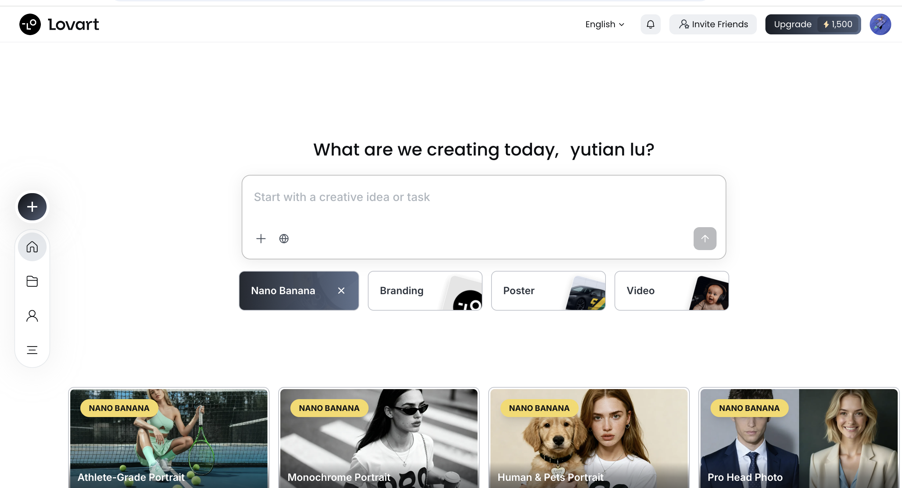

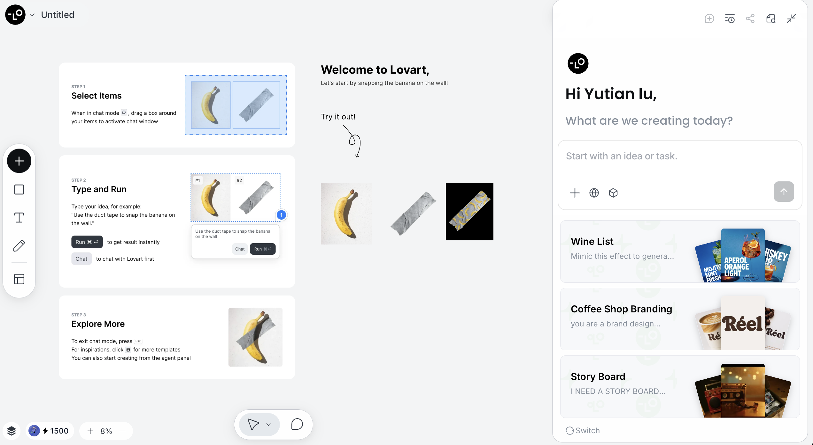


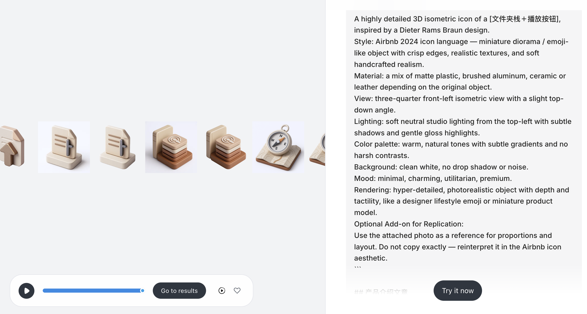

## 📚 课堂作业：创建你自己的图像生成创意应用程序

1. 请参考上述文档中提供的示例，并复刻两个以上的上述子任务。
2. 参考 z.ai，思考并创建你作为一套生成工具（例如从输入图像创建视频的工具、AIID 纪念视频，或允许通过上传照片更改背景、服装或生成不同地点旅行视频的工具），家居设计工具，电影生成工具等。最后，这些工具应该让你的同学可以访问，让他们也能体验到同样的乐趣！

# 如何找到最好的模型

大语言模型（LLM）的发展速度非常快，我们总是需要确保我们使用的是排名靠前的模型之一。通过以下两个网站，我们可以轻松确定哪些文本、视频和图像大模型目前最强大。一般来说，我们将此类网站称为 **“LLM 竞技场”** —— 我们可以并排比较两个模型的输出。你需要选择你更喜欢的响应，这种选择算作一票。获得更多选票的模型被认为具有更好的性能。

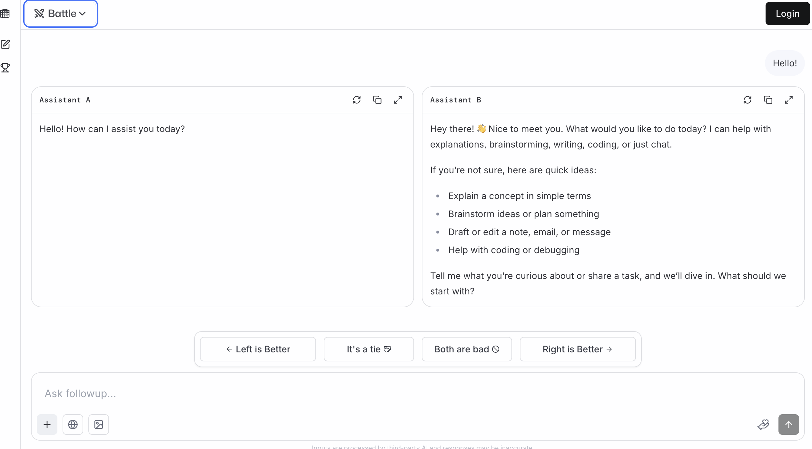

此外，你偶尔可能会在这些大模型竞技场中看到神秘的匿名模型。通常，这些是来自 OpenAI 或 Google 等公司的内部测试模型。你可能有机会意外体验到最先进模型的能力！

### LMArena

网站：https://lmarena.ai/

简介：LMArena 最初由加州大学伯克利分校大模型系统组织（LMSYS）作为一个学术副项目推出，现已发展成为一家公司。它是一个开源的众包 AI 基准测试平台。

它改变了传统的基于学科测试评估 AI 技术的方式，将评估权移交给社区用户。通过匿名和众包配对比较，它评估大规模模型。该平台支持超过 68 个模型，如 GPT-4o 和 Claude 3.5。

它使用 Elo 评分系统，可以更真实地反映用户对模型回答质量的评价。根据用户投票数据，它编制了一个排行榜，涵盖七个类别，包括文本/语言能力、Web 开发和视觉/图像理解。

截至 2025 年 4 月，它已记录了超过 300 万次比较，并评估了 400 多个模型，成为比较和评估 AI 模型性能的流行方法。

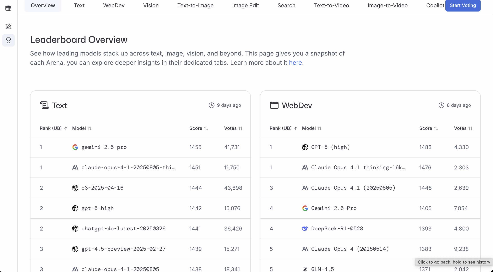

### Artificial Analysis

网站：[https://artificialanalysis.ai](https://artificialanalysis.ai/)

Artificial Analysis 是领先的独立 AI 基准测试和分析平台。它专注于对 AI 模型和 API 提供商进行独立分析。该网站提供详细的数据和图表，可以帮助开发者、用户、研究人员和其他用户做出明智的选择。

通过比较不同 AI 模型的质量、性能、价格和其他关键指标，它帮助用户找到最适合其需求的 AI 模型解决方案。

其功能包括模型比较、质量评估、价格分析、性能测试和上下文窗口分析。它还提供了详细的用户指南和常见问题解答，涵盖各种类型模型的评估，如大语言模型、文本到图像模型和语音到文本模型。此外，它还提供了一个专注于模型基准的免费 API 和一个具有更全面数据的商业 API。

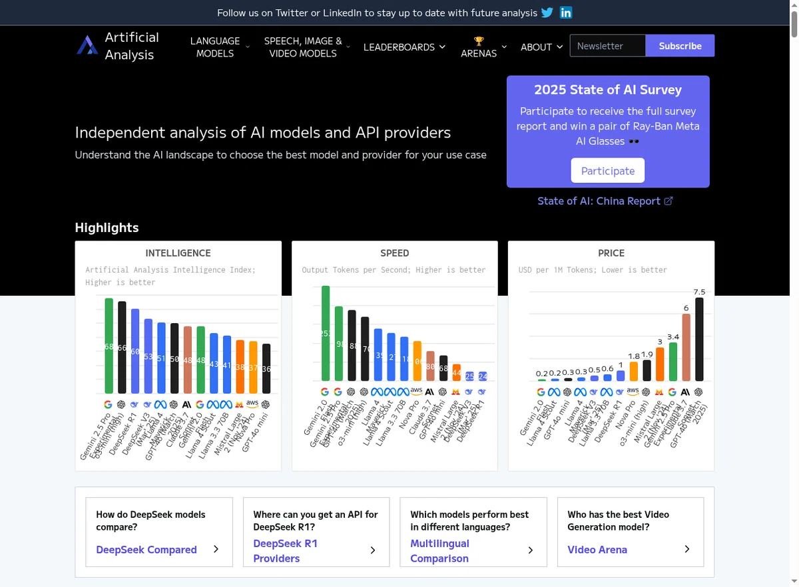


